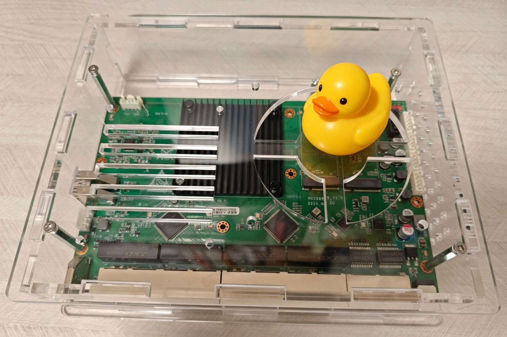
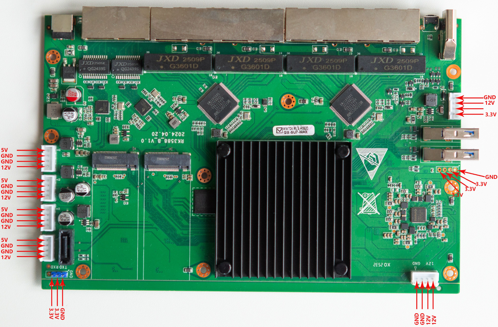
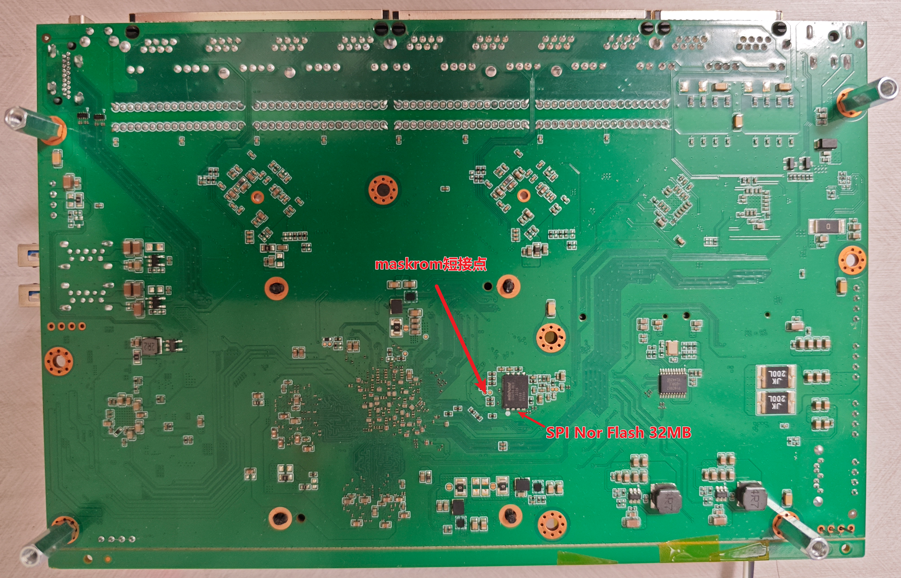
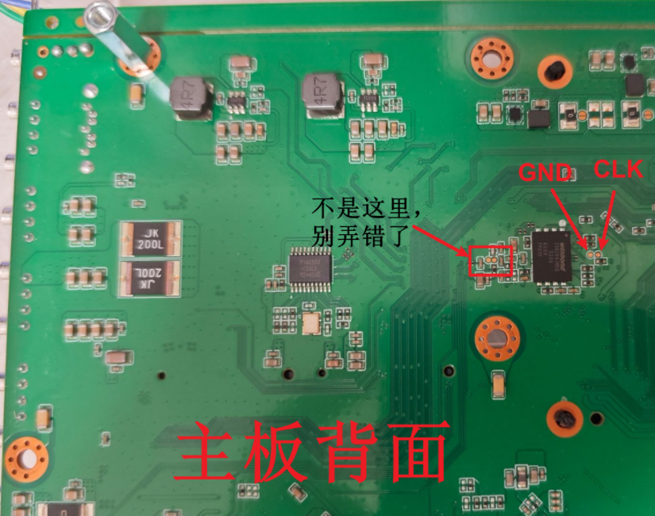
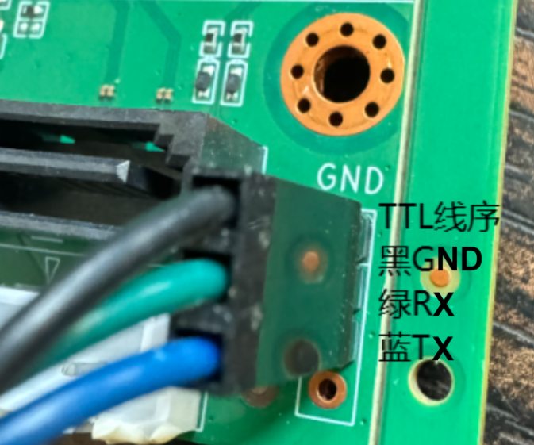
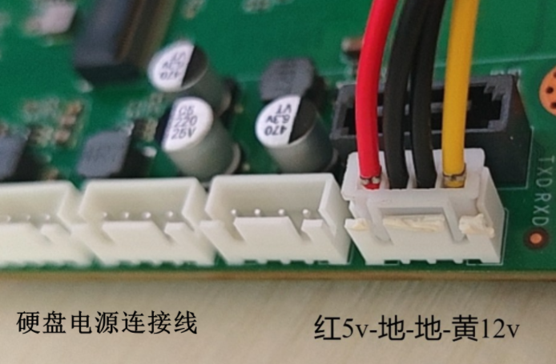

# 彼度云 BYD-G98(BYD-Z98)

## 目录

* [硬件规格](docs/硬件规格.md)
* [刷机指引](docs/刷机指引.md)
  * [ophub armbian](docs/刷机指引/armbian.md)
  * [ophub 飞牛](docs/刷机指引/fnos.md)
  * [原厂wayos](docs/刷机指引/原厂wayos.md)
  * [SPI recovery固件刷写](docs/刷机指引/spi_recovery.md)
  * [EMMC recovery固件刷写](docs/刷机指引/emmc_recovery.md)
  * [android12固件](docs/刷机指引/android12.md)
  * [android13固件](docs/刷机指引/android13.md)
  * [android14固件](docs/刷机指引/android14.md)
* [适配记录](docs/适配记录.md)
  * [uboot](docs/适配记录/uboot.md)
  * [recovery](docs/适配记录/recovery.md)
  * [kernel](docs/适配记录/kernel.md)
  * [android14适配](docs/适配记录/android/android14.md)
  * [android14适配](docs/适配记录/android/android13.md)
  * [android14适配](docs/适配记录/android/android12.md)

## 参数规格

| 项目 | 参数说明 |
|------|----------|
| CPU型号 | **RK3588**（瑞芯微八核ARM SoC） |
| 架构 | 八核 ARM Cortex-A76（+四核Cortex-A55，典型RK3588配置） |
| 主频 | 2.4 GHz（A76大核） |
| 双核GPU | 算力6T（指 Mali-G610 MP4 GPU，标称AI算力约6 TOPS INT8） |
| 内存 | **DDR4 16GB**（板载，不可扩展） |
| 无线规格 | —（无内置Wi-Fi模块） |
| 存储 | 选配固态（需用户自行安装，支持NVMe×2 + SATA×1） |
| 硬盘接口 | NVMe×2 + SATA×1（共10个存储接口，可组RAID或分布式存储） |
| RJ45电口数 | 10个： • 2.5G网口 ×2 • 千兆网口 ×8 |
| USB口数 | USB3.0*2 |
| AC/DC接口 | 220V交流输入 + DC-IN直流输入（双供电冗余设计） |

## 相关链接

* 官方介绍: <https://aibidu.com/?m=home&c=View&a=index&aid=579>
* ophub适配申请：<https://github.com/ophub/fnnas/issues/606>
* g18交流贴：<https://github.com/ophub/amlogic-s9xxx-openwrt/issues/845>

## 适配进度

| 配置文件名 | 仓库地址 | 分支 | 适配进度 | 备注 |
| :--- | :--- | :--- | :--- | :--- |
| `ophub_6.18.y` | `https://github.com/ophub/linux-6.18.y.git` | `ophub_6.18.y` | ✅ 已完成 | 初步完成 |
| `rockchip-linux_develop-6.1` | `https://github.com/rockchip-linux/kernel.git` | `develop-6.1` | ✅ 已完成 | 初步完成 |
| `rockchip-linux_develop-6.6` | `https://github.com/rockchip-linux/kernel.git` | `develop-6.6` | ✅ 已完成 | 初步完成 |
| `ophub_linux-6.1.y-rockchip` | `https://github.com/ophub/linux-6.1.y-rockchip` | `linux-6.1.y-rockchip` | 🔄 进行中 | 适配中 |
| `openeuler_OLK6.6` | | | 🔄 进行中 | 适配中 |
| `ophub_6.1.y` | | | ⬜ 未开始  | |
| `ophub_6.6.y` | | | ⬜ 未开始  | |
| `ophub_6.12.y` | | | ⬜ 未开始  | |
| `armbian_rk-6.1-rkr5.1` | | | ⬜ 未开始  | |
| `friendlyarm_nanopi6-v6.1.y` | | | ⬜ 未开始  | |
| `linux-stable` | | | ⬜ 未开始  | |
| `lubancat_lbc-develop-6.1` | | | ⬜ 未开始  | |
| `official_5.10.66` | | | ⬜ 未开始  | |
| `openeuler_OLK6.6` | | | ⬜ 未开始  | |
| `orangepi-xunlong_orange-pi-6.1-rk35xx` | | | ⬜ 未开始  | |
| `radxa_linux-6.1-stan-rkr5.1` | | | ⬜ 未开始  | |
| `torvalds_linux` | | | ⬜ 未开始  | | 

## maskrom短接点、TTL、硬盘电源

- maskrom短接点：

主板背面位置

- debug调试口

主板正面，有丝印

- 硬盘电源连接线

**务必注意线序！颜色顺序基本是正确的，严格按照颜色对应连接。**
**已有一个三星 2.5 寸 SSD 因线序接反被 12V 击穿烧毁，此为实测血泪教训**

## 免责申明

- 本仓库所提供的内容均基于公开、合法渠道整理，仅供用户参考与学习之用。
- 严格遵守国家相关法律法规，尊重并保护个人隐私及知识产权。
- 如您认为相关内容涉及您的隐私、版权或其他合法权益，请及时联系，将依法核实并在必要时予以删除或下架。
- 对于因使用或无法使用本网站/平台内容所引发的任何直接或间接损失，不承担任何法律责任。
- 用户在使用过程中应自行判断信息的适用性，并承担相应风险。

