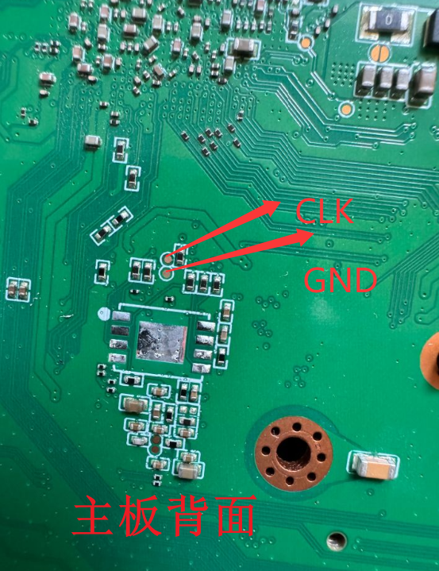
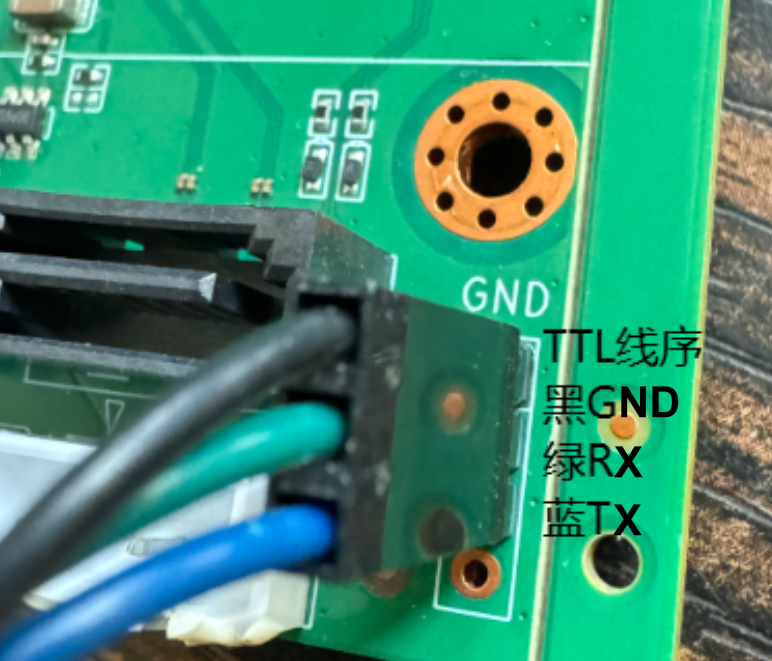
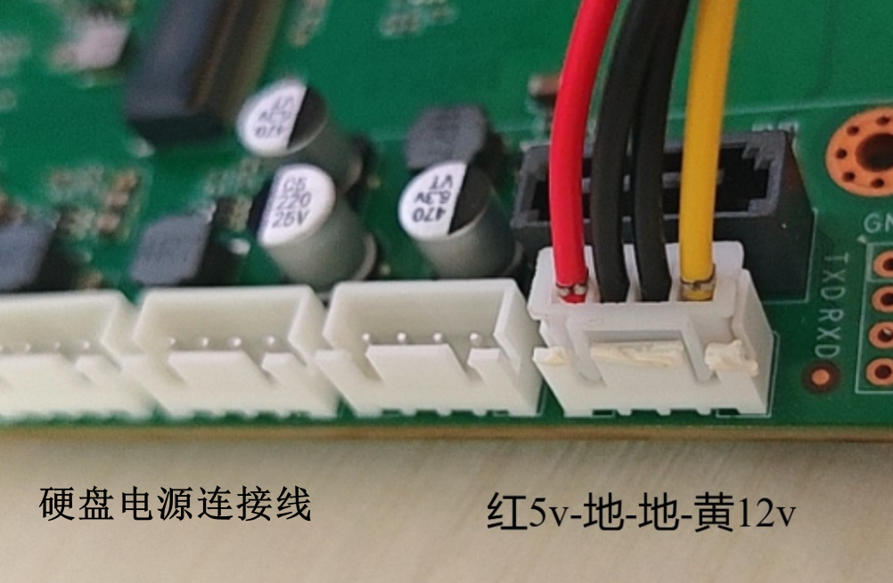

# BYD G98

## 相关链接

* 官方介绍: <https://aibidu.com/?m=home&c=View&a=index&aid=579>
* 

## 目录

* [硬件规格](docs/硬件规格.md)
* [固件](docs/固件.md)
    * [armbian](docs/固件/armbian.md)
    * [飞牛fnos](docs/固件/fnos.md)
    * [istoreos](docs/固件/istoreos.md)

---

## 参数规格

## maskrom短接点、TTL、硬盘电源

- maskrom短接点：

主板背面位置

- debug调试口

主板正面，有丝印

- 硬盘电源连接线

## 免责申明

- 本仓库所提供的内容均基于公开、合法渠道整理，仅供用户参考与学习之用。
- 严格遵守国家相关法律法规，尊重并保护个人隐私及知识产权。
- 如您认为相关内容涉及您的隐私、版权或其他合法权益，请及时联系，将依法核实并在必要时予以删除或下架。
- 对于因使用或无法使用本网站/平台内容所引发的任何直接或间接损失，不承担任何法律责任。
- 用户在使用过程中应自行判断信息的适用性，并承担相应风险。

---

