# 刷机指引

## 硬件工具

1. CH340 （连接 TTL 调试口）

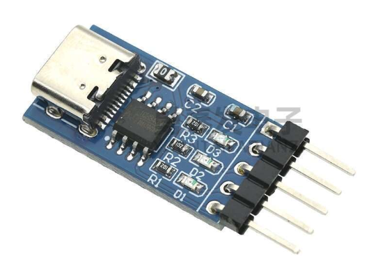

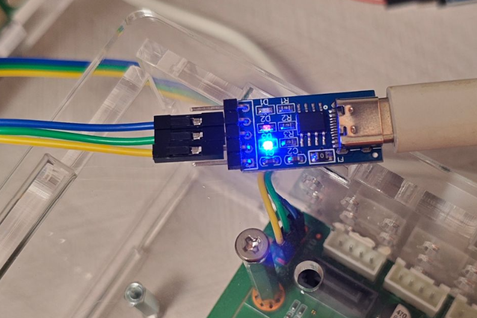

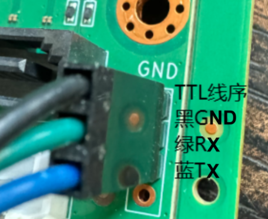


2. 双公头USB

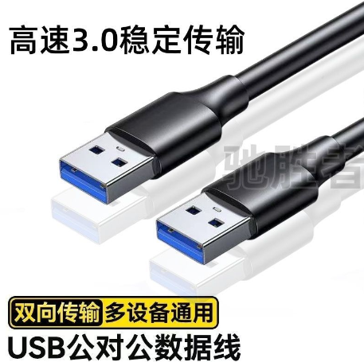

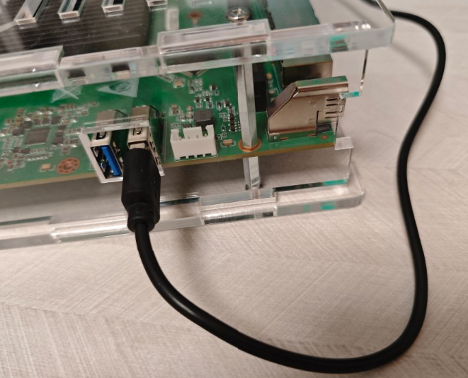


## 软件工具

1. 安装TTL调试工具驱动

2. 安装rkdev usb驱动

## debug调试口连接

波特率1500000， 8n1


## 刷机流程

测试环境

1. windows 10
2. 瑞星微开发工具 v3.19
3. G98有SPI NOR FLASH(32MB)，默认支持nvme引导

基本步骤：
1. uboot打断，进入命令行

开机按 ctrl+c 打断

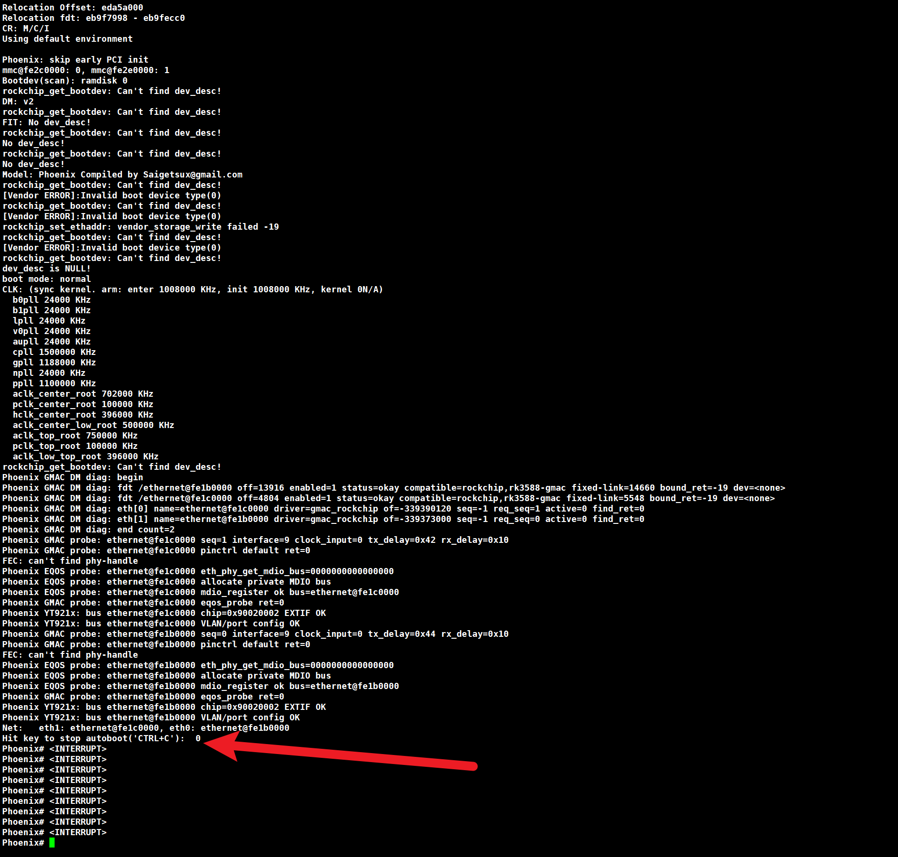


2. 执行命令扫描nvme

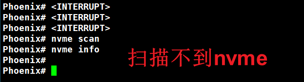

此时可能遇到不识别nvme的情况，需要命令触发扫描


```shell
pci enum
nvme scan
```

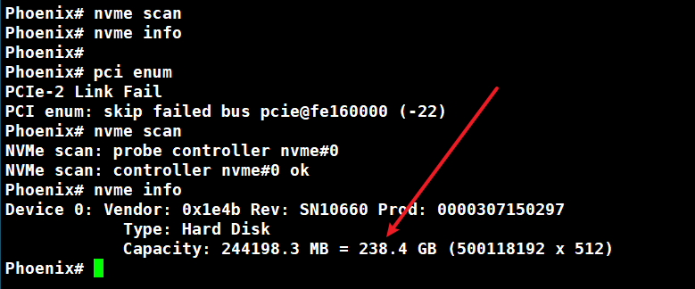

此时可见nvme已经识别

3. 进入loader模式刷机

```shell
rockusb 0 nvme 0
```

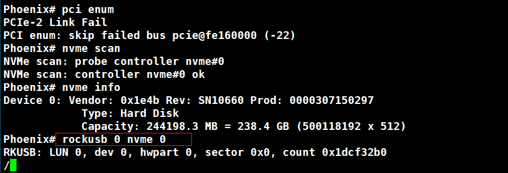


4. 电脑端用rkdevtool刷机

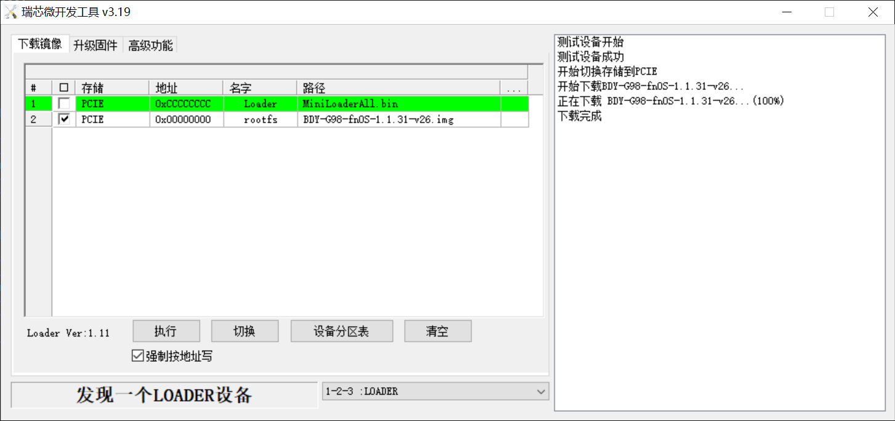


## SPI Nor Flash备份

步骤：
1. 断电
2. 按住recovery按键，保持不动
3. 上电，稍等一会儿，进入loader模式后松开recovery按键


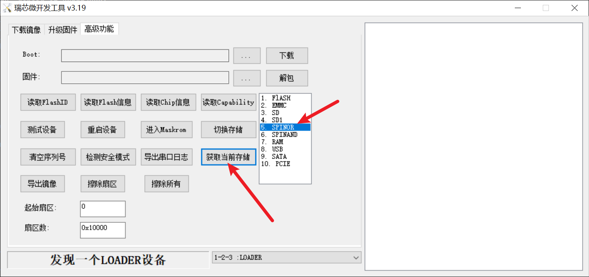

4. 获取当前存储，显示为SPINOR。

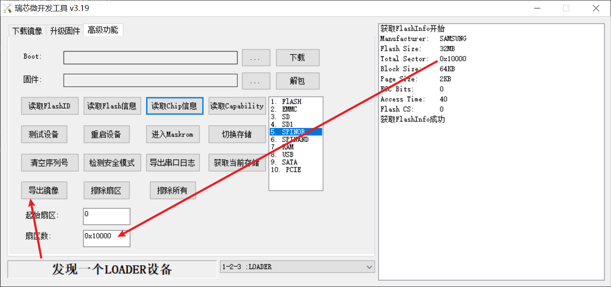

5. 点击读取Flash信息，填写扇区数，默认起始扇区是0

6. 点击导出镜像即可

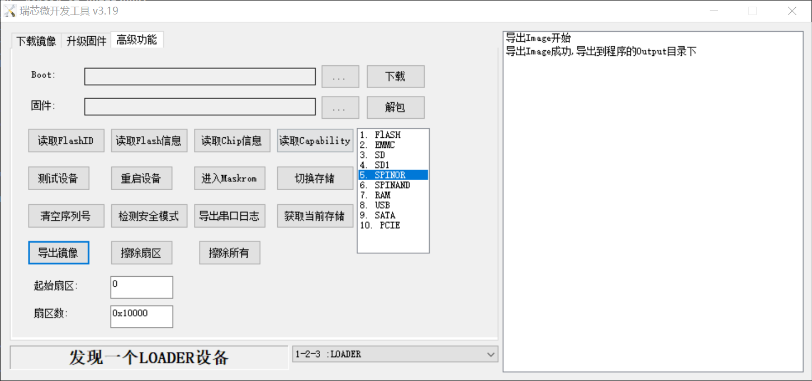

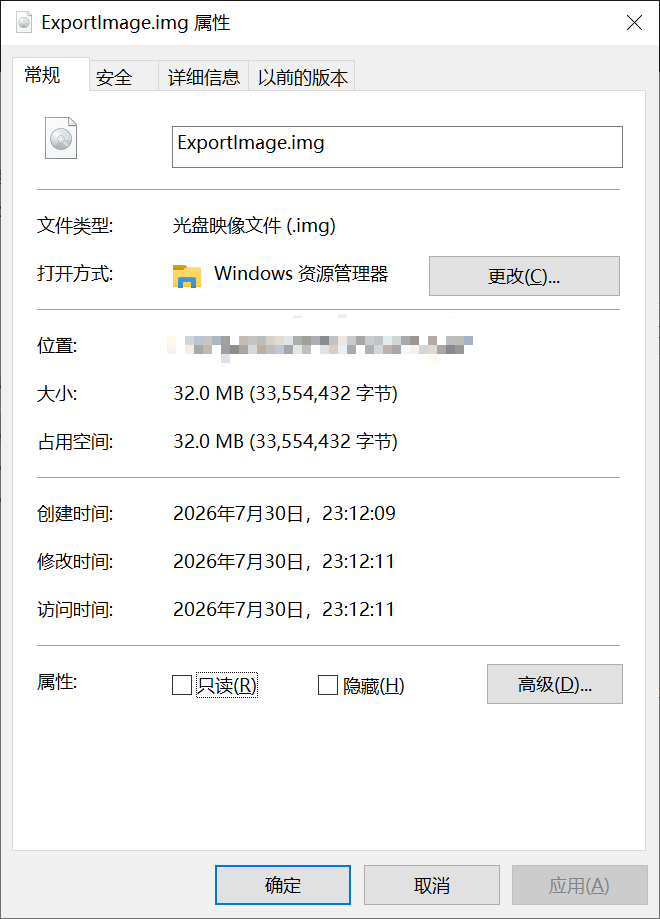


## SPI Nor Flash烧写流程

* SPI只有32MB
* 刷机包请在仓库release中获取

步骤：
1. 断电
2. 按住recovery按键，保持不动
3. 上电，稍等一会儿，进入loader模式后松开recovery按键
4. 打开瑞星微开发工具，点击“执行”即可


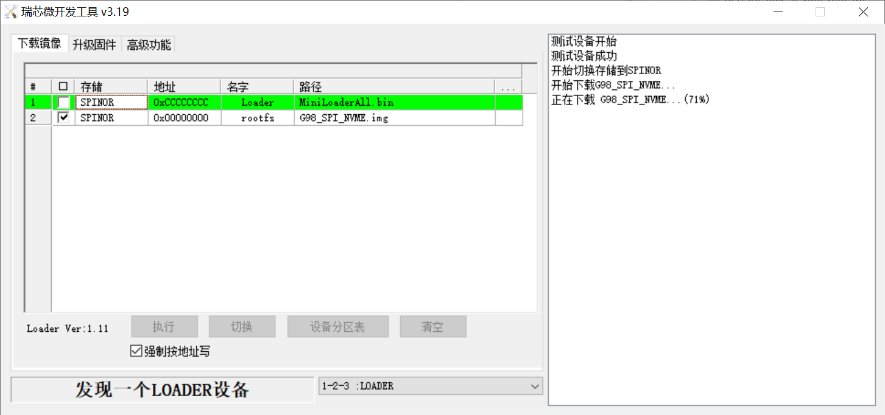

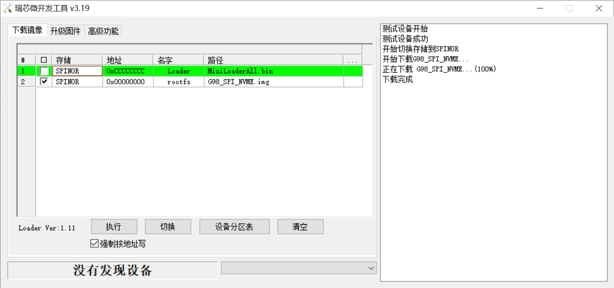

* SPI烧写速度较慢，请耐心等待。32MB预计3-5分钟。

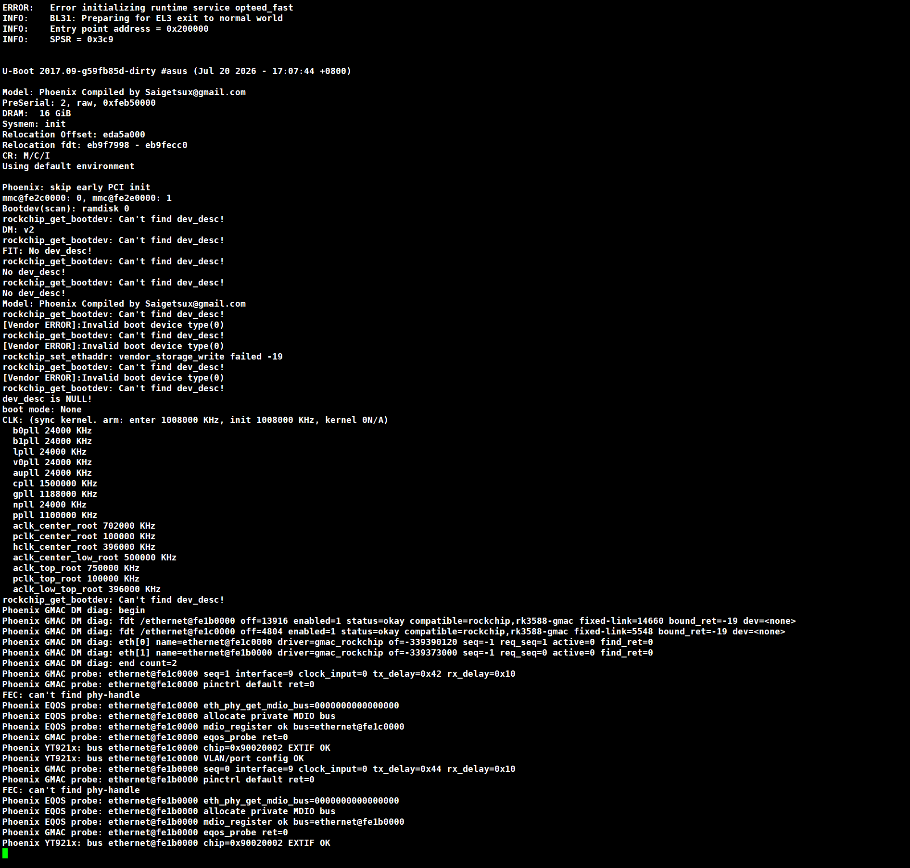

5. 刷机完成，默认重启系统


