# SPI recovery固件刷写

本项目是 **BDY_G98 (RK3588)** 开发板的 U-Boot 引导加载程序适配仓库，基于 Rockchip Linux 官方 U-Boot 进行定制开发。

## 📜 免责声明

**本仓库所提供的内容均基于公开、合法渠道整理，仅供用户参考与学习之用。**

* 严格遵守国家相关法律法规，尊重并保护个人隐私及知识产权。
* 如您认为相关内容涉及您的隐私、版权或其他合法权益，请及时联系，将依法核实并在必要时予以删除或下架。
* 对于因使用或无法使用本网站/平台内容所引发的任何直接或间接损失，不承担任何法律责任。
* 用户在使用过程中应自行判断信息的适用性，并承担相应风险。


## 🚀 默认启动顺序

```
USB → NVMe → SATA(SCSI)
```

对每个存储设备依次执行以下搜索流程，任一命中即启动；未命中则自动回退至下一设备。**全部失败后进入Loader模式**。

## 🐛 问题反馈

如在适配或使用过程中发现缺陷，请通过 [Issues](https://github.com/yifengyou/BDY_G98_RK3588/issues) 提交详细的问题描述与日志，感谢您的贡献！

## 💾 刷机指引

* 若熟悉瑞星微刷机流程，可使用 spi_full_disk.img 全盘恢复（SPI 32MB）。 支持从0x00000000地址刷写，请自行配置miniloader、自行配置分区表、自行获取瑞芯微开发工具v3.37。
  
* 若不了解刷机流程，请参看下面操作步骤

### 不死Uboot刷写指引

#### 1. 获取uboot镜像和刷机工具

请下载最新发布的 U-Boot 固件包并解压至本地目录（建议路径不含中文或空格）：
> 🔗 [G98-Recovery_ONLY-SPI.zip](https://github.com/yifengyou/BDY_G98_RK3588/releases/download/spi_recovery/G98-Recovery_ONLY-SPI.zip)

#### 2. UBOOT刷机流程

1. **启动工具**：运行解压目录中的 `RKDevTool.exe`。

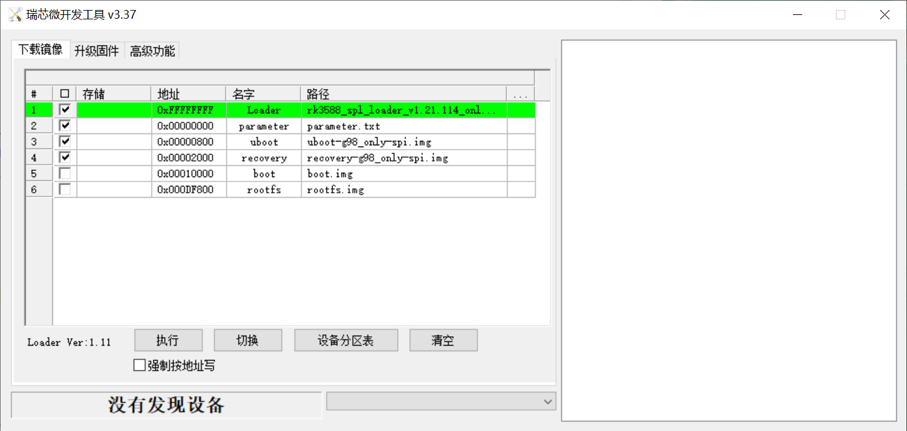


2. **短接进入MASKROM模式**：


拆下主板，断电状态下，用镊子短接图上标记的 GND 和 CLK两处。保持不动，上电后，可见RKdevTool显示为 "发现一个MASKROM设备"，说明成功进入MASKROM模式。

**进入MASKROM模式后可以松开短接，不需要一直保持短接状态。**

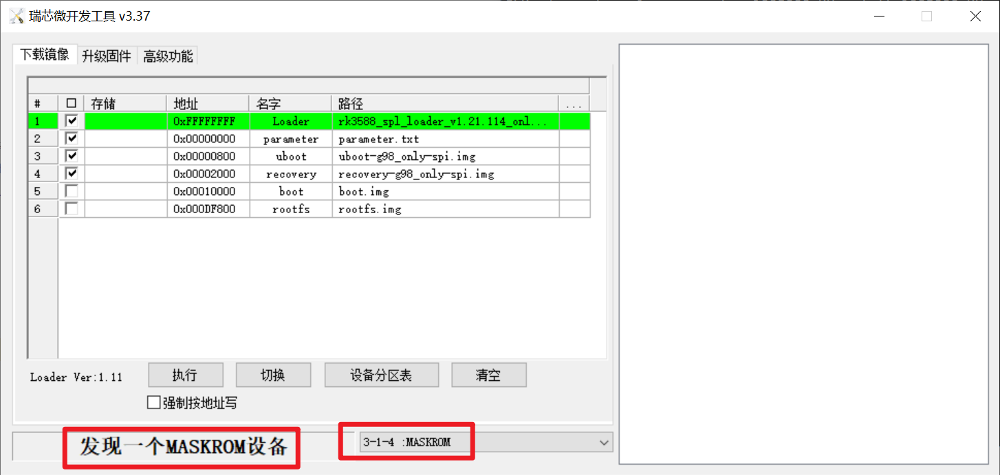


3. 点击执行

点击执行，开始刷写，稍等几分钟待烧写完成。（大约3-5分钟）

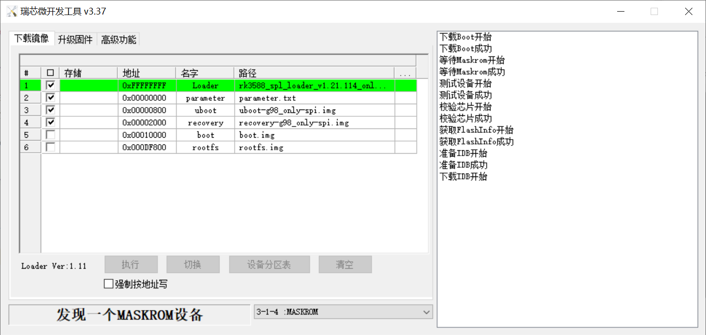

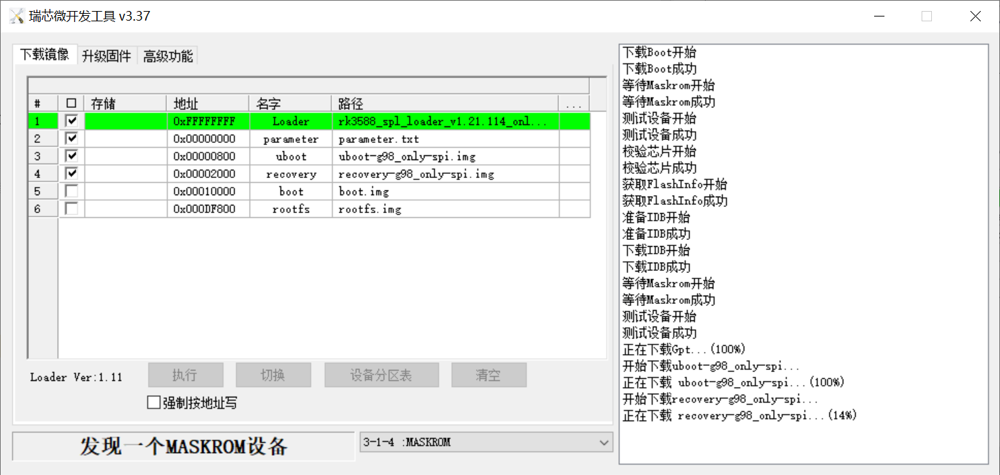

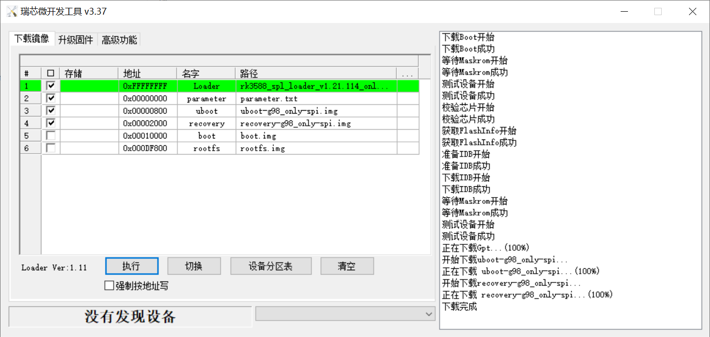

显示"下载完成", 说明烧写成功


### 系统刷写指引

1. 断开G98主板电源

2. 按住reset按键

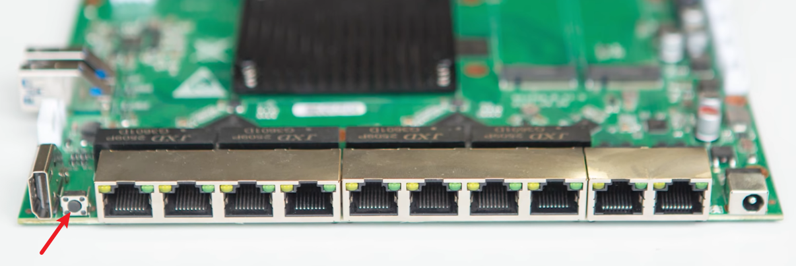


3. 接通电源，按键保持5-10s后松开

4. 插上网线

根据你的网络环境选择不同网口

* 如果你是接到路由器或交换机等局域网中，请接到WAN口
* 若孤岛环境（电脑与G98通过网线直连），请接到LAN口。G98会给电脑分配一个192.168.1.0/24网段的ip（网关是192.168.1.1）

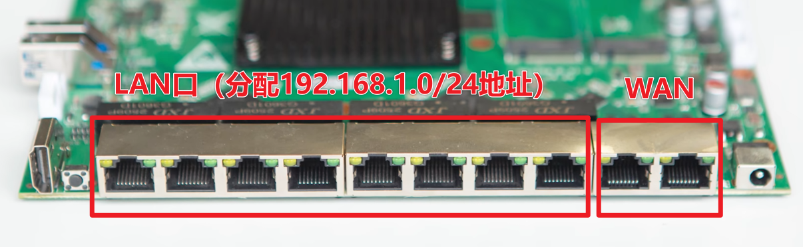

5. 浏览器打开网页

* 如果在4步骤接入的是LAN口，那么浏览器打开地址是<http://192.168.1.1>
* 如果在4步骤接入的是LAN口，那么在路由器上查看ip后，打开对应地址即可

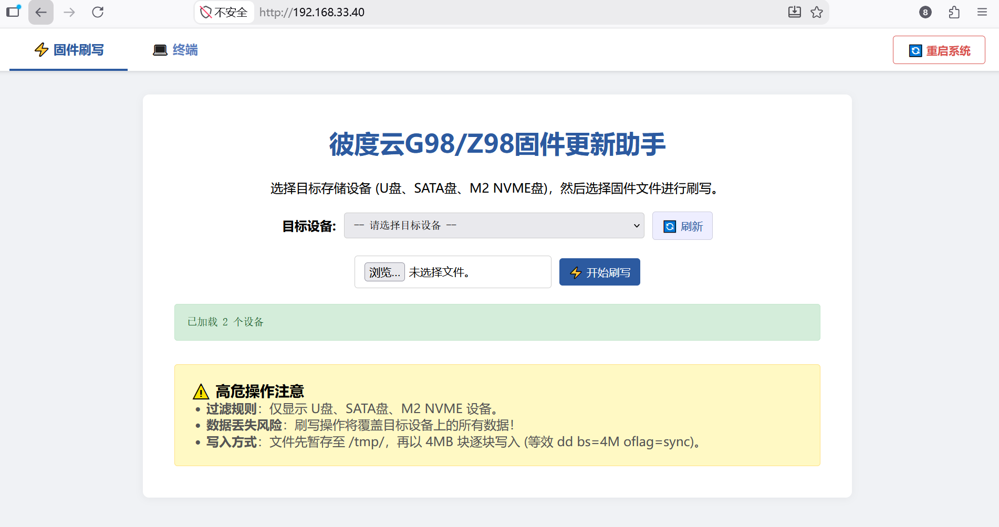


6. 下载固件

请访问 [固件列表](https://github.com/yifengyou/BDY_G98_RK3588/blob/master/docs/%E5%9B%BA%E4%BB%B6%E5%88%97%E8%A1%A8.md)

7. 选择目标存储

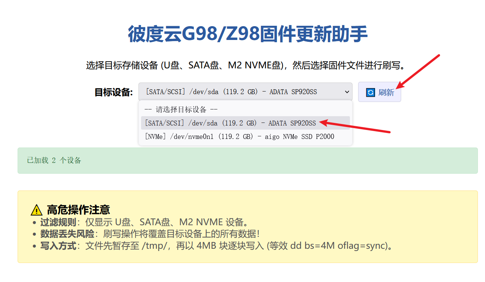


8. 选择固件文件

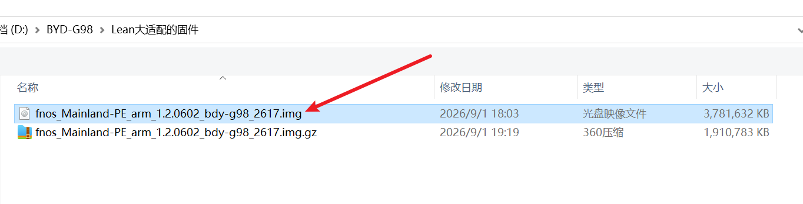

9. 点击“开始刷写”

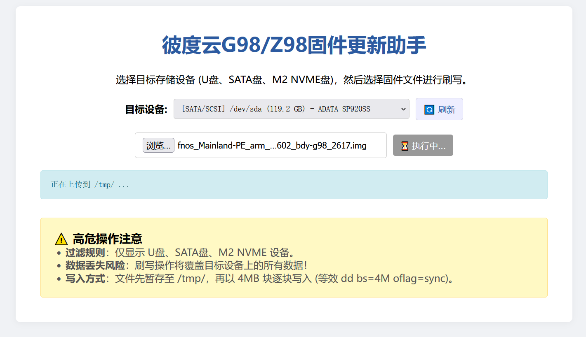

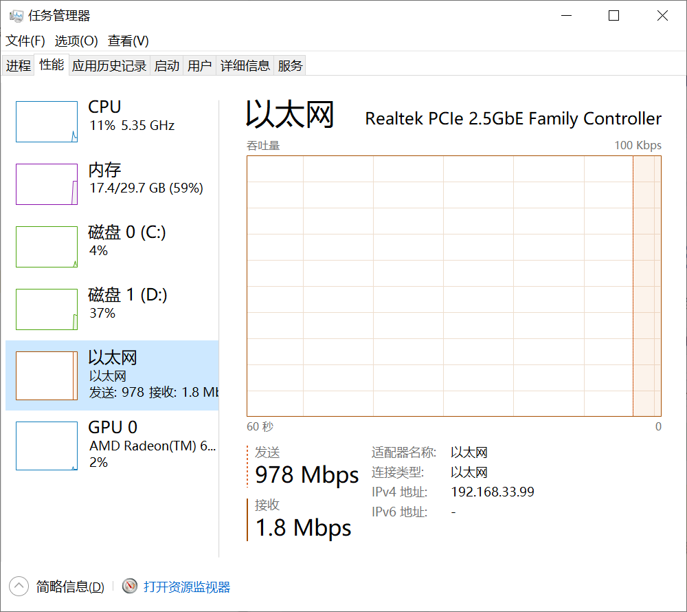

正常网络状态下会跑满网络带宽

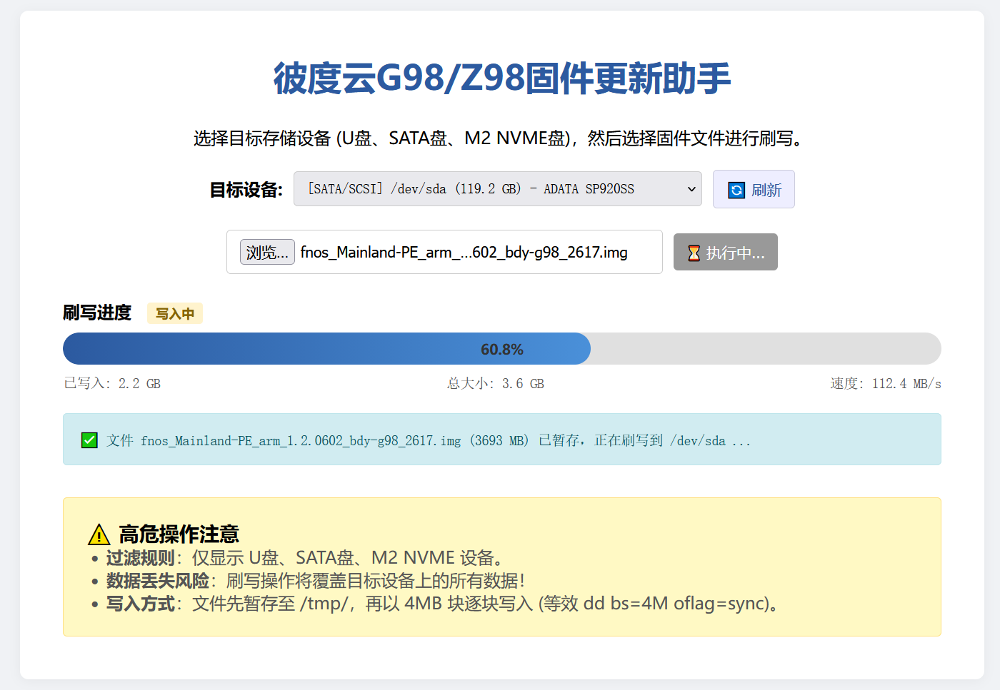

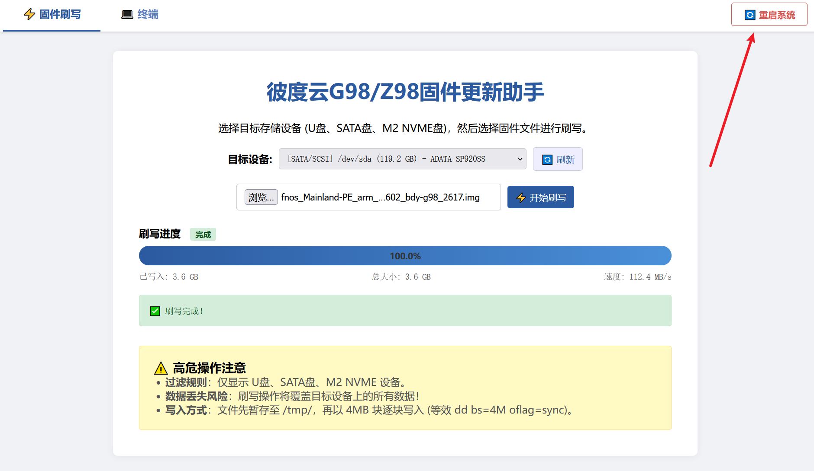

10. 烧写完成，重启系统

enjoy~


---

### 🚨 安全警告与故障处理

- **严禁断电断连**：烧录过程中**绝对不要**断开 USB 连接或切断电源，否则极大概率导致砖机，需短接 MASKROM 点位才能修复。
- **失败重试**：如烧录中途报错或失败，请重新让设备进入 Maskrom 模式后再次尝试。
- **备份意识**：若设备内原有重要数据，请在烧录前确认已做好备份。


