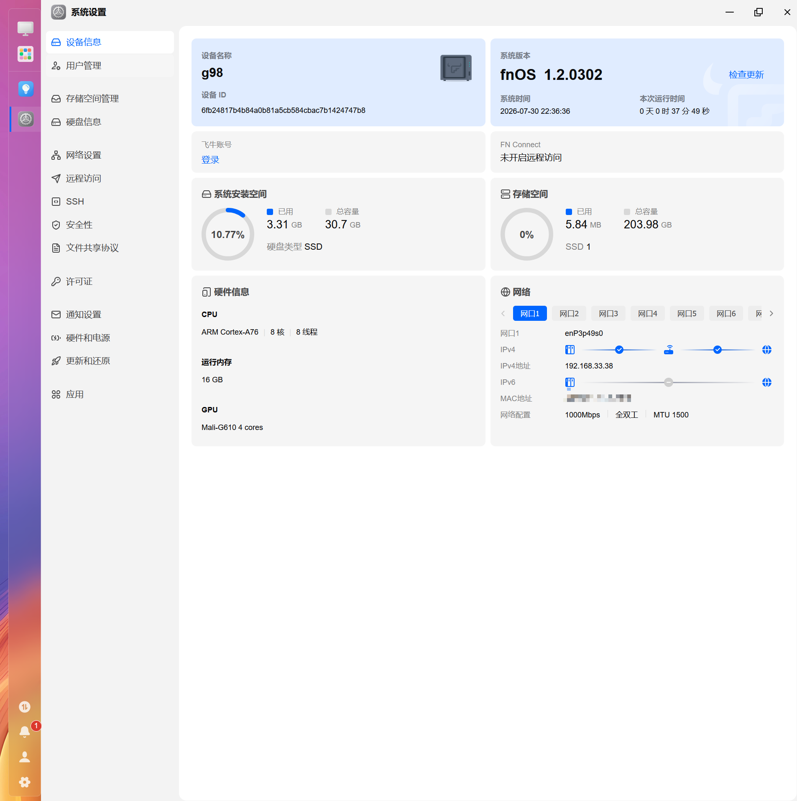
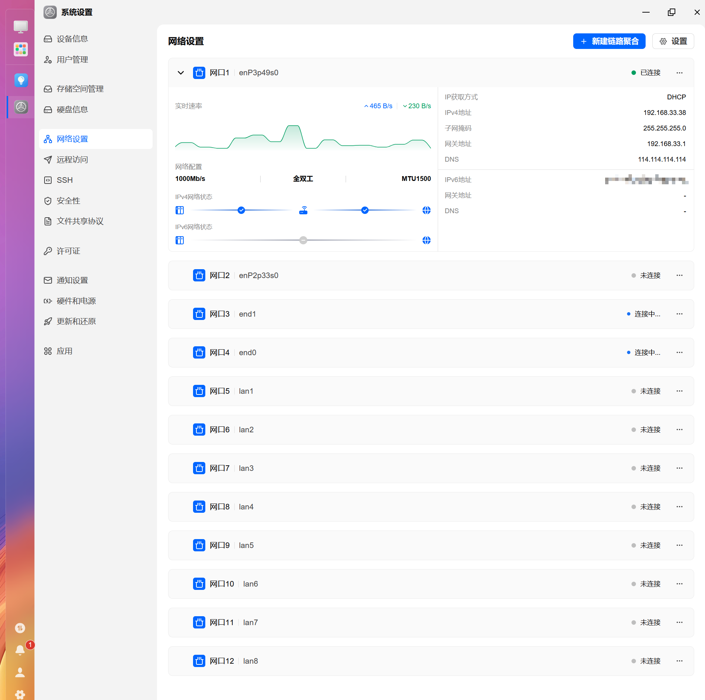
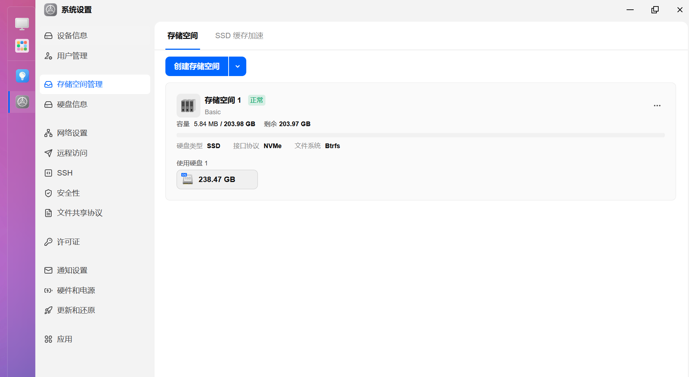
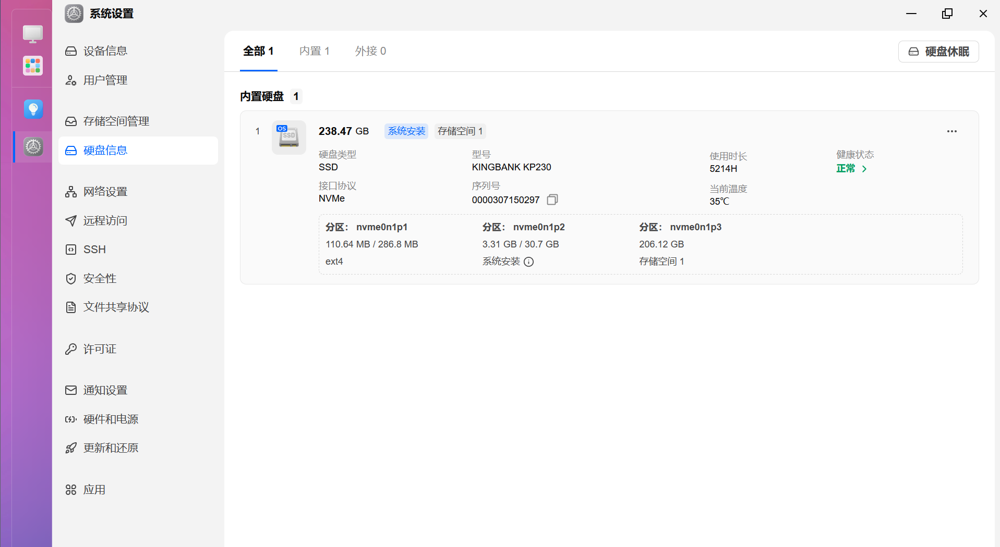
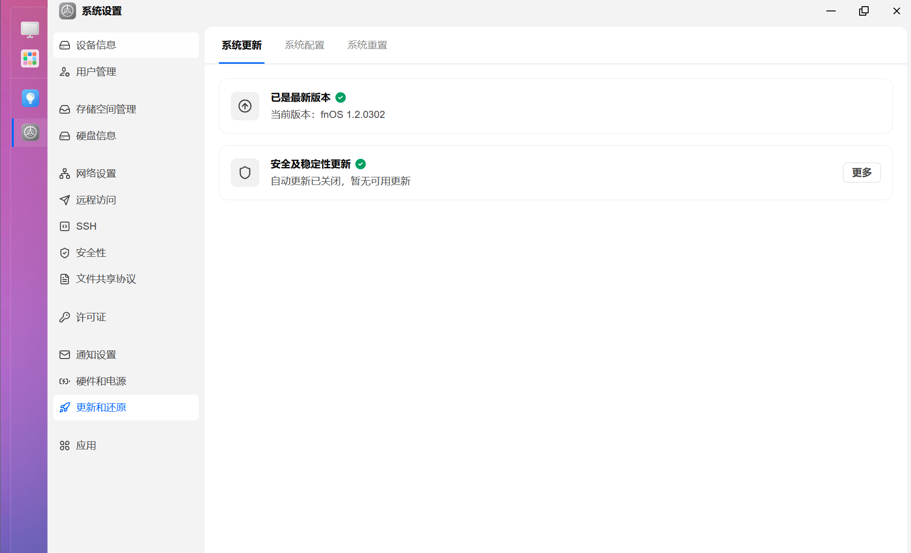

# 飞牛fnos












* 支持系统更新


* app正常可安装


* 内核版本

```shell
root@g98:/# cat /proc/cmdline 
root=PARTUUID=be7afb3b-7a89-9d4e-a6b4-93afac2013ff rootwait rw rootfstype=btrfs bdy_bootif=nvme bdy_bootdev=0 bdy_bootpart=1 console=ttyS2,1500000 console=tty1 earlycon=uart8250,mmio32,0xfeb50000 splash=verbose consoleblank=0 loglevel=7 cma=256M cgroup_enable=cpuset cgroup_memory=1 cgroup_enable=memory panic=30 modprobe.blacklist=yt921x,tag_yt921x
root@g98:/# uname -a
Linux g98 6.18.18.c951-trim #951 SMP Mon Jul 20 03:47:21 UTC 2026 aarch64 GNU/Linux
```

---