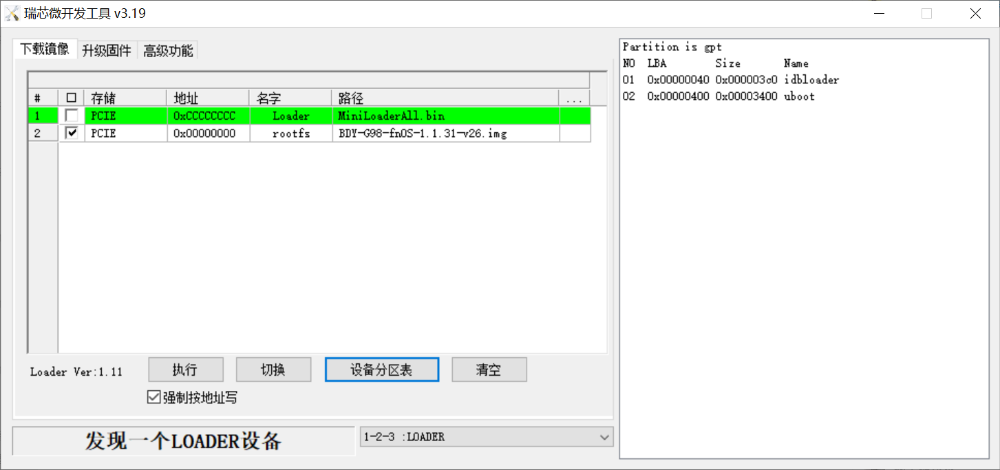

# SPI


```shell
# binwalk G98_SPI_NVME.img 

DECIMAL       HEXADECIMAL     DESCRIPTION
--------------------------------------------------------------------------------
255720        0x3E6E8         CRC32 polynomial table, little endian
330392        0x50A98         Flattened device tree, size: 5446 bytes, version: 17
524288        0x80000         Flattened device tree, size: 1975 bytes, version: 17
1320588       0x14268C        CRC32 polynomial table, little endian
1378792       0x1509E8        Android bootimg, kernel size: 1919249152 bytes, kernel addr: 0x5F6C656E, ramdisk size: 1919181921 bytes, ramdisk addr: 0x5700635F, product name: ""
1895936       0x1CEE00        Flattened device tree, size: 17558 bytes, version: 17

```




