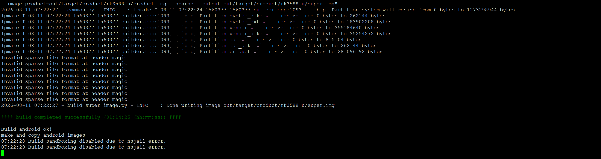

# android14

## 编译环境

```text
注意事项：
1. SDK 采用交叉编译，所以要在 X86_64 电脑上使用 SDK，不要将 SDK 下载到板子上。
2. 编译环境请使用 Ubuntu20.04/Ubuntu22.04（真机或 docker 容器），如果使用其他版本可能导致编译出错。
3. 不要在虚拟机共享文件夹以及非英文目录存放、解压SDK。
4. 获取、编译 SDK 请全程使用普通用户，不允许也不需要使用 root 权限（除非需要 apt 安装软件）
```

建议在docker容器（ubuntu 22.04）中编译

```
sudo apt-get update
sudo apt-get install -y git gnupg flex bison gperf libsdl1.2-dev \
libesd-java  squashfs-tools build-essential zip curl \
libncurses5-dev zlib1g-dev pngcrush schedtool libxml2 libxml2-utils \
xsltproc lzop libc6-dev schedtool g++-multilib lib32z1-dev \
lib32readline-dev gcc-multilib libswitch-perl libssl-dev unzip zip device-tree-compiler \
liblz4-tool python3-pyelftools
```

## 硬件要求

编译 Android 对机器的配置要求较高：

```text
64 位 CPU
Android13源码编译需要的内存比较大，我们实测Android14内存需要至少32G，推荐使用64G的内存
250GB 空闲的磁盘空间
```

## 编译

```shell
source build/envsetup.sh
lunch rk3588_u-userdebug
./build.sh -UKAu
```



```text
------ PACKAGE ------
Add file: ./package-file
package-file,Add file: ./package-file done,offset=0x800,size=0x29a,userspace=0x1
Add file: ./Image/MiniLoaderAll.bin
bootloader,Add file: ./Image/MiniLoaderAll.bin done,offset=0x1000,size=0x771c0,userspace=0xef
Add file: ./Image/parameter.txt
parameter,Add file: ./Image/parameter.txt done,offset=0x78800,size=0x29d,userspace=0x1,flash_address=0x00000000
Add file: ./Image/uboot.img
uboot,Add file: ./Image/uboot.img done,offset=0x79000,size=0x400000,userspace=0x800,flash_address=0x00004000
Add file: ./Image/misc.img
misc,Add file: ./Image/misc.img done,offset=0x479000,size=0xc000,userspace=0x18,flash_address=0x00008000
Add file: ./Image/dtbo.img
dtbo,Add file: ./Image/dtbo.img done,offset=0x485000,size=0x400000,userspace=0x800,flash_address=0x0000a000
Add file: ./Image/vbmeta.img
vbmeta,Add file: ./Image/vbmeta.img done,offset=0x885000,size=0x1000,userspace=0x2,flash_address=0x0000c000
Add file: ./Image/boot.img
boot,Add file: ./Image/boot.img done,offset=0x886000,size=0x271d800,userspace=0x4e3b,flash_address=0x0000c800
Add file: ./Image/recovery.img
recovery,Add file: ./Image/recovery.img done,offset=0x2fa3800,size=0x5436000,userspace=0xa86c,flash_address=0x0002c800
Add file: ./Image/baseparameter.img
baseparameter,Add file: ./Image/baseparameter.img done,offset=0x83d9800,size=0x100000,userspace=0x200,flash_address=0x0020cc00
Add file: ./Image/super.img
super,Add file: ./Image/super.img done,offset=0x84d9800,size=0x7e4ffc80,userspace=0xfca00,flash_address=0x0020d400
Add CRC...
Make firmware OK!
------ OK ------
********rkImageMaker ver 2.23********
Generating new image, please wait...
Writing head info...
Writing boot file...
Writing firmware...
Generating MD5 data...
MD5 data generated successfully!
New image generated successfully!
Making update.img  OK.
Make update image ok!

```

## 问题解决

### libgpiod 报config.h缺失

```c
vendor/rockchip/common/platform_external_libgpiod/src/lib/misc.c:11:10: fatal error: 'config.h' file not found
#include "config.h"
         ^~~~~~~~~~
1 error generated.
05:48:26 ninja failed with: exit status 1

#### failed to build some targets (05:20 (mm:ss)) ####

Build android failed!
+ echo 'All done! [1]'
All done! [1]
+ exit 0
```

临时手动生成config.h

```c
/* Auto-generated stub for Android build */
#ifndef _CONFIG_H_STUB
#define _CONFIG_H_STUB

/* 根据 configure.ac 中的实际版本号填写 */
#define GPIOD_VERSION_STR "1.6.4"
#define PACKAGE_VERSION   "1.6.4"
#define PACKAGE_STRING    "libgpiod 1.6.4"
#define PACKAGE_NAME      "libgpiod"
#define PACKAGE_TARNAME   "libgpiod"
#define PACKAGE_BUGREPORT ""
#define PACKAGE_URL       ""

#endif
```

## sandboxing disabled due to nsjail error

```text
+ unset abs_var_cache_ANDROID_CLANG_PREBUILTS
+ unset cached_abs_vars
+ [[ -n '' ]]
+ ./build.sh -UKu
07:23:01 Build sandboxing disabled due to nsjail error.
07:23:02 Build sandboxing disabled due to nsjail error.
07:23:03 Build sandboxing disabled due to nsjail error.
will build u-boot
will build kernel
will build update.img
07:23:03 Build sandboxing disabled due to nsjail error.
07:23:04 Build sandboxing disabled due to nsjail error.
07:23:05 Build sandboxing disabled due to nsjail error.
07:23:06 Build sandboxing disabled due to nsjail error.
07:23:07 Build sandboxing disabled due to nsjail error.
```

---