# BDY_G98_RK3588 uboot源码仓

本项目是 **BDY_G98 (RK3588)** 开发板的 U-Boot 引导加载程序适配仓库，基于 Rockchip Linux 官方 U-Boot 进行定制开发。

**仅支持不带EMMC的G98设备，使用默认的32M SPI Nor Flash刷写uboot即可**

## 📦 源码基线

- **上游来源**: [rockchip-linux/u-boot](https://github.com/rockchip-linux/u-boot.git)
- **分支**: `next-dev`

## ✨ 适配进展与特性

针对 BDY_G98 硬件平台，已完成以下外设及启动功能的适配：

🚨 **注意**：仅支持有SPI Nor Flash，没有EMMC的设备

| 模块 | 状态 | 说明 |
| :--- | :---: | :--- |
| **SATA / SCSI** | ✅ | 可正常识别 SATA/SCSI 存储设备并引导 |
| **NVMe** | ✅ | 双 M.2 NVMe 插槽均可识别并引导 |
| **USB 3.0** | ✅ | 两个 USB 3.0 端口均工作正常 |
| **eMMC** | ❌ |不识别、不支持、默认禁用 |
| **启动配置** | ✅ | 自动扫描 `extlinux.conf` 与 `boot.scr`（Distro Boot） |
| **存储后端切换** | ✅ | 支持 NVMe / SATA / SPI Flash 后端存储切换 |
| **常用命令** | ✅ | 支持 `rbrom`、`sf`、`scsi`、`nvme`、`mmc` 等调试命令 |
| **2.5G 网口** | ❌ | RTL8125 暂不支持，网络功能不可用 |
| **千兆网口** | ❌ | YT9215 驱动未适配，网络功能不可用 |

* 🚨 **注意**：暂不支持EMMC，没有测试条件。不支持EMMC，默认禁用。
* 🚨 **注意**：当前版本 **不支持任何有线网络**，无法使用 TFTP/NFS 启动或 U-Boot 网络命令。如需网络功能，请等待后续驱动适配。

## 🚀 默认启动顺序

```
USB → NVMe → SATA(SCSI)
```

对每个存储设备依次执行以下搜索流程，任一命中即启动；未命中则自动回退至下一设备。**全部失败后进入Loader模式**。

### 搜索策略

| 优先级 | 配置文件 | 搜索路径 |
| :---: | :--- | :--- |
| 1 | `extlinux.conf` | `/boot/extlinux/extlinux.conf` → `/extlinux/extlinux.conf` → `/extlinux.conf` |
| 2 | `boot.scr` | `/boot/boot.scr` → `/boot.scr` |

- **分区范围**：仅搜索设备的 **分区 1** 和 **分区 2**
- **设备遍历**：每类设备尝试 `devnum 0` 和 `devnum 1`
- **匹配逻辑**：先 extlinux 后 boot.scr；extlinux 使用 `sysboot` 解析，boot.scr 使用 `source` 执行

## 适配信息

| 项目 | 版本 / 来源 |
| :--- | :--- |
| U-Boot 基线 | [rockchip-linux/u-boot](https://github.com/rockchip-linux/u-boot) 2017.09 |
| 烧录工具 | RKDevTool Release v3.37 |
| 二进制固件 | Rockchip SDK 6.1 rkbin |

## 🐛 问题反馈

如在适配或使用过程中发现缺陷，请通过 [Issues](../../issues) 提交详细的问题描述与日志，感谢您的贡献！

## 📜 免责声明

**本仓库所提供的内容均基于公开、合法渠道整理，仅供用户参考与学习之用。**

* 严格遵守国家相关法律法规，尊重并保护个人隐私及知识产权。
* 如您认为相关内容涉及您的隐私、版权或其他合法权益，请及时联系，将依法核实并在必要时予以删除或下架。
* 对于因使用或无法使用本网站/平台内容所引发的任何直接或间接损失，不承担任何法律责任。
* 用户在使用过程中应自行判断信息的适用性，并承担相应风险。

## 💾 刷机指引

* 若熟悉瑞星微刷机流程，可使用 SPI_Full_Disk.img 全盘恢复（SPI 32MB）。 支持从0x00000000地址刷写。
* 若不了解刷机流程，请参看下面操作步骤

### A. 将UBOOT镜像输入SPI

#### 1. 获取uboot镜像和刷机工具

请下载最新发布的 U-Boot 固件包并解压至本地目录（建议路径不含中文或空格）：
> 🔗 [BDY_G98_RK3588-uboot Releases](https://github.com/yifengyou/BDY_G98_RK3588-uboot/releases/download/bdy-g98-uboot/BYD_G98_UBOOT.zip)

#### 2. UBOOT刷机流程

1. **启动工具**：运行解压目录中的 `RKDevTool.exe`。

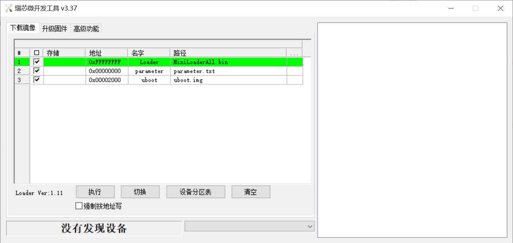

2. **短接进入MASKROM模式**：

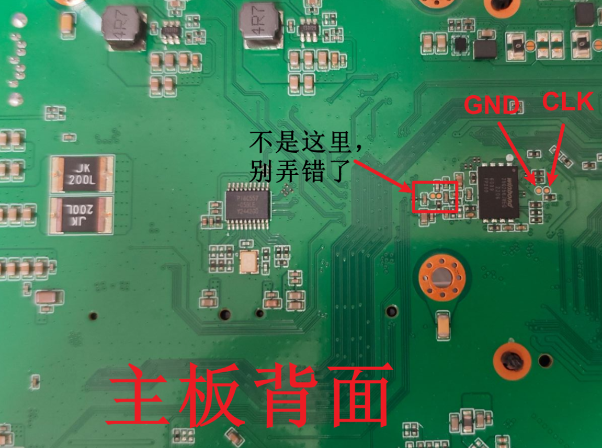

拆下主板，断电状态下，用镊子短接图上标记的 GND 和 CLK两处。保持不动，上电后，可见RKdevTool显示为 "发现一个MASKROM设备"，说明成功进入MASKROM模式。

**进入MASKROM模式后可以松开短接，不需要一直保持短接状态。**

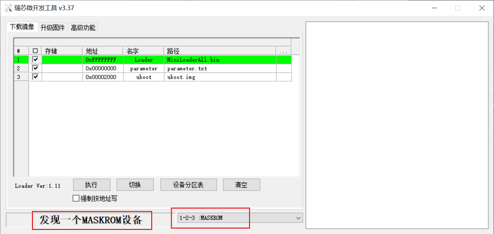

3. 刷MiniLoaderAll

点击 **「高级功能」→「Boot 选择MiniLoaderAll.bin」→「点击下载」**

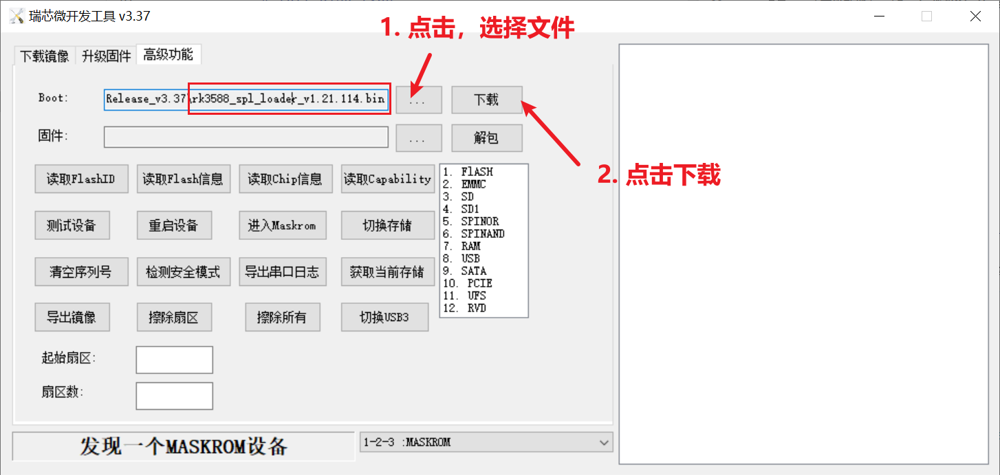

正常情况下，右侧日志显示"下载成功"

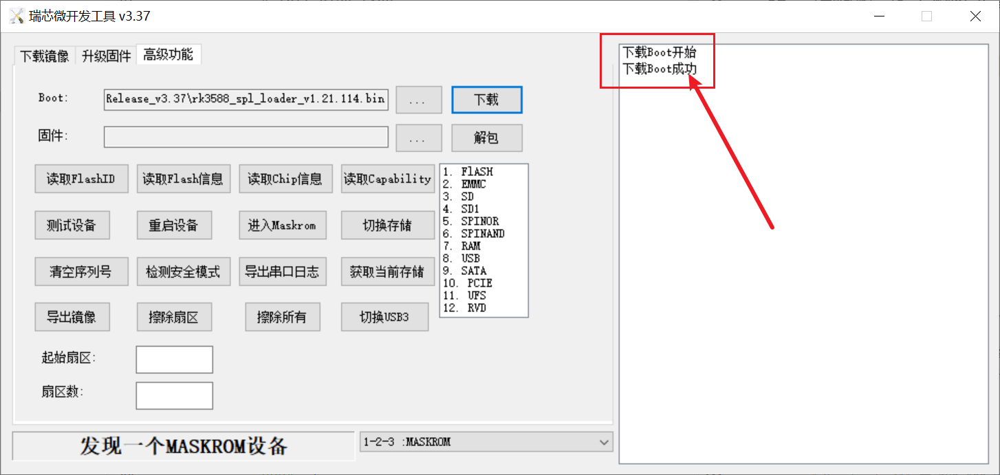

4. （可选步骤）确认当前选择的是SPI NOR FLASH

点击 获取当前存储，显示为 SPINOR，则正常

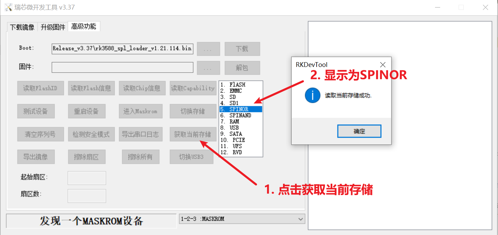

5. 刷写Uboot

切换到下载镜像，点击下载即可

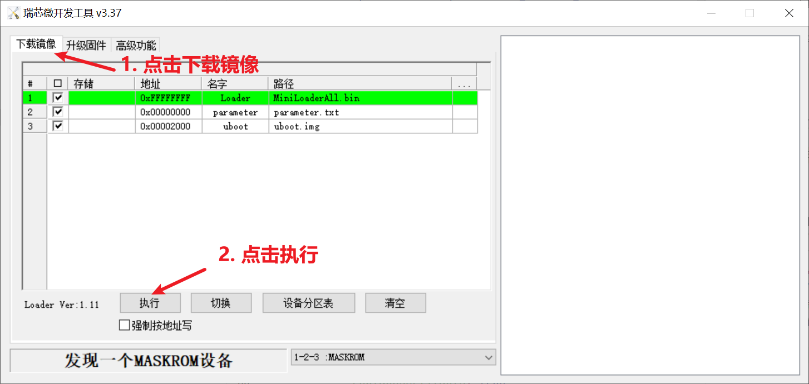

右侧正常日志输出：

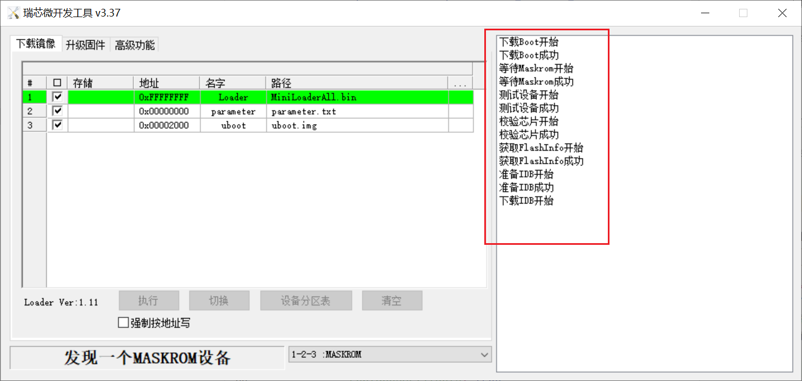

右侧正常日志输出：

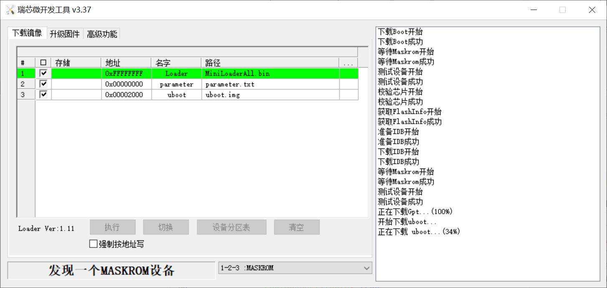

刷机完成，右侧日志显示 ”下载完成“

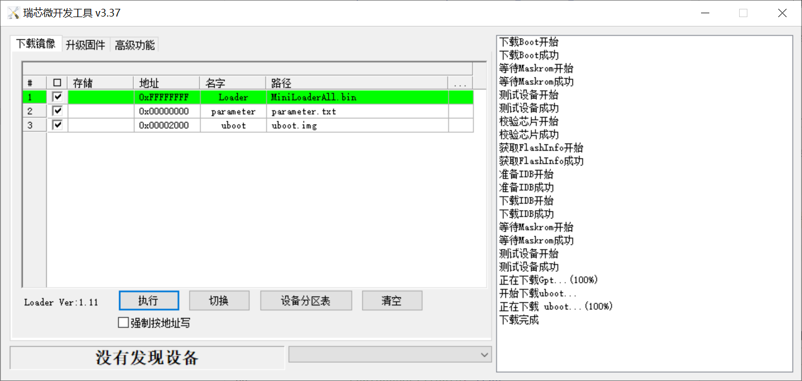

下载完成后系统默认重启。

### B. 刷系统到NVME或SATA

**在刷写A步骤的Uboot后操作，其他Uboot不一定适用当前步骤**

1. 进入Loader模式

断电状态下，按住recovery按键 （板子上就一个按键，HDMI接口旁边），上电。默认会进入loader模式。

**进入loader模式后，可松开recovery按键，不需要长按**

2. 切换到PCIE（NVME） 或 SATA

* 若是烧写系统到**NVME盘**， 则 点击 **「高级功能」→「选择PCIE」→「点击切换存储」**
* 若是烧写系统到**SATA盘**， 则 点击 **「高级功能」→「选择SATA」→「点击切换存储」**

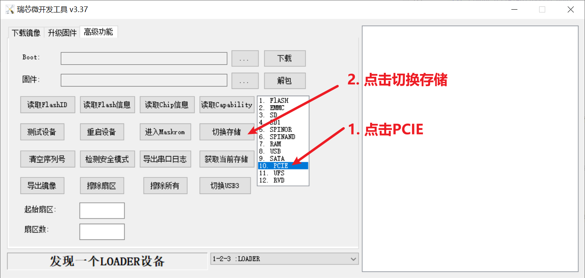

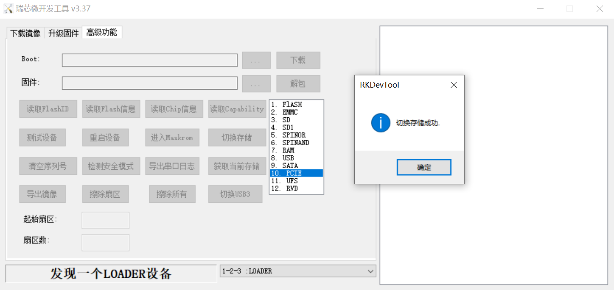

此时读取存储，未报错，标记还是PCIE，则正常

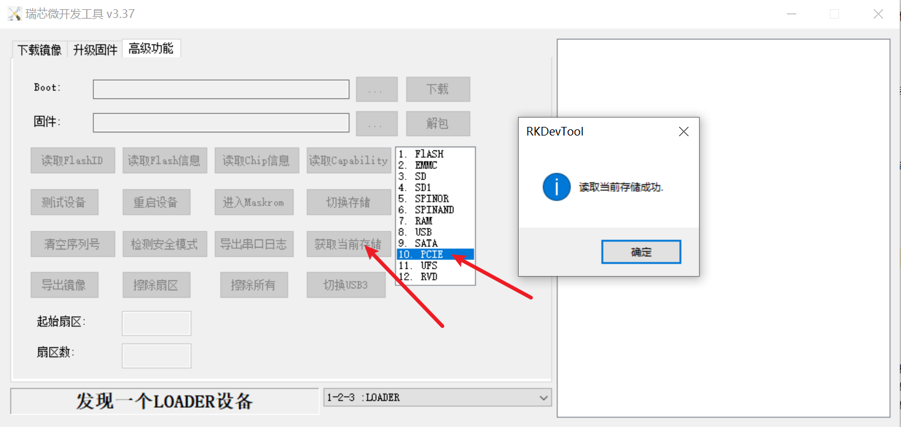

3. 刷系统到NVME 或 SATA

切换到下载镜像，选择所需的镜像。

以Armbian Ubuntu24.04为例：

下载地址<https://github.com/yifengyou/BDY_G98_RK3588/releases/download/ophub_6.18.y_image/BDY_G98_6.18.y_armbian_noble_xfce_aarch64.rar>

下载后解压，打开解压目录下的 RKDevTool.exe

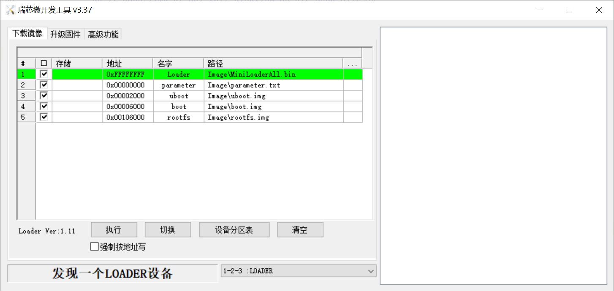

Loader模式下，点击执行即可。

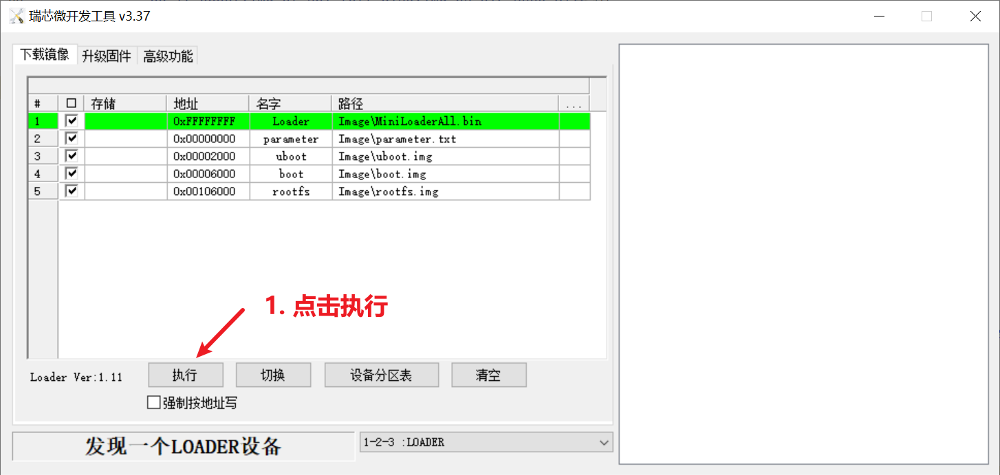


---

### 🚨 安全警告与故障处理

- **严禁断电断连**：烧录过程中**绝对不要**断开 USB 连接或切断电源，否则极大概率导致砖机，需短接 MASKROM 点位才能修复。
- **失败重试**：如烧录中途报错或失败，请重新让设备进入 Maskrom 模式后再次尝试。
- **备份意识**：若设备内原有重要数据，请在烧录前确认已做好备份。


