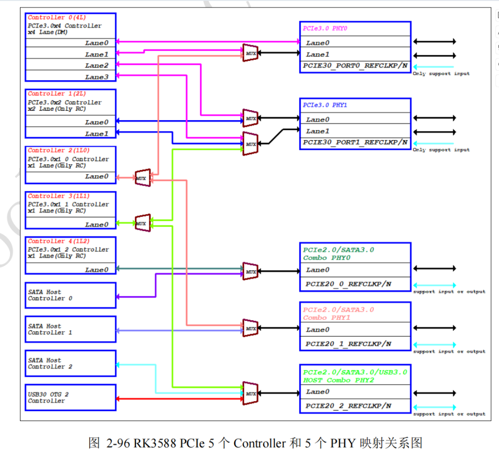

# pcie nvme

## 物理连接

aigo是靠近cpu的NVME槽位，另一个则是靠近sata口的槽位

| NVMe 设备 | Linux 平台设备名 | DTS 节点 (物理基地址) | APB 寄存器地址 | PCIe Config/MMIO 空间 |
| :--- | :--- | :--- | :--- | :--- |
| nvme0n1 (aigo) | `a40000000.pcie` | `pcie@fe150000` | `0xfe150000` | Config: `0xf0000000` / MMIO: `0x900000000` |
| nvme1n1 (KINGBANK) | `a40400000.pcie` | `pcie@fe160000` | `0xfe160000` | Config: `0xf1000000` / MMIO: `0x940000000` |

## controller与phy的分配情况



```txt
RK3588 原生支持极其灵活的 PCIe 架构：

    5个控制器 (Controllers)：
        Controller 0 (4L): PCIe 3.0 x4 (Endpoint/Root Complex)
        Controller 1 (2L): PCIe 3.0 x2 (仅 Root Complex)
        Controller 2 (1L0): PCIe 3.0 x1_0 (仅 Root Complex)
        Controller 3 (1L1): PCIe 3.0 x1_1 (仅 Root Complex)
        Controller 4 (1L2): PCIe 3.0 x1_2 (仅 Root Complex)
    5个 PHY：
        PCIe3.0 PHY0 (2 Lanes)
        PCIe3.0 PHY1 (2 Lanes)
        Combo PHY0 (PCIe2.0 / SATA3.0)
        Combo PHY1 (PCIe2.0 / SATA3.0)
        Combo PHY2 (PCIe2.0 / SATA3.0 / USB3.0)
```

设备树中实际启用了 **2个 PCIe 节点**，它们都指向了同一个 PCIe 3.0 PHY (`phys = <&pcie30phy>`)，即图中的 **PCIe3.0 PHY0 + PHY1** 组合。

*  **节点 A: `pcie3x4` (对应图中的 Controller 0)**
    *   **DTS 配置:** `num-lanes = <2>;`，`max-link-speed = <3>;`
    *   **硬件映射分析:**
        *   虽然硬件上 Controller 0 是 4 Lane 的，但设备树将其限制为了 **2 Lane (x2)**。
        *   它使用了 `pcie30phy`。根据图中连线，Controller 0 的 Lane0/Lane1 可以通过 MUX 连接到 PCIe3.0 PHY0。
        *   **结论:** 这里把原本可以跑 x4 的 Controller 0，**拆分/降级** 成了 x2 模式使用。

*  **节点 B: `pcie3x2` (对应图中的 Controller 1)**
    *   **DTS 配置:** `num-lanes = <2>;`，`max-link-speed = <3>;`
    *   **硬件映射分析:**
        *   这是原生的 2 Lane 控制器。
        *   它也使用了 `pcie30phy`。根据图中连线，Controller 1 的 Lane0/Lane1 通过 MUX 连接到了 PCIe3.0 PHY1。
        *   **结论:** 这是一个标准的 PCIe 3.0 x2 通道。

## uboot中的pcie命令

```shell
pcie@fe160000: PCIe Linking... LTSSM is 0x0
pcie@fe160000: PCIe Linking... LTSSM is 0x0
pcie@fe160000: PCIe Linking... LTSSM is 0x0
pcie@fe160000: PCIe-2 Link Fail
=> pci write.w 1.0.0 0x04 0x0000
=> pci write.w 0.0.0 0x04 0x0000
=> pci write.w 0.0.0 0x1a 0x0101
=> pci write.l 0.0.0 0x20 0xf02ff020
=> pci write.l 0.0.0 0x24 0xf02ff020
=> pci write.l 0.0.0 0x28 0x00000000
=> pci write.l 0.0.0 0x2c 0x00000000
=> pci write.w 0.0.0 0x04 0x0007
=> pci write.l 1.0.0 0x10 0xf0200000
=> pci write.l 1.0.0 0x14 0x00000000
=> pci write.w 1.0.0 0x04 0x0006
=> md 0xf0200000 4
f0200000: ff0103ff 00200030 00010400 00000000    ....0. .........
=> nvme scan
try to probe
=> nvme info
Device 0: Vendor: 0x1e4b Rev: SN10660 Prod: 0000307150297
            Type: Hard Disk
            Capacity: 244198.3 MB = 238.4 GB (500118192 x 512)
```


#### Type 0 Header (Endpoint, 如 NVMe SSD 1.0.0)

| 偏移 | 长度 | 字段名称 | 作用 | 备注 |
| :--- | :--- | :--- | :--- | :--- |
| 0x00 | 2 | Vendor ID | 厂商标识 | 0x1e4b (Maxio/联芸科技) |
| 0x02 | 2 | Device ID | 设备标识 | 0x1202 (特定 NVMe 主控型号) |
| 0x04 | 2 | Command | 设备控制 | Bit0:IO, Bit1:Mem, Bit2:BusMaster, Bit6:ParityErr |
| 0x06 | 2 | Status | 状态寄存器 | 反映错误、能力支持等只读状态 |
| 0x08 | 1 | Revision ID | 硬件版本 | 芯片修订版本号 |
| 0x09 | 3 | Class Code | 设备分类 | 0x010802 = Mass Storage / NVMe Controller |
| 0x0C | 1 | Cache Line Size | 缓存行大小 | 用于优化 Burst 传输，x86 常用，ARM 常忽略 |
| 0x0D | 1 | Latency Timer | 延迟定时器 | PCIe 中已废弃，保留兼容 |
| 0x0E | 1 | Header Type | 头类型 | 0x00 = Endpoint |
| 0x10-0x24 | 24 | BAR0-BAR5 | 基地址寄存器 | 定义设备占用的内存/IO空间大小和位置 |
| 0x2C | 2 | Subsystem Vendor ID | 子系统厂商 | 板卡/模组制造商 ID |
| 0x2E | 2 | Subsystem ID | 子系统设备号 | 具体产品型号标识 |
| 0x30 | 4 | Expansion ROM Base | Option ROM 地址 | 存放固件/引导代码的 ROM 映射地址 |
| 0x3C | 1 | Interrupt Line | 中断线号 | 软件使用的中断向量号（PCIe 主要用 MSI） |
| 0x3D | 1 | Interrupt Pin | 中断引脚 | INTA/B/C/D，PCIe 中仅作兼容标识 |

#### Type 1 Header (Bridge, 如 PCIe Bridge 0.0.0)

| 偏移 | 长度 | 字段名称 | 作用 | 备注 |
| :--- | :--- | :--- | :--- | :--- |
| 0x00-0x0F | 16 | 通用字段 | 同 Type 0 | Vendor/Device/Command/Status/Class 等 |
| 0x18 | 1 | Primary Bus Number | 主总线号 | 桥片上游连接的 Bus 编号 (0x00) |
| 0x19 | 1 | Secondary Bus Number | 次级总线号 | 桥片下游直连的 Bus 编号 (0x01) |
| 0x1A | 1 | Subordinate Bus Number | 从属总线号 | 下游所有子树中最大的 Bus 编号 (0x01) |
| 0x1C | 1 | I/O Base | IO 基地址低8位 | 下游 IO 窗口起始地址 >> 8 |
| 0x1D | 1 | I/O Limit | IO 限制地址低8位 | 下游 IO 窗口结束地址 >> 8 |
| 0x20 | 2 | Memory Base | 内存基地址 | 下游非预取内存窗口起始 >> 16 |
| 0x22 | 2 | Memory Limit | 内存限制地址 | 下游非预取内存窗口结束 >> 16 |
| 0x24 | 2 | Prefetchable Mem Base | 预取内存基地址 | 下游预取内存窗口起始 >> 16 |
| 0x26 | 2 | Prefetchable Mem Limit | 预取内存限制 | 下游预取内存窗口结束 >> 16 |
| 0x28 | 4 | Prefetch Base Upper 32 | 预取基地址高32位 | 支持 64-bit 预取内存窗口 |
| 0x2C | 4 | Prefetch Limit Upper 32 | 预取限制高32位 | 支持 64-bit 预取内存窗口 |
| 0x3E | 2 | Bridge Control | 桥片控制 | 奇偶校验、SERR、复位等桥片特有控制位 |


## 测试环境

```shell
root@G98:/# lsblk
NAME        MAJ:MIN RM   SIZE RO TYPE MOUNTPOINTS
sda           8:0    0 119.2G  0 disk 
├─sda1        8:1    0   330M  0 part /boot
└─sda2        8:2    0    32G  0 part /
sdb           8:16   1  29.3G  0 disk 
├─sdb1        8:17   1  29.3G  0 part /vol00/DataTraveler_3.0
└─sdb2        8:18   1    32M  0 part /vol00/DataTraveler_3.0_1
zram0       252:0    0   7.8G  0 disk [SWAP]
nvme0n1     259:0    0 119.2G  0 disk /vol00/aigo NVMe SSD P2000
nvme1n1     259:1    0 238.5G  0 disk 
├─nvme1n1p1 259:2    0   330M  0 part /vol00/KINGBANK KP230
└─nvme1n1p2 259:3    0    32G  0 part /vol00/KINGBANK KP230_1
root@G98:/# find /sys -name nvme0n1
/sys/kernel/debug/block/nvme0n1
/sys/class/block/nvme0n1
/sys/devices/platform/a40000000.pcie/pci0000:00/0000:00:00.0/0000:01:00.0/nvme/nvme0/nvme0n1
/sys/fs/ext4/nvme0n1
/sys/block/nvme0n1
root@G98:/# find /sys -name nvme1n1
/sys/kernel/debug/block/nvme1n1
/sys/class/block/nvme1n1
/sys/devices/platform/a40400000.pcie/pci0001:10/0001:10:00.0/0001:11:00.0/nvme/nvme1/nvme1n1
/sys/block/nvme1n1
root@G98:/# lspci -nn
0000:00:00.0 PCI bridge [0604]: Rockchip Electronics Co., Ltd RK3588 [1d87:3588] (rev 01)
0000:01:00.0 Non-Volatile memory controller [0108]: MAXIO Technology (Hangzhou) Ltd. NVMe SSD Controller MAP1202 [1e4b:1202] (rev 01)
0001:10:00.0 PCI bridge [0604]: Rockchip Electronics Co., Ltd RK3588 [1d87:3588] (rev 01)
0001:11:00.0 Non-Volatile memory controller [0108]: MAXIO Technology (Hangzhou) Ltd. NVMe SSD Controller MAP1202 [1e4b:1202] (rev 01)
0002:20:00.0 PCI bridge [0604]: Rockchip Electronics Co., Ltd RK3588 [1d87:3588] (rev 01)
0002:21:00.0 Ethernet controller [0200]: Realtek Semiconductor Co., Ltd. RTL8125 2.5GbE Controller [10ec:8125] (rev 05)
0003:30:00.0 PCI bridge [0604]: Rockchip Electronics Co., Ltd RK3588 [1d87:3588] (rev 01)
0003:31:00.0 Ethernet controller [0200]: Realtek Semiconductor Co., Ltd. RTL8125 2.5GbE Controller [10ec:8125] (rev 05)
root@G98:/# 
```


---