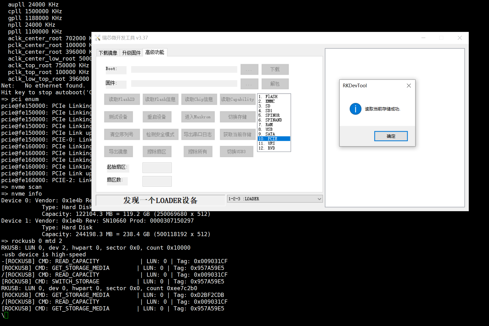
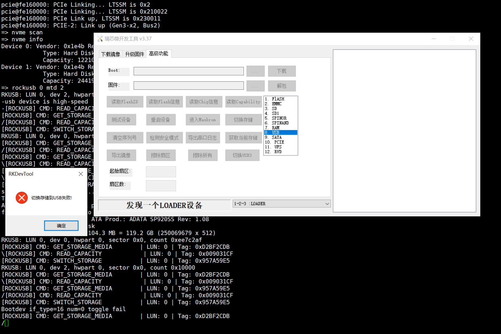

# rockusb

## 前提

* 协议本质：rockusb 确实是 Rockchip 私有协议，运行在 USB Bulk Transfer 基础信道之上，用于固件烧录、分区读写、设备调试等。它不是标准的 USB Mass Storage (UMS) 或 DFU 协议。
* U-Boot 命令：rockusb 是 U-Boot 侧的服务端命令，执行后 U-Boot 进入等待状态，监听宿主机（如 RKDevTool、upgrade_tool、rkdeveloptool）发来的私有协议指令。

```shell
=> rockusb 
rockusb - Use the rockusb Protocol

Usage:
rockusb <USB_controller> <devtype> <dev[:part]>  e.g. rockusb 0 mmc 0

=>
```

* ```<USB_controller>```：不是存储设备编号，而是 USB OTG/Device 控制器的索引。例如 0 通常指板子上连接 PC 的那个 USB Device 口（通常是 OTG 口）。这个参数决定了通过哪个物理
  USB 端口进行 rockusb 通信。
* ```<devtype> + <dev[:part]>```：这才是指定 rockusb 协议默认操作的后端存储介质。当宿主机发送"读/写 LBA"等不指定设备的简化指令时，U-Boot 会使用这里指定的 mmc/nand/spi
  作为默认目标。

```rockusb 0 mmc 0```的意思是：

**"通过 USB 控制器 0 启动 rockusb 服务，并将 mmc 0 设为默认操作的后端存储"。**

## rockusb如何指定spi nor flash作为后端存储

step1：确认spi nor flash类型

```shell
=> dm uclass

uclass 13: blk
  [   ] ramdisk-ro.blk @ ebae9550 | ramdisk0 *
  [   ] flash@0.blk @ ebaeb480 | mtd1 *
  [ + ] flash@1.blk @ ebaeb710, seq 0, (req -1) | mtd2 *
  [   ] mmc@fe2c0000.blk @ ebaebab0 | mmc1 *
  [   ] mmc@fe2e0000.blk @ ebaebe10 | mmc0 *
  [   ] ahci_scsi.id0lun0 @ ebaf7b70 | scsi0 *
  [   ] usb_mass_storage.lun0 @ ebb26450 | usb0 *
=> dm tree
 ebaeb390    mtd        [   ]   spi_nand                   |   |-- flash@0 *
 ebaeb480    blk        [   ]   mtd_blk                    |   |   `-- flash@0.blk *
 ebaeb620    spi_flash  [ + ]   spi_flash_std              |   `-- flash@1 *
 ebaeb710    blk        [ + ]   mtd_blk                    |       `-- flash@1.blk *

```

在blk类型，可见mtd2某人启用。另外spi股灾spi_flash下的作为mtd_blk

```shell
=> printenv devtype
devtype=mtd
=> printenv devnum
devnum=2
=> rockusb 0 mtd 2
RKUSB: LUN 0, dev 2, hwpart 0, sector 0x0, count 0x10000
\usb device is high-speed
```

## rockusb支持哪些命令

* windows端不同rkdevtool版本差异部分命令不支持
* 已测试g98 配套rockchip uboot bsp，最合适的rkdevtool是v3.37

| 功能分类 | 命令宏定义 | 核心作用 | 备注 / 实现细节 |
| :--- | :--- | :--- | :--- |
| 核心存储读写 | `RKUSB_LBA_READ_10` | 按 LBA 读取存储数据 | 转换为标准 SCSI `SC_READ_10` 处理，复用 UMS 逻辑 |
| | `RKUSB_LBA_WRITE_10` | 按 LBA 写入存储数据 | 转换为标准 SCSI `SC_WRITE_10` 处理，复用 UMS 逻辑 |
| | `RKUSB_LBA_ERASE` | LBA 级别擦除 | 用于 eMMC TRIM 或 NAND 块擦除 |
| | `RKUSB_READ_CAPACITY` | 获取存储容量信息 | 返回总块数与块大小 |
| 设备识别与信息 | `RKUSB_TEST_UNIT_READY` | 测试设备就绪状态 | 类似 SCSI TUR，用于握手验证 |
| | `RKUSB_GET_CHIP_VER` | 获取 SoC 芯片版本 | 上位机据此区分 RK3588/RK3568 等型号 |
| | `RKUSB_READ_FLASH_ID` | 读取 Flash 原厂 ID | 识别 NAND/eMMC/SPI NOR 厂商与型号 |
| | `RKUSB_READ_FLASH_INFO` | 读取 Flash 详细参数 | 包含页大小、块大小、ECC 信息等 |
| | `RKUSB_GET_STORAGE_MEDIA` | 获取当前存储介质类型 | 返回当前绑定的后端存储类型 |
| 高级存储管理 | `RKUSB_SWITCH_STORAGE` | 动态切换后端存储 | 关键能力：无需重启即可切换 mmc/sd/spi 等后端 |
| | `RKUSB_TEST_BAD_BLOCK` | 检测 NAND 坏块 | 仅适用于 NAND Flash 介质 |
| | `RKUSB_ERASE_10_FORCE` | 强制擦除 | 忽略写保护限制，具有破坏性 |
| | `RKUSB_VS_READ` | 厂商自定义区读取 | 访问 OOB、Metadata 等非数据区 |
| | `RKUSB_VS_WRITE` | 厂商自定义区写入 | 写入厂商配置区，需谨慎使用 |
| 系统控制与调试 | `RKUSB_RESET` | 软复位设备 | 烧录完成后常用，触发设备重启 |
| | `RKUSB_SWITCH_USB3` | 切换至 USB3.0 模式 | 运行时提升传输速率，需硬件支持 |
| | `RKUSB_UART_READ` | 通过 USB 回读 UART 日志 | 依赖 `CONFIG_PSTORE`，无串口时获取崩溃日志 |
| | `RKUSB_READ_OTP_DATA` | 读取 OTP/eFuse 数据 | 依赖 `CONFIG_ROCKCHIP_OTP`，读取 SN/MAC/密钥等 |
| 已废弃 / 不支持 | `RKUSB_READ_10` / `WRITE_10` | 旧版 RAW 读写 | 打印提示使用新版工具，已被 LBA 版本取代 |
| | `RKUSB_SDRAM_*` | SDRAM 读写与执行 | MaskROM 阶段能力，U-Boot 阶段不再需要 |
| | `RKUSB_READ/WRITE_SPARE` | 旧版 Spare/OOB 操作 | 已被 VS 命令整合替代 |
| | `RKUSB_LOW_FORMAT` 等 | 低级格式化/设置ID等 | 遗留命令，直接返回 `UNKNOWN_CMND` |

```c
static int rkusb_cmd_process(struct fsg_common *common,
			     struct fsg_buffhd *bh, int *reply)
{
	struct usb_request	*req = bh->outreq;
	struct fsg_bulk_cb_wrap	*cbw = req->buf;
	int rc;

	dump_cbw(cbw);

	if (rkusb_check_lun(common)) {
		*reply = -EINVAL;
		return RKUSB_RC_ERROR;
	}

	switch (common->cmnd[0]) {
	case RKUSB_TEST_UNIT_READY:
		*reply = rkusb_do_test_unit_ready(common, bh);
		rc = RKUSB_RC_FINISHED;
		break;

	case RKUSB_READ_FLASH_ID:
		*reply = rkusb_do_read_flash_id(common, bh);
		rc = RKUSB_RC_FINISHED;
		break;

	case RKUSB_TEST_BAD_BLOCK:
		*reply = rkusb_do_test_bad_block(common, bh);
		rc = RKUSB_RC_FINISHED;
		break;

	case RKUSB_ERASE_10_FORCE:
		*reply = rkusb_do_erase_force(common, bh);
		rc = RKUSB_RC_FINISHED;
		break;

	case RKUSB_LBA_READ_10:
		rkusb_fixup_cbwcb(common, bh);
		common->cmnd[0] = SC_READ_10;
		common->cmnd[1] = 0; /* Not support */
		rc = RKUSB_RC_CONTINUE;
		break;

	case RKUSB_LBA_WRITE_10:
		rkusb_fixup_cbwcb(common, bh);
		common->cmnd[0] = SC_WRITE_10;
		common->cmnd[1] = 0; /* Not support */
		rc = RKUSB_RC_CONTINUE;
		break;

	case RKUSB_READ_FLASH_INFO:
		*reply = rkusb_do_read_flash_info(common, bh);
		rc = RKUSB_RC_FINISHED;
		break;

	case RKUSB_GET_CHIP_VER:
		*reply = rkusb_do_get_chip_info(common, bh);
		rc = RKUSB_RC_FINISHED;
		break;

	case RKUSB_LBA_ERASE:
		*reply = rkusb_do_lba_erase(common, bh);
		rc = RKUSB_RC_FINISHED;
		break;

	case RKUSB_VS_WRITE:
		*reply = rkusb_do_vs_write(common);
		rc = RKUSB_RC_FINISHED;
		break;

	case RKUSB_VS_READ:
		*reply = rkusb_do_vs_read(common);
		rc = RKUSB_RC_FINISHED;
		break;

#ifdef CONFIG_PSTORE
	case RKUSB_UART_READ:
		rkusb_fixup_cbwcb(common, bh);
		*reply = rkusb_do_uart_debug_read(common);
		rc = RKUSB_RC_FINISHED;
		break;
#endif

	case RKUSB_SWITCH_STORAGE:
		*reply = rkusb_do_switch_storage(common);
		rc = RKUSB_RC_FINISHED;
		break;

	case RKUSB_GET_STORAGE_MEDIA:
		*reply = rkusb_do_get_storage_info(common, bh);
		rc = RKUSB_RC_FINISHED;
		break;

	case RKUSB_READ_CAPACITY:
		*reply = rkusb_do_read_capacity(common, bh);
		rc = RKUSB_RC_FINISHED;
		break;

	case RKUSB_SWITCH_USB3:
		*reply = rkusb_do_switch_to_usb3(common, bh);
		rc = RKUSB_RC_FINISHED;
		break;

	case RKUSB_RESET:
		*reply = rkusb_do_reset(common, bh);
		rc = RKUSB_RC_FINISHED;
		break;

#ifdef CONFIG_ROCKCHIP_OTP
	case RKUSB_READ_OTP_DATA:
		*reply = rkusb_do_read_otp(common, bh);
		rc = RKUSB_RC_FINISHED;
		break;
#endif

	case RKUSB_READ_10:
	case RKUSB_WRITE_10:
		printf("CMD Not support, pls use new version Tool\n");
	case RKUSB_SET_DEVICE_ID:
	case RKUSB_ERASE_10:
	case RKUSB_WRITE_SPARE:
	case RKUSB_READ_SPARE:
	case RKUSB_GET_VERSION:
	case RKUSB_ERASE_SYS_DISK:
	case RKUSB_SDRAM_READ_10:
	case RKUSB_SDRAM_WRITE_10:
	case RKUSB_SDRAM_EXECUTE:
	case RKUSB_LOW_FORMAT:
	case RKUSB_SET_RESET_FLAG:
	case RKUSB_SPI_READ_10:
	case RKUSB_SPI_WRITE_10:
		/* Fall through */
	default:
		rc = RKUSB_RC_UNKNOWN_CMND;
		break;
	}

	return rc;
}
```

## rockusb如何切换设备

* 已测试在v3.37下，sata、pcie（nvme）、spi

```shell
static int rkusb_do_switch_storage(struct fsg_common *common)
{
	enum if_type type, cur_type = ums[common->lun].block_dev.if_type;
	int devnum, cur_devnum = ums[common->lun].block_dev.devnum;
	struct blk_desc *block_dev;
	u32 media = BOOT_TYPE_UNKNOWN;

	media = 1 << common->cmnd[1];

	switch (media) {
#ifdef CONFIG_MMC
	case BOOT_TYPE_EMMC:
		type = IF_TYPE_MMC;
		devnum = 0;
		mmc_initialize(gd->bd);
		break;
#endif
	case BOOT_TYPE_MTD_BLK_NAND:
		type = IF_TYPE_MTD;
		devnum = 0;
		break;
	case BOOT_TYPE_MTD_BLK_SPI_NAND:
		type = IF_TYPE_MTD;
		devnum = 1;
		break;
	case BOOT_TYPE_MTD_BLK_SPI_NOR:
		type = IF_TYPE_MTD;
		devnum = 2;
		break;
#if defined(CONFIG_SCSI) && defined(CONFIG_CMD_SCSI) && (defined(CONFIG_AHCI) || defined(CONFIG_UFS))
	case BOOT_TYPE_SATA:
		type = IF_TYPE_SCSI;
		devnum = 0;
		scsi_scan(true);
		break;
#endif
	case BOOT_TYPE_PCIE:
		type = IF_TYPE_NVME;
		devnum = 0;
		break;
	default:
		printf("Bootdev 0x%x is not support\n", media);
		return -ENODEV;
	}

	if (cur_type == type && cur_devnum == devnum)
		return 0;

#if CONFIG_IS_ENABLED(SUPPORT_USBPLUG)
	block_dev = usbplug_blk_get_devnum_by_type(type, devnum);
#else
	block_dev = blk_get_devnum_by_type(type, devnum);
#endif
	if (!block_dev) {
		printf("Bootdev if_type=%d num=%d toggle fail\n", type, devnum);
		return -ENODEV;
	}

	common->luns[common->lun].num_sectors = block_dev->lba;
	ums[common->lun].num_sectors = block_dev->lba;
	ums[common->lun].block_dev = *block_dev;

	printf("RKUSB: LUN %d, dev %d, hwpart %d, sector %#x, count %#x\n",
	       0,
	       ums[common->lun].block_dev.devnum,
	       ums[common->lun].block_dev.hwpart,
	       ums[common->lun].start_sector,
	       ums[common->lun].num_sectors);

	return 0;
}
```

* sata可以切换


* nvme可以切换




* 不支持usb，代码中就没有usb获取、切换的逻辑



暂不考虑支持usb刷写


