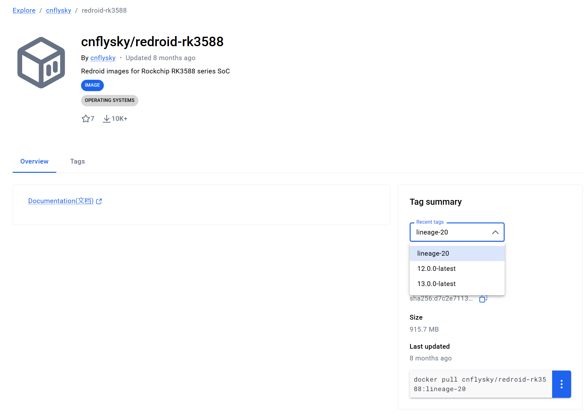
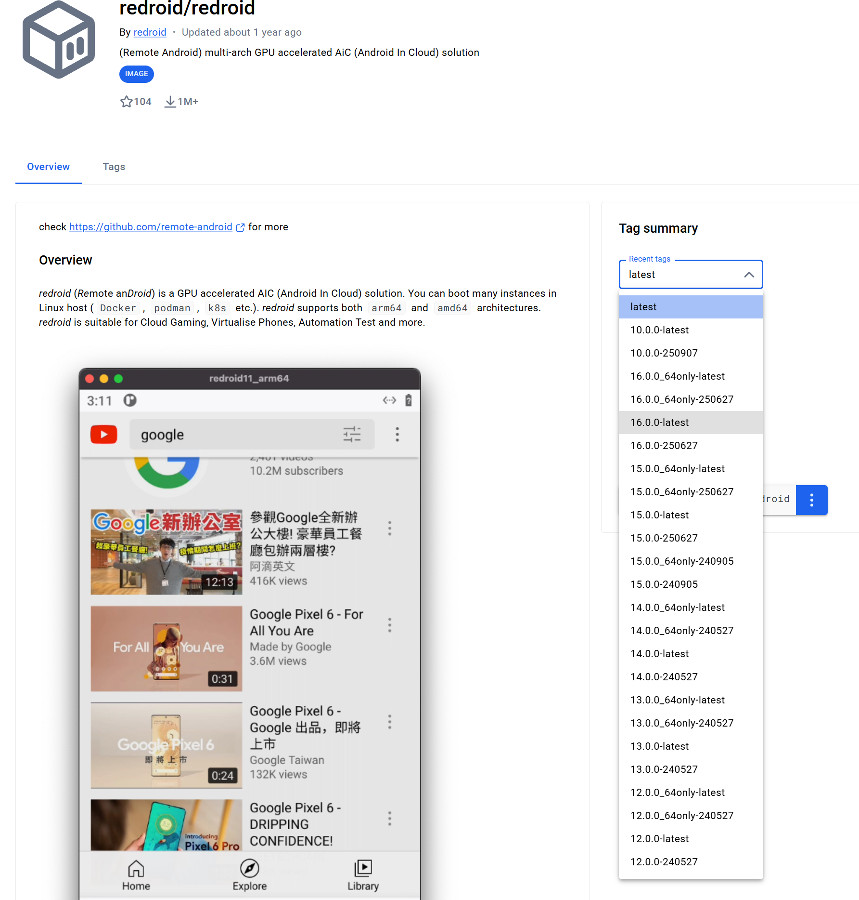
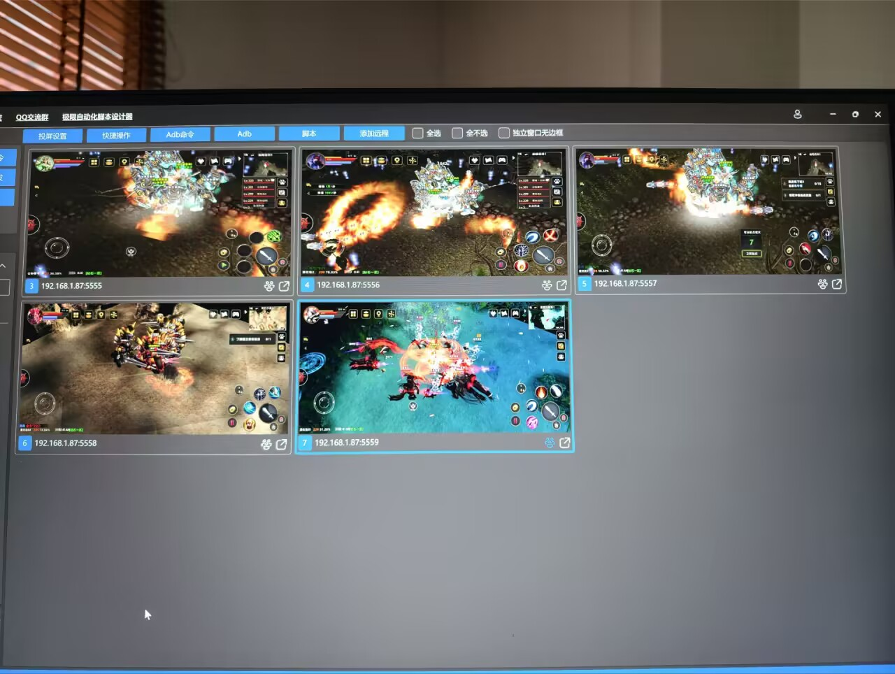

# android14适配

## 编译报错

```shell
[ 13% 6058/45202] Building dtbo img file out/target/product/kedge2/obj/FAKE/rockchip_dtbo_intermediates/rebuild-dtbo.img.
create image file: out/target/product/kedge2/obj/FAKE/rockchip_dtbo_intermediates/rebuild-dtbo.img...
Total 1 entries.
[ 21% 9927/45202] //packages/wallpapers/LivePicker:LiveWallpapersPicker aapt2 compile packages/wallpapers/LivePicker/res [common]
FAILED: out/soong/.intermediates/packages/wallpapers/LivePicker/LiveWallpapersPicker/android_common/aapt2/packages/wallpapers/LivePicker/res/drawable_btn_colored_background.xml.flat out/soong/.intermediates/packages/wallpapers/LivePicker/LiveWallpapersPicker/android_common/aapt2/packages/wallpapers/LivePicker/res/drawable_btn_transparent.xml.flat out/soong/.intermediates/packages/wallpapers/LivePicker/LiveWallpapersPicker/android_common/aapt2/packages/wallpapers/LivePicker/res/drawable_btn_transparent_background.xml.flat out/soong/.intermediates/packages/wallpapers/LivePicker/LiveWallpapersPicker/android_common/aapt2/packages/wallpapers/LivePicker/res/drawable_gradient_background.9.png.flat out/soong/.intermediates/packages/wallpapers/LivePicker/LiveWallpapersPicker/android_common/aapt2/packages/wallpapers/LivePicker/res/drawable_ic_arrow_back_white_24dp.xml.flat out/soong/.intermediates/packages/wallpapers/LivePicker/LiveWallpapersPicker/android_common/aapt2/packages/wallpapers/LivePicker/res/drawable_ic_delete_white_24dp.xml.flat out/soong/.intermediates/packages/wallpapers/LivePicker/LiveWallpapersPicker/android_common/aapt2/packages/wallpapers/LivePicker/res/drawable-hdpi_livewallpaper_placeholder.png.flat out/soong/.intermediates/packages/wallpapers/LivePicker/LiveWallpapersPicker/android_common/aapt2/packages/wallpapers/LivePicker/res/drawable-hdpi_wallpaper_picker_preview.png.flat out/soong/.intermediates/packages/wallpapers/LivePicker/LiveWallpapersPicker/android_common/aapt2/packages/wallpapers/LivePicker/res/drawable-mdpi_livewallpaper_placeholder.png.flat out/soong/.intermediates/packages/wallpapers/LivePicker/LiveWallpapersPicker/android_common/aapt2/packages/wallpapers/LivePicker/res/drawable-mdpi_wallpaper_picker_preview.png.flat out/soong/.intermediates/packages/wallpapers/LivePicker/LiveWallpapersPicker/android_common/aapt2/packages/wallpapers/LivePicker/res/drawable-sw600dp_ic_device.xml.flat
out/soong/host/linux-x86/bin/aapt2 compile -o out/soong/.intermediates/packages/wallpapers/LivePicker/LiveWallpapersPicker/android_common/aapt2/packages/wallpapers/LivePicker/res --pseudo-localize packages/wallpapers/LivePicker/res/drawable/btn_colored_background.xml packages/wallpapers/LivePicker/res/drawable/btn_transparent.xml packages/wallpapers/LivePicker/res/drawable/btn_transparent_background.xml packages/wallpapers/LivePicker/res/drawable/gradient_background.9.png packages/wallpapers/LivePicker/res/drawable/ic_arrow_back_white_24dp.xml packages/wallpapers/LivePicker/res/drawable/ic_delete_white_24dp.xml packages/wallpapers/LivePicker/res/drawable-hdpi/livewallpaper_placeholder.png packages/wallpapers/LivePicker/res/drawable-hdpi/wallpaper_picker_preview.png packages/wallpapers/LivePicker/res/drawable-mdpi/livewallpaper_placeholder.png packages/wallpapers/LivePicker/res/drawable-mdpi/wallpaper_picker_preview.png packages/wallpapers/LivePicker/res/drawable-sw600dp/ic_device.xml
packages/wallpapers/LivePicker/res/drawable/ic_delete_white_24dp.xml:1: error: no element found.
packages/wallpapers/LivePicker/res/drawable/ic_delete_white_24dp.xml: error: file failed to compile.
02:16:26 ninja failed with: exit status 1

  #### failed to build some targets (01:31 (mm:ss)) ####
```

目标仓库的ref有问题，修改为正确的才行。修改到default.xml中


## recovery模式卡死

```text
[    7.876700][    T1] RKNPU fdab0000.npu: can't request region for resource [mem 0xfdad0000-0xfdadffff]
[    7.877101][    T1] [drm] Initialized rknpu 0.8.2 20220829 for fdab0000.npu on minor 1
[    7.885998][    T1] RKNPU fdab0000.npu: leakage=8
[    7.886100][    T1] debugfs: Directory 'fdab0000.npu-rknpu' with parent 'vdd_npu_s0' already present!
[    7.905427][    T1] RKNPU fdab0000.npu: pvtm=867
[    7.921562][    T1] RKNPU fdab0000.npu: pvtm-volt-sel=3
[    7.922191][    T1] RKNPU fdab0000.npu: avs=0
[    7.922306][    T1] RKNPU fdab0000.npu: l=10000 h=85000 hyst=5000 l_limit=0 h_limit=800000000 h_table=0
[    7.979573][    T1] RKNPU fdab0000.npu: failed to find power_model node
[    7.979646][    T1] RKNPU fdab0000.npu: RKNPU: failed to initialize power model
[    7.979673][    T1] RKNPU fdab0000.npu: RKNPU: failed to get dynamic-coefficient
[    7.987203][    T1] cfg80211: Loading compiled-in X.509 certificates for regulatory database
[    7.990696][    T1] cfg80211: Loaded X.509 cert 'sforshee: 00b28ddf47aef9cea7'
[    7.991016][  T214] platform regulatory.0: Direct firmware load for regulatory.db failed with error -2
[    7.991052][  T214] cfg80211: failed to load regulatory.db
[    7.993545][    T1] rockchip-pm rockchip-suspend: not set pwm-regulator-config
[    7.996676][    T1] I : [File] : drivers/gpu/arm/mali400/mali/linux/mali_kernel_linux.c; [Line] : 409; [Func] : mali_module_init(); svn_rev_string_from_arm of this mali_ko is '', rk_ko_ver is '5', built at '01:26:55', on 'Sep 10 2026'.
[    7.997741][    T1] Mali: 
[    7.997744][    T1] Mali device driver loaded
[    7.997755][    T1] rkisp rkisp0-vir0: clear unready subdev num: 1
[    7.997987][    T1] rkisp0-vir0: Async subdev notifier completed
[    7.998001][    T1] rkisp rkisp0-vir1: clear unready subdev num: 1
[    7.998267][    T1] rkisp0-vir1: Async subdev notifier completed
[    7.998281][    T1] rkisp rkisp1-vir0: clear unready subdev num: 1
[    7.998546][    T1] rkisp1-vir0: Async subdev notifier completed
[    7.998560][    T1] ALSA device list:
[    7.998568][    T1]   #0: rockchip,dp0
[    7.998576][    T1]   #1: rockchip,sound-micarray
[    7.998583][    T1]   #2: rockchip,bt
[    7.998590][    T1]   #3: rockchip-hdmi0
[    7.998979][    T1] Freeing unused kernel memory: 1344K
[    8.017121][    T1] Run /init as init process
[    8.068546][    T1] init: init first stage started!
[    8.068646][    T1] init: Unable to open /lib/modules, skipping module loading.
[    8.068685][    T1] init: First stage mount skipped (recovery mode)
[    8.068902][    T1] init: [libfs_mgr]ReadFstabFromDt(): failed to read fstab from dt
[    8.069325][    T1] init: Using Android DT directory /proc/device-tree/firmware/android/
[    8.069368][    T1] init: Skipped setting INIT_AVB_VERSION (not vbmeta compatible)
[    8.115631][    T1] init: Skipping mount of system_ext, system is not dynamic.
[    8.115656][    T1] init: Opening SELinux policy
[    8.116424][    T1] init: Loading SELinux policy
[    8.123942][    T1] SELinux:  Permission nlmsg_getneigh in class netlink_route_socket not defined in policy.
[    8.123982][    T1] SELinux:  Permission bpf in class capability2 not defined in policy.
[    8.123985][    T1] SELinux:  Permission checkpoint_restore in class capability2 not defined in policy.
[    8.123994][    T1] SELinux:  Permission bpf in class cap2_userns not defined in policy.
[    8.123996][    T1] SELinux:  Permission checkpoint_restore in class cap2_userns not defined in policy.
[    8.124039][    T1] SELinux: the above unknown classes and permissions will be denied
[    8.125963][    T1] SELinux:  policy capability network_peer_controls=1
[    8.125967][    T1] SELinux:  policy capability open_perms=1
[    8.125970][    T1] SELinux:  policy capability extended_socket_class=1
[    8.125973][    T1] SELinux:  policy capability always_check_network=0
[    8.125975][    T1] SELinux:  policy capability cgroup_seclabel=0
[    8.125977][    T1] SELinux:  policy capability nnp_nosuid_transition=1
[    8.125980][    T1] SELinux:  policy capability genfs_seclabel_symlinks=0
[    8.125982][    T1] SELinux:  policy capability ioctl_skip_cloexec=0
[    8.207080][   T61] audit: type=1403 audit(4.510:2): auid=4294967295 ses=4294967295 lsm=selinux res=1
[    8.209806][    T1] selinux: SELinux: Loaded file_contexts
[    8.209822][    T1] selinux: 
[    8.249154][    T1] init: init second stage started!
[    8.259576][    T1] init: Using Android DT directory /proc/device-tree/firmware/android/
[    8.259886][    T1] init: Init cannot set 'ro.boot.console' to 'ttyFIQ0': Read-only property was already set
[    8.259895][    T1] init: Init cannot set 'ro.boot.wificountrycode' to 'CN': Read-only property was already set
[    8.259904][    T1] init: Init cannot set 'ro.boot.hardware' to 'rk30board': Read-only property was already set
[    8.259911][    T1] init: Init cannot set 'ro.boot.boot_devices' to 'fe2e0000.mmc': Read-only property was already set
[    8.259919][    T1] init: Init cannot set 'ro.boot.selinux' to 'permissive': Read-only property was already set
[    8.261149][    T1] init: Overriding previous property 'ro.build.display.id':'kedge2-userdebug 12 SQ3A.220705.003.A1 eng.root.20260910.022726 release-keys' with new value 'Edge2-android-12-v20260910'
[    8.261157][    T1] init: Overriding previous property 'persist.sys.usb.config':'adb' with new value 'none'
[    8.261348][    T1] init: Couldn't load property file '/system/build.prop': open() failed: No such file or directory: No such file or directory
[    8.333384][   T61] audit: type=1400 audit(4.633:3): avc:  denied  { sys_nice } for  pid=245 comm="ueventd" capability=23  scontext=u:r:ueventd:s0 tcontext=u:r:ueventd:s0 tclass=capability permissive=1
[    8.333445][  T245] ueventd: ueventd started!
[    8.335072][  T245] selinux: SELinux: Loaded file_contexts
[    8.335078][  T245] selinux: 
[    8.335143][  T245] ueventd: Parsing file /system/etc/ueventd.rc...
[    8.335169][  T245] ueventd: Added '/vendor/etc/ueventd.rc' to import list
[    8.335175][  T245] ueventd: Added '/odm/etc/ueventd.rc' to import list
[    8.335300][  T245] ueventd: Parsing file /vendor/etc/ueventd.rc...
[    8.335312][  T245] ueventd: Unable to read config file '/vendor/etc/ueventd.rc': open() failed: No such file or directory
[    8.335322][  T245] ueventd: Parsing file /odm/etc/ueventd.rc...
[    8.335331][  T245] ueventd: Unable to read config file '/odm/etc/ueventd.rc': open() failed: No such file or directory
[    8.566356][    T1] file system registered
# [    8.580168][  T257] charger: Charger uses system defaults.
[    8.580372][   T61] audit: type=1400 audit(4.883:4): avc:  denied  { read } for  pid=257 comm="charger" name="type" dev="sysfs" ino=36671 scontext=u:r:charger:s0 tcontext=u:object_r:sysfs:s0 tclass=file permissive=1
[    8.580385][   T61] audit: type=1400 audit(4.883:5): avc:  denied  { open } for  pid=257 comm="charger" path="/sys/devices/platform/feaa0000.i2c/i2c-2/2-0022/power_supply/tcpm-source-psy-2-0022/type" dev="sysfs" ino=36671 scontext=u:r:charger:s0 tcontext=u:object_r:sysfs:s0 tclass=file permissive=1
[    8.580393][   T61] audit: type=1400 audit(4.883:6): avc:  denied  { getattr } for  pid=257 comm="charger" path="/sys/devices/platform/feaa0000.i2c/i2c-2/2-0022/power_supply/tcpm-source-psy-2-0022/type" dev="sysfs" ino=36671 scontext=u:r:charger:s0 tcontext=u:object_r:sysfs:s0 tclass=file permissive=1
[    8.580730][  T257] healthd: BatteryCycleCountPath not found
[    8.580821][   T61] audit: type=1400 audit(4.883:7): avc:  denied  { wake_alarm } for  pid=257 comm="charger" capability=35  scontext=u:r:charger:s0 tcontext=u:r:charger:s0 tclass=capability2 permissive=1
[    8.581307][  T257] healthd: battery l=50 v=3 t=2.6 h=2 st=3 c=-1600 fc=100 chg=au
recovery filesystem table
=========================
  0 /mnt/internal_sd  vfat /dev/block/platform/ff0f0000.dwmmc/by-name/user 0
  1 /mnt/external_sd  vfat /dev/block/mmcblk0p1 0
  2 /system  ext4 /dev/block/by-name/system 0
  3 /vendor  ext4 /dev/block/by-name/vendor 0
  4 /odm  ext4 /dev/block/by-name/odm 0
  5 /product  ext4 /dev/block/by-name/product 0
  6 /system_ext  ext4 /dev/block/by-name/system_ext 0
  7 /vendor_dlkm  ext4 /dev/block/by-name/vendor_dlkm 0
  8 /odm_dlkm  ext4 /dev/block/by-name/odm_dlkm 0
  9 /cache  ext4 /dev/block/by-name/cache 0
  10 /metadata  ext4 /dev/block/by-name/metadata 0
  11 /data  f2fs /dev/block/by-name/userdata 0
  12 /cust  ext4 /dev/block/by-name/cust 0
  13 /custom  ext4 /dev/block/by-name/custom 0
  14 /radical_update  ext4 /dev/block/by-name/radical_update 0
  15 /misc  emmc /dev/block/by-name/misc 0
  16 /uboot  emmc /dev/block/by-name/uboot 0
  17 /charge  emmc /dev/block/by-name/charge 0
  18 /resource  emmc /dev/block/by-name/resource 0
  19 /parameter  emmc /dev/block/by-name/parameter 0
  20 /boot  emmc /dev/block/by-name/boot 0
  21 /recovery  emmc /dev/block/by-name/recovery 0
  22 /backup  emmc /dev/block/by-name/backup 0
  23 /frp  emmc /dev/block/by-name/frp 0
  24 /trust  emmc /dev/block/by-name/trust 0
  25 /baseparamer  emmc /dev/block/by-name/baseparamer 0
  26 /vbmeta  emmc /dev/block/by-name/vbmeta 0
  27 /dtbo  emmc /dev/block/by-name/dtbo 0
  28 /vendor_boot  emmc /dev/block/by-name/vendor_boot 0
  29 /tmp  ramdisk ramdisk 0

exit=================
result_point[0] is ----/dev/block/mmcblk0
111
emmc_point is /dev/block/mmcblk0
sd_point is (null)
sd_point_2 is (null)
read cmdline
I:Boot command: boot-recovery
I:Got 2 arguments from boot message
ensure_path_mounted path=/cache/recovery/last_locale 
I:[libfs_mgr]Invalid ext4 superblock on '/dev/block/by-name/cache'
E:[libfs_mgr]Failed to mount /cache: File exists
E:Can't mount /cache/recovery/last_locale
Loading make_device from librecovery_ui_ext.so
W:Failed to read max brightness: No such file or directory
I:Screensaver disabled
[    9.413622][  T258] rockchip-vop2 fdd90000.vop: [drm:vop2_crtc_atomic_disable] Crtc atomic disable vp0
[    9.451620][  T258] rockchip-vop2 fdd90000.vop: [drm:vop2_crtc_atomic_enable] Update mode to 1080

```

卡在这里一动不动


## 死锁打印mipi相关驱动日志

屏蔽mipi驱动，报错

```shell
  GEN     modules.builtin
  LD      .tmp_vmlinux.kallsyms1
ld.lld: error: undefined symbol: khadas_mipi_id
>>> referenced by of_display_timing.c:154 (/rockchip/android/khadas-android/android12/kernel-5.10/drivers/video/of_display_timing.c:154)
>>>               video/of_display_timing.o:(of_get_display_timings) in archive drivers/built-in.a
>>> referenced by of_display_timing.c:154 (/rockchip/android/khadas-android/android12/kernel-5.10/drivers/video/of_display_timing.c:154)
>>>               video/of_display_timing.o:(of_get_display_timings) in archive drivers/built-in.a

ld.lld: error: undefined symbol: gup_clk_calibration
>>> referenced by gt9xx.c:2547 (/rockchip/android/khadas-android/android12/kernel-5.10/drivers/input/touchscreen/gt9xx/gt9xx.c:2547)
>>>               input/touchscreen/gt9xx/gt9xx.o:(gtp_main_clk_proc) in archive drivers/built-in.a
make[1]: *** [Makefile:1286: vmlinux] Error 1
make: *** [arch/arm64/Makefile:214: rk3588-bdy-g98.img] Error 2
```

解决办法

```shell
--- a/kernel-5.10/drivers/video/of_display_timing.c
+++ b/kernel-5.10/drivers/video/of_display_timing.c
@@ -140,7 +140,7 @@ EXPORT_SYMBOL_GPL(of_get_display_timing);
  * of_get_display_timings - parse all display_timing entries from a device_node
  * @np: device_node with the subnodes
  **/
-extern int khadas_mipi_id;
+int khadas_mipi_id;
 struct display_timings *of_get_display_timings(const struct device_node *np)
 {
        struct device_node *timings_np;

```


## 编译报错 - gup_clk_calibration

```shell
  UPD     include/generated/compile.h
  CC      init/version.o
  AR      init/built-in.a
  LD      vmlinux.o
  MODPOST vmlinux.symvers
  MODINFO modules.builtin.modinfo
  GEN     modules.builtin
  LD      .tmp_vmlinux.kallsyms1
ld.lld: error: undefined symbol: gup_clk_calibration
>>> referenced by gt9xx.c:2547 (/rockchip/android/khadas-android/android12/kernel-5.10/drivers/input/touchscreen/gt9xx/gt9xx.c:2547)
>>>               input/touchscreen/gt9xx/gt9xx.o:(gtp_main_clk_proc) in archive drivers/built-in.a
make[1]: *** [Makefile:1286: vmlinux] Error 1
make: *** [arch/arm64/Makefile:214: rk3588-bdy-g98.img] Error 2
root@kdev-ubuntu2204:/rockchip/android/khadas-android/android12/kernel-5.10# rg gup_clk_calibration
drivers/input/touchscreen/gt9xx/gt9xx_update.c
2780:static u8 gup_clk_calibration_pin_select(s32 bCh)
2881:s32 gup_clk_calibration(void)
2914:    gup_clk_calibration_pin_select(1);//use GIO1 to do the calibration

drivers/input/touchscreen/gt9xx/gt9xx.c
127:extern s32 gup_clk_calibration(void);
2547:    ret = gup_clk_calibration();

```

解决办法：

```shell
CONFIG_TABLET_USB_HANWANG=y
CONFIG_TABLET_USB_KBTAB=y
CONFIG_INPUT_TOUCHSCREEN=y
CONFIG_TOUCHSCREEN_GSL3673=y
CONFIG_TOUCHSCREEN_EDT_FT5X06=y
CONFIG_TOUCHSCREEN_GSLX680_PAD=y
CONFIG_TOUCHSCREEN_GT1X=y
# CONFIG_TOUCHSCREEN_GT9XX is not set
CONFIG_TOUCHSCREEN_ELAN5515=y
CONFIG_ROCKCHIP_REMOTECTL=y
CONFIG_ROCKCHIP_REMOTECTL_PWM=y
CONFIG_SENSOR_DEVICE=y

```


## 编译报错 - tp101_into_suspend

```shell
  LD      vmlinux.o
  MODPOST vmlinux.symvers
  MODINFO modules.builtin.modinfo
  GEN     modules.builtin
  LD      .tmp_vmlinux.kallsyms1
ld.lld: error: undefined symbol: tp101_into_suspend
>>> referenced by pwm_bl.c:86 (/rockchip/android/khadas-android/android12/kernel-5.10/drivers/video/backlight/pwm_bl.c:86)
>>>               video/backlight/pwm_bl.o:(pwm_backlight_power_off) in archive drivers/built-in.a
make[1]: *** [Makefile:1286: vmlinux] Error 1
make: *** [arch/arm64/Makefile:214: rk3588-bdy-g98.img] Error 2

root@kdev-ubuntu2204:/rockchip/android/khadas-android/android12/kernel-5.10# rg tp101_into_suspend
drivers/video/backlight/pwm_bl.c
68:extern void tp101_into_suspend(void);
86:	tp101_into_suspend();

drivers/input/touchscreen/gt9xx/gt9xx.c
165:void tp101_into_suspend(void)


```

解决办法：

```shell
root@kdev-ubuntu2204:/rockchip/android/khadas-android/android12/kernel-5.10# rg tp101_into_suspend
drivers/video/backlight/pwm_bl.c
68:extern void tp101_into_suspend(void);
86:	tp101_into_suspend();

drivers/input/touchscreen/gt9xx/gt9xx.c
165:void tp101_into_suspend(void)
root@kdev-ubuntu2204:/rockchip/android/khadas-android/android12/kernel-5.10# grep -i pwm_bl drivers/video/backlight/Makefile 
obj-$(CONFIG_BACKLIGHT_PWM)		+= pwm_bl.o


CONFIG_MALI_BIFROST_EXPERT=y
CONFIG_MALI_BIFROST_DEBUG=y
CONFIG_BACKLIGHT_CLASS_DEVICE=y
# CONFIG_BACKLIGHT_PWM is not set
CONFIG_ROCKCHIP_MULTI_RGA=y
CONFIG_IEP=y
CONFIG_ROCKCHIP_MPP_SERVICE=y
CONFIG_ROCKCHIP_MPP_RKVDEC=y
```


## 内核版本和启动参数

```shell
Adding bank: 0x4f0000000 - 0x500000000 (size: 0x10000000)
Total: 2408.347 ms

Starting kernel ...

[    2.916927][    T0] Booting Linux on physical CPU 0x0000000000 [0x412fd050]
[    2.916988][    T0] Linux version 5.10.110 (root@kdev-ubuntu2204) (Android (7284624, based on r416183b) clang version 12.0.5 (https://android.googlesource.com/toolchain/llvm-project c935d99d7cf2016289302412d708641d52d2f7ee), LLD 12.0.5 (/buildbot/src/android/llvm-toolchain/out/llvm-project/lld c935d99d7cf2016289302412d708641d52d2f7ee)) #12 SMP PREEMPT Wed Sep 16 08:41:19 UTC 2026
[    3.099365][    T0] Machine model: Khadas Edge2
[    3.420999][    T0] earlycon: uart8250 at MMIO32 0x00000000feb50000 (options '')
[    3.426071][    T0] printk: bootconsole [uart8250] enabled
[    3.528223][    T0] OF: fdt: Reserved memory: failed to reserve memory for node 'drm-cubic-lut@00000000': base 0x0000000000000000, size 0 MiB
[    3.530161][    T0] Reserved memory: created CMA memory pool at 0x00000004ff800000, size 8 MiB
[    3.531013][    T0] OF: reserved mem: initialized node cma, compatible id shared-dma-pool
[    4.835024][    T0] Zone ranges:
[    4.835377][    T0]   DMA32    [mem 0x0000000000200000-0x00000000ffffffff]
[    4.836084][    T0]   Normal   [mem 0x0000000100000000-0x00000004ffffffff]
[    4.836785][    T0] Movable zone start for each node
[   28.854147][    T0] psci: Trusted OS migration not required
[   28.854710][    T0] psci: SMC Calling Convention v1.2
[   28.856317][    T0] percpu: Embedded 31 pages/cpu s89176 r8192 d29608 u126976
[   28.857970][    T0] Detected VIPT I-cache on CPU0
[   28.858627][    T0] CPU features: detected: GIC system register CPU interface
[   28.859337][    T0] CPU features: detected: Virtualization Host Extensions
[   28.860033][    T0] CPU features: detected: ARM errata 1165522, 1319367, or 1530923
[   28.860824][    T0] alternatives: patching kernel code
[   28.869985][    T0] Built 1 zonelists, mobility grouping on.  Total pages: 4122720
[   28.870796][    T0] Kernel command line: storagemedia=emmc androidboot.storagemedia=emmc androidboot.mode=normal  androidboot.dtb_idx=0 androidboot.dtbo_idx=0  androidboot.verifiedbootstate=orange androidboot.serialno=1A2B3C4D5E6F70 khadas_mipi_id=0 is_mipi_lcd_exit=0 console=ttyFIQ0 firmware_class.path=/vendor/etc/firmware init=/init rootwait ro loop.max_part=7 androidboot.console=ttyFIQ0 androidboot.wificountrycode=CN androidboot.hardware=rk30board androidboot.boot_devices=fe2e0000.mmc androidboot.selinux=permissive androidboot.console=ttyFIQ0 androidboot.wificountrycode=CN androidboot.hardware=rk30board androidboot.boot_devices=fe2e0000.mmc androidboot.selinux=permissive earlycon=uart8250,mmio32,0xfeb50000 irqchip.gicv3_pseudo_nmi=0
[   28.882790][    T0] Dentry cache hash table entries: 2097152 (order: 12, 16777216 bytes, linear)
[   28.884967][    T0] Inode-cache hash table entries: 1048576 (order: 11, 8388608 bytes, linear)
[   28.885955][    T0] mem auto-init: stack:off, heap alloc:off, heap free:off
[   28.901901][    T0] software IO TLB: mapped [mem 0x00000000e9f00000-0x00000000edf00000] (64MB)
[   30.673695][    T0] Memory: 14142608K/16752640K available (28862K kernel code, 10910K rwdata, 18032K rodata, 1600K init, 1296K bss, 2601840K reserved, 8192K cma-reserved)
[   30.675671][    T0] SLUB: HWalign=64, Order=0-3, MinObjects=0, CPUs=8, Nodes=1
[   30.677626][    T0] rcu: Preemptible hierarchical RCU implementation.
[   30.678271][    T0] rcu: 	RCU event tracing is enabled.
[   30.678799][    T0] 	Trampoline variant of Tasks RCU enabled.
[   30.679373][    T0] 	Tracing variant of Tasks RCU enabled.
[   30.679927][    T0] rcu: RCU calculated value of scheduler-enlistment delay is 30 jiffies.
[   30.730035][    T0] NR_IRQS: 64, nr_irqs: 64, preallocated irqs: 0
[   30.747895][    T0] GICv3: GIC: Using split EOI/Deactivate mode
[   30.748493][    T0] GICv3: 480 SPIs implemented
[   30.748954][    T0] GICv3: 0 Extended SPIs implemented
[   30.749548][    T0] GICv3: Distributor has no Range Selector support
[   30.750189][    T0] GICv3: 16 PPIs implemented
[   30.750688][    T0] GICv3: CPU0: found redistributor 0 region 0:0x00000000fe680000
[   30.752019][    T0] ITS [mem 0xfe640000-0xfe65ffff]
[   30.752650][    T0] ITS@0x00000000fe640000: allocated 8192 Devices @100180000 (indirect, esz 8, psz 64K, shr 0)
[   30.753705][    T0] ITS@0x00000000fe640000: allocated 32768 Interrupt Collections @100190000 (flat, esz 2, psz 64K, shr 0)
[   30.754807][    T0] ITS: using cache flushing for cmd queue
[   30.755570][    T0] ITS [mem 0xfe660000-0xfe67ffff]
[   30.756192][    T0] ITS@0x00000000fe660000: allocated 8192 Devices @1001b0000 (indirect, esz 8, psz 64K, shr 0)
[   30.757248][    T0] ITS@0x00000000fe660000: allocated 32768 Interrupt Collections @1001c0000 (flat, esz 2, psz 64K, shr 0)
[   30.758358][    T0] ITS: using cache flushing for cmd queue
[   30.759996][    T0] GICv3: using LPI property table @0x00000001001d0000
[   30.760971][    T0] GIC: using cache flushing for LPI property table

```


## pcie不识别

```shell
console:/ # dmesg |grep -i pcie
[   31.964334] rk-pcie fe190000.pcie: invalid prsnt-gpios property in node
[   31.964441] rk-pcie fe190000.pcie: no vpcie3v3 regulator found
[   31.965890] rk-pcie fe190000.pcie: missing legacy IRQ resource
[   31.965978] rk-pcie fe190000.pcie: IRQ msi not found
[   31.966029] rk-pcie fe190000.pcie: use outband MSI support
[   31.966081] rk-pcie fe190000.pcie: Missing *config* reg space
[   31.966203] rk-pcie fe190000.pcie: host bridge /pcie@fe190000 ranges:
[   31.966322] rk-pcie fe190000.pcie:      err 0x00f4000000..0x00f40fffff -> 0x00f4000000
[   31.966424] rk-pcie fe190000.pcie:       IO 0x00f4100000..0x00f41fffff -> 0x00f4100000
[   31.966536] rk-pcie fe190000.pcie:      MEM 0x00f4200000..0x00f4ffffff -> 0x00f4200000
[   31.966623] rk-pcie fe190000.pcie:      MEM 0x0a00000000..0x0a3fffffff -> 0x0a00000000
[   31.966777] rk-pcie fe190000.pcie: Missing *config* reg space
[   31.967060] rk-pcie fe190000.pcie: invalid resource
[   32.174039] rk-pcie fe190000.pcie: PCIe Linking... LTSSM is 0x3
[   32.199572] rk-pcie fe190000.pcie: PCIe Linking... LTSSM is 0x3
[   32.226205] rk-pcie fe190000.pcie: PCIe Linking... LTSSM is 0x3
[   32.252883] rk-pcie fe190000.pcie: PCIe Linking... LTSSM is 0x3
[   32.279543] rk-pcie fe190000.pcie: PCIe Linking... LTSSM is 0x3
[   32.306206] rk-pcie fe190000.pcie: PCIe Linking... LTSSM is 0x3
[   32.332861] rk-pcie fe190000.pcie: PCIe Linking... LTSSM is 0x3
[   32.359525] rk-pcie fe190000.pcie: PCIe Linking... LTSSM is 0x3
[   32.386205] rk-pcie fe190000.pcie: PCIe Linking... LTSSM is 0x3
[   32.412872] rk-pcie fe190000.pcie: PCIe Linking... LTSSM is 0x3
[   34.862830] rk-pcie fe190000.pcie: PCIe Link Fail
[   34.862903] rk-pcie fe190000.pcie: failed to initialize host

```


## 容器android

* <https://github.com/CNflysky/redroid-rk3588>



* <https://hub.docker.com/r/redroid/redroid>




* <cnflysky/redroid-rk3588:12.0.0-latest>

cnflysky/redroid-rk3588 带gpu。redroid不带gpu（一般而言）

```shell
services:
 android12-5555:
  image: cnflysky/redroid-rk3588:12.0.0-latest
   #image: redroid/redroid:12.0.0_64only-latest
  container_name: android12-5555
  restart: unless-stopped
  privileged: true
  ports:
   - "5555:5555"
  environment:
   - TZ=Asia/Shanghai
    # 可选：限制内存，rk3588建议按需设置
      # - MEM=4g
  volumes:
      # 使用docker命名卷，不要写宿主机目录
   - android12data:/data
   - /dev/mali0:/dev/mali0
   - /dev/dma_heap:/dev/dma_heap
  command:
   - androidboot.redroid_width=1080
   - androidboot.redroid_height=1920
   - androidboot.redroid_fake_wifi=1
   - androidboot.redroid_magisk=1
   - androidboot.redroid_enable_input_subsys=1
    # 【推荐追加】rk3588 常用优化参数，解决黑屏/渲染卡顿
   - androidboot.redroid_gpu_mode=mali
   - androidboot.redroid_dma_heap=1
     # 可选：adb默认开启，部分镜像需要
      # - androidboot.redroid_adb=1 
volumes:
  android12data:
    # 把docker卷放在你 /vol1/1000/docker/appDATA 目录
   #driver: local
   #driver_opts:
    #type: none
    #o: bind
    #device: /vol1/1000/docker/appDATA/android12/data
```


```shell

services:
  redroid:
    image: cnflysky/redroid-rk3588:13.0.0-latest
    privileged: true
    devices:
      - /dev/dri
      - /dev/mali0
      - /dev/binderfs
    ports:
      - "5555:5555"
    volumes:
      - /vol1/1000/mydata:/data
    command:
      - androidboot.redroid_gpu_mode=host
      - androidboot.use_memfd=true
      - androidboot.redroid_width=1082
      - androidboot.redroid_height=1920

```


## 安卓投屏

极限投屏：

* <https://my.feishu.cn/docx/A1owdUD7zocEfjxmVfAcwpaCnoC>
* <https://my.feishu.cn/drive/folder/KviYfz5uFlpUT8dXgdjccmfUnse>



安卓多开，5开毫无压力


校卫投屏


