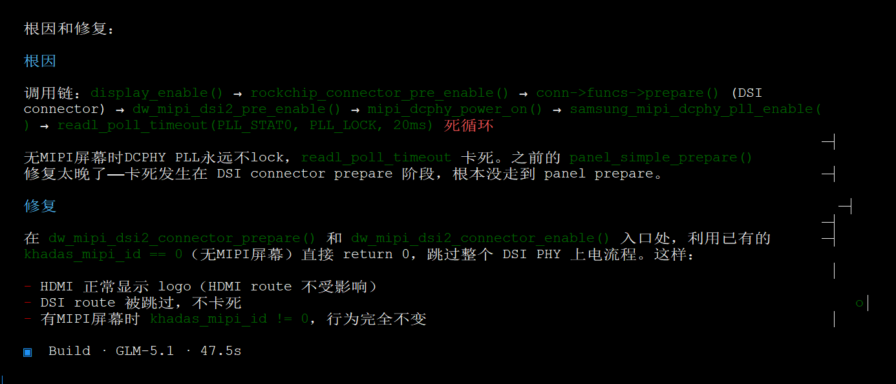

# android14适配

## 安卓系统体积


## 代码同步问题

```shell
<remote fetch="https://git.khadas.com/" name="gitkhadas" />
...
<project name="android_device_khadas_rk3588" path="device/khadas/rk3588" remote="gitkhadas" revision="fb77780d339ad7044ecb01be4b13271dc1a2be66"/>


https://git.khadas.com/android_device_khadas_rk3588

```

解决办法：

```shell
./repo init -u https://github.com/khadas/android_manifest.git -b khadas-edge2-android13
sed -i 's/fb77780d339ad7044ecb01be4b13271dc1a2be66/khadas-edge2-android13/g' .repo/manifests/default.xml
```

## lfs缺失问题

* <https://github.com/haoyangw/linux_camera_engine_rkaiq>

```shell
cp ./IspFec/src/gen_mesh/android/genMesh_static_32bit/libgenMeshLib.a /rockchip/android/khadas-android/android13/external/camera_engine_rkaiq/IspFec/src/gen_mesh/android/genMesh_static_32bit/libgenMeshLib.a
cp ./IspFec/src/gen_mesh/android/genMesh_static_64bit/libgenMeshLib.a /rockchip/android/khadas-android/android13/external/camera_engine_rkaiq/IspFec/src/gen_mesh/android/genMesh_static_64bit/libgenMeshLib.a
cp ./rkaiq/common/gen_mesh/android/genMesh_static_32bit/libgenMeshLib.a /rockchip/android/khadas-android/android13/external/camera_engine_rkaiq/common/gen_mesh/android/genMesh_static_32bit/libgenMeshLib.a
cp ./rkaiq/common/gen_mesh/android/genMesh_static_64bit/libgenMeshLib.a /rockchip/android/khadas-android/android13/external/camera_engine_rkaiq/common/gen_mesh/android/genMesh_static_64bit/libgenMeshLib.a
```

lfs文件在其他仓库有，建议github全局检索


```shell
# find . -name libgenMeshLib.a |xargs -i ls -alh {}
-rwxr-xr-x 1 root root 101M Sep 10 12:16 ./IspFec/src/gen_mesh/android/genMesh_static_32bit/libgenMeshLib.a
-rwxr-xr-x 1 root root 109M Sep 10 12:16 ./IspFec/src/gen_mesh/android/genMesh_static_64bit/libgenMeshLib.a
-rwxr-xr-x 1 root root 164K Sep 10 12:13 ./IspFec/src/gen_mesh/linux/genMesh_static_32bit/libgenMeshLib.a
-rwxr-xr-x 1 root root 562K Sep 10 12:13 ./IspFec/src/gen_mesh/linux/genMesh_static_64bit/libgenMeshLib.a
-rwxr-xr-x 1 root root 36M Sep 10 12:16 ./rkaiq/common/gen_mesh/android/genMesh_static_32bit/libgenMeshLib.a
-rwxr-xr-x 1 root root 37M Sep 10 12:16 ./rkaiq/common/gen_mesh/android/genMesh_static_64bit/libgenMeshLib.a
-rwxr-xr-x 1 root root 505K Sep 10 12:13 ./rkaiq/common/gen_mesh/linux/genMesh_static_32bit/libgenMeshLib.a
-rwxr-xr-x 1 root root 562K Sep 10 12:13 ./rkaiq/common/gen_mesh/linux/genMesh_static_64bit/libgenMeshLib.a
```

超过100MB，github会提示用lfs。但lfs不要钱么？


## 鸭佬android13


```shell
127|console:/ # uname -a
Linux localhost 5.10.157 #2 SMP PREEMPT Fri Aug 14 01:46:50 UTC 2026 aarch64 Toybox
console:/ # lsblk
/system/bin/sh: lsblk: inaccessible or not found
127|console:/ # df -h
Filesystem            Size Used Avail Use% Mounted on
tmpfs                 7.7G 1.2M  7.7G   1% /dev
tmpfs                 7.7G 4.0K  7.7G   1% /mnt
/dev/block/mmcblk0p11  10M  80K   10M   1% /metadata
/dev/block/dm-0       1.0G 1.0G  3.3M 100% /
/dev/block/dm-3       392M 391M  1.1M 100% /vendor
/dev/block/dm-5       720K 716K  4.0K 100% /odm
/dev/block/dm-1       232K  36K  196K  16% /system_dlkm
/dev/block/dm-2       170M 169M  520K 100% /system_ext
/dev/block/dm-4        26M  26M   80K 100% /vendor_dlkm
/dev/block/dm-6       232K  36K  196K  16% /odm_dlkm
/dev/block/dm-7       274M 273M  840K 100% /product
tmpfs                 7.7G 8.0K  7.7G   1% /apex
tmpfs                 7.7G 492K  7.7G   1% /linkerconfig
/dev/block/mmcblk0p10 320M 140K  320M   1% /cache
/dev/block/mmcblk0p15 109G  68M  109G   1% /data
tmpfs                 7.7G    0  7.7G   0% /data_mirror
/dev/fuse             109G  68M  109G   1% /mnt/user/0/emulated
console:/ # ip -br a
lo               UNKNOWN        127.0.0.1/8 ::1/128 
dummy0           UNKNOWN        fe80::f4d7:b4ff:fe73:c61b/64 
eth0             DOWN           
eth1             DOWN           
eth2             DOWN           
eth3             UP             192.168.33.44/24 fe80::daee:203f:3d37:4442/64 
ip_vti0@NONE     DOWN           
ip6_vti0@NONE    DOWN           
sit0@NONE        DOWN           
ip6tnl0@NONE     DOWN           
console:/ # ip a
1: lo: <LOOPBACK,UP,LOWER_UP> mtu 65536 qdisc noqueue state UNKNOWN group default qlen 1000
    link/loopback 00:00:00:00:00:00 brd 00:00:00:00:00:00
    inet 127.0.0.1/8 scope host lo
       valid_lft forever preferred_lft forever
    inet6 ::1/128 scope host 
       valid_lft forever preferred_lft forever
2: dummy0: <BROADCAST,NOARP,UP,LOWER_UP> mtu 1500 qdisc noqueue state UNKNOWN group default qlen 1000
    link/ether f6:d7:b4:73:c6:1b brd ff:ff:ff:ff:ff:ff
    inet6 fe80::f4d7:b4ff:fe73:c61b/64 scope link 
       valid_lft forever preferred_lft forever
3: eth0: <BROADCAST,MULTICAST> mtu 1500 qdisc noop state DOWN group default qlen 1000
    link/ether 2e:6e:87:ee:bc:d8 brd ff:ff:ff:ff:ff:ff
4: eth1: <BROADCAST,MULTICAST> mtu 1500 qdisc noop state DOWN group default qlen 1000
    link/ether 2e:21:01:74:c2:3d brd ff:ff:ff:ff:ff:ff
5: eth2: <NO-CARRIER,BROADCAST,MULTICAST,UP> mtu 1500 qdisc pfifo_fast state DOWN group default qlen 1000
    link/ether 52:c1:bd:d9:45:d9 brd ff:ff:ff:ff:ff:ff
6: eth3: <BROADCAST,MULTICAST,UP,LOWER_UP> mtu 1500 qdisc pfifo_fast state UP group default qlen 1000
    link/ether e6:26:91:81:7c:ab brd ff:ff:ff:ff:ff:ff
    inet 192.168.33.44/24 brd 192.168.33.255 scope global eth3
       valid_lft forever preferred_lft forever
    inet6 fe80::daee:203f:3d37:4442/64 scope link stable-privacy 
       valid_lft forever preferred_lft forever
7: ip_vti0@NONE: <NOARP> mtu 1480 qdisc noop state DOWN group default qlen 1000
    link/ipip 0.0.0.0 brd 0.0.0.0
8: ip6_vti0@NONE: <NOARP> mtu 1364 qdisc noop state DOWN group default qlen 1000
    link/tunnel6 :: brd ::
9: sit0@NONE: <NOARP> mtu 1480 qdisc noop state DOWN group default qlen 1000
    link/sit 0.0.0.0 brd 0.0.0.0
10: ip6tnl0@NONE: <NOARP> mtu 1452 qdisc noop state DOWN group default qlen 1000
    link/tunnel6 :: brd ::
console:/ # 

```


## khadas android13 uboot

```shell

# git log --pretty=format:"%h %an <%ae> %s" --graph

* b26af094768 Xiong Zhang <xiong.zhang@wesion.com> Support custom startup logo. Path:/vendor/custom
* 2396b5554e3 Xiong Zhang <xiong.zhang@wesion.com> Support device tree overlay
* 4fda4ee51f3 Goenjoy Huang <goenjoy@khadas.com> DP: fix 1080p cannot work for dp [1/2]
* e3d24d162d4 Goenjoy Huang <goenjoy@khadas.com> LCD: Fixed the problem of a bright line on the far right side of the old 5-inch screen [1/2]
* 97d8eedbe08 goenjoy <goenjoy@namtso.com> hdmi: add hdmi_out_mode kernel parameter transmission
* 0ab871385ab Goenjoy Huang <goenjoy@khadas.com> camera: compatible camera with both OS08A10 and IMX415
* e1db41021b2 Goenjoy Huang <goenjoy@khadas.com> LCD: Compatible with old TS050 and new TS050 [1/3]
* b3da3768656 Goenjoy Huang <goenjoy@khadas.com> LCD: NEW Compatible with TS050,TS101 and HDMI [1/3]
* bef2dfdb1e9 Goenjoy Huang <goenjoy@khadas.com> Edge2: set led initial status as blue on
* bf1e675a705 Goenjoy Huang <goenjoy@khadas.com> kbi: update kbi code
* f5fee78d343 Goenjoy Huang <goenjoy@khadas.com> LOGO: Compatible with TS050 and TS101 [1/2]
* 678f3957b10 Goenjoy Huang <goenjoy@khadas.com> LCD: Compatible with TS050 and TS101 [1/4]
* 61aff002cab Haylrn Zhao <haylrn.zhao@wesion.com> Edge2: Add edge2 10inch mipi logo rotate 180 degrees
* dcac78ed406 Haylrn Zhao <haylrn.zhao@wesion.com> Edge2: Change LED state and add run update
* abce459a502 Goenjoy Huang <goenjoy@khadas.com> Edge2: add usid run
* e9f6ac55742 Jack Zhao <jack.zhao@wesion.com> Edge2: add reboot_test mode
* b847015bbd4 Jack Zhao <jack.zhao@wesion.com> Edge2: kbi: fix usid
* 741dfda8343 Jack Zhao <jack.zhao@wesion.com> Edge2: fix the startup priority mode error after restart
* 72f30117985 Goenjoy Huang <goenjoy@khadas.com> Edge2: MCU: modify MCU to i2c2 for edge2-v11 board
* 8b87413e7f6 Jack Zhao <jack.zhao@wesion.com> Edge2: add preliminary support for kbi cmd
* 6ecc50be3b4 Jack Zhao <jack.zhao@wesion.com> Edge2: configs: enble CMD_I2C
* d808dc53305 Jack Zhao <jack.zhao@wesion.com> arm: dts: Edge2: fix SD firmware startup VCC5v failure
* 9b2caf61854 Goenjoy Huang <goenjoy@khadas.com> Edge2: Enble TYPEC0_PWR_EN pin
* c88006ec338 Goenjoy Huang <goenjoy@khadas.com> LCD: Fix mipi panel reset pin control[1/2]
* 7b87560f199 goenjoy <goenjoy@khadas.com> Edge2: set vcc5V
* 6cea7ea84ad goenjoy <goenjoy@khadas.com> Edge2: Enble CMD_GPIO, CMD_I2C, CMD_RUN config
* ec8f6c3f1de goenjoy <goenjoy@khadas.com> Edge2: Fix cannot enter uboot command line mode
* dfabeae4792 Goenjoy Huang <goenjoy@khadas.com> Add Khadas edge2 config (from rk3588_defconfig) and dts (from rk3588-evb.dts)


* 4024d9e5d8d Joseph Chen <chenjh@rock-chips.com> spl: fit: Not allow append fdt failed
```


## khadas edge2 android 


## redroid

https://github.com/cnflysky/redroid-rk3588


## uboot卡死-禁用mipi驱动

```shell
=== rockchip_show_logo start ===
  route: crtc_id=2, is_init=0, is_enable=0, conn_type=16
header load_bmp_logo cmd ext4load mmc 0:9 0x00000000ebd530b0 logo_kernel.bmp 200...
Failed to mount ext2 filesystem...
** Unrecognized filesystem type **
header rockchip_read_resource_file len 512...
pdst load_bmp_logo cmd ext4load mmc 0:9 0x00000000edf00000 logo_kernel.bmp 5ad8...
Failed to mount ext2 filesystem...
** Unrecognized filesystem type **
pdst rockchip_read_resource_file len 23256...
  load_bmp_logo ok: 600x600 bpp=16, calling display_logo...
  >> display_logo: crtc_id=2, is_init=0
Rockchip UBOOT DRM driver version: v1.0.1
  >> display_init: crtc_id=2, conn_type=16
vp0 have layer nr:2[0 2 ], primary plane: 2
vp1 have layer nr:2[1 3 ], primary plane: 3
vp2 have layer nr:2[6 8 ], primary plane: 8
vp3 have layer nr:2[7 9 ], primary plane: 9
Using display timing dts
dsi@fde20000:  detailed mode clock 152198 kHz, flags[a]
    H: 1080 1184 1188 1315
    V: 1920 1924 1927 1929
bus_format: 100e
VOP update mode to: 1080x1920p60, type: MIPI0 for VP2
VP2 set crtc_clock to 152195KHz
  >> display_init returned 0, is_init=1
  >> display_check done, calling display_set_plane...
VOP VP2 enable Esmart2[600x600->600x600@240x660] fmt[2] addr[0xedf06000]
  >> display_set_plane returned 0
  >> calling display_enable...
  >> display_enable: crtc_id=2, conn_type=16
  >>   crtc_funcs->prepare...
  >>   crtc_funcs->prepare done
  >>   rockchip_connector_pre_enable...
    >> connector_path_pre_enable: conn=dsi@fde20000, has_funcs=1, has_bridge=0, has_panel=1
    >>   calling conn->funcs->prepare (dsi@fde20000)...
    >> dw_mipi_dsi2_connector_prepare: dsi@fde20000
final DSI-Link bandwidth: 1014633 Kbps x 4
    >> dw_mipi_dsi2_pre_enable: start
    >>   calling mipi_dcphy_power_on...

```




推荐这种方式，禁用mipi驱动

```shell

diff --git a/u-boot/configs/kedge2_defconfig b/u-boot/configs/kedge2_defconfig
index 34f228d2b..3f62df302 100644
--- a/u-boot/configs/kedge2_defconfig
+++ b/u-boot/configs/kedge2_defconfig
@@ -205,10 +205,10 @@ CONFIG_DM_VIDEO=y
 CONFIG_DISPLAY=y
 CONFIG_DRM_ROCKCHIP=y
 CONFIG_DRM_ROCKCHIP_DW_HDMI_QP=y
-CONFIG_DRM_ROCKCHIP_DW_MIPI_DSI2=y
+# CONFIG_DRM_ROCKCHIP_DW_MIPI_DSI2 is not set
 CONFIG_DRM_ROCKCHIP_DW_DP=y
 CONFIG_DRM_ROCKCHIP_ANALOGIX_DP=y
-CONFIG_DRM_ROCKCHIP_SAMSUNG_MIPI_DCPHY=y
+# CONFIG_DRM_ROCKCHIP_SAMSUNG_MIPI_DCPHY is not set
 CONFIG_PHY_ROCKCHIP_SAMSUNG_HDPTX_HDMI=y
 CONFIG_USE_TINY_PRINTF=y
 CONFIG_LIB_RAND=y


```

## kernel5.10 启动卡死

```shell
[  186.264344][    T7] dwhdmi-rockchip fde80000.hdmi: registered ddc I2C bus driver
[  186.268249][    T7] dw-hdmi-qp-hdcp dw-hdmi-qp-hdcp.8.auto: dw_hdcp_qp_hdcp_probe success
[  186.268561][    T7] rockchip-drm display-subsystem: bound fde80000.hdmi (ops dw_hdmi_rockchip_ops)
[  186.268599][    T7] dw-mipi-dsi2 fde20000.dsi: [drm:dw_mipi_dsi2_bind] *ERROR* Failed to find panel or bridge: -517
[  186.298479][    T7] rockchip-vop2 fdd90000.vop: [drm:vop2_bind] vp0 assign plane mask: 0x5, primary plane phy id: 2
[  186.298502][    T7] rockchip-vop2 fdd90000.vop: [drm:vop2_bind] vp1 assign plane mask: 0xa, primary plane phy id: 3
[  186.298516][    T7] rockchip-vop2 fdd90000.vop: [drm:vop2_bind] vp2 assign plane mask: 0x140, primary plane phy id: 8
[  186.298530][    T7] rockchip-vop2 fdd90000.vop: [drm:vop2_bind] vp3 assign plane mask: 0x280, primary plane phy id: 9
[  186.330156][    T7] rockchip-drm display-subsystem: bound fdd90000.vop (ops vop2_component_ops)
[  186.332328][    T7] dwhdmi-rockchip fde80000.hdmi: registered ddc I2C bus driver
[  186.336399][    T7] dw-hdmi-qp-hdcp dw-hdmi-qp-hdcp.8.auto: dw_hdcp_qp_hdcp_probe success
[  186.336715][    T7] rockchip-drm display-subsystem: bound fde80000.hdmi (ops dw_hdmi_rockchip_ops)
[  186.336753][    T7] dw-mipi-dsi2 fde20000.dsi: [drm:dw_mipi_dsi2_bind] *ERROR* Failed to find panel or bridge: -517
[  186.367153][    T7] rockchip-vop2 fdd90000.vop: [drm:vop2_bind] vp0 assign plane mask: 0x5, primary plane phy id: 2
[  186.367179][    T7] rockchip-vop2 fdd90000.vop: [drm:vop2_bind] vp1 assign plane mask: 0xa, primary plane phy id: 3
[  186.367194][    T7] rockchip-vop2 fdd90000.vop: [drm:vop2_bind] vp2 assign plane mask: 0x140, primary plane phy id: 8
[  186.367208][    T7] rockchip-vop2 fdd90000.vop: [drm:vop2_bind] vp3 assign plane mask: 0x280, primary plane phy id: 9
[  186.398897][    T7] rockchip-drm display-subsystem: bound fdd90000.vop (ops vop2_component_ops)
[  186.401108][    T7] dwhdmi-rockchip fde80000.hdmi: registered ddc I2C bus driver
[  186.405180][    T7] dw-hdmi-qp-hdcp dw-hdmi-qp-hdcp.8.auto: dw_hdcp_qp_hdcp_probe success
[  186.405488][    T7] rockchip-drm display-subsystem: bound fde80000.hdmi (ops dw_hdmi_rockchip_ops)
[  186.405527][    T7] dw-mipi-dsi2 fde20000.dsi: [drm:dw_mipi_dsi2_bind] *ERROR* Failed to find panel or bridge: -517
[  186.437618][    T7] rockchip-vop2 fdd90000.vop: [drm:vop2_bind] vp0 assign plane mask: 0x5, primary plane phy id: 2
[  186.437641][    T7] rockchip-vop2 fdd90000.vop: [drm:vop2_bind] vp1 assign plane mask: 0xa, primary plane phy id: 3
[  186.437655][    T7] rockchip-vop2 fdd90000.vop: [drm:vop2_bind] vp2 assign plane mask: 0x140, primary plane phy id: 8
[  186.437669][    T7] rockchip-vop2 fdd90000.vop: [drm:vop2_bind] vp3 assign plane mask: 0x280, primary plane phy id: 9
[  186.466997][    T7] rockchip-drm display-subsystem: bound fdd90000.vop (ops vop2_component_ops)
[  186.469266][    T7] dwhdmi-rockchip fde80000.hdmi: registered ddc I2C bus driver
[  186.472966][    T7] dw-hdmi-qp-hdcp dw-hdmi-qp-hdcp.8.auto: dw_hdcp_qp_hdcp_probe success
[  186.473277][    T7] rockchip-drm display-subsystem: bound fde80000.hdmi (ops dw_hdmi_rockchip_ops)
[  186.473316][    T7] dw-mipi-dsi2 fde20000.dsi: [drm:dw_mipi_dsi2_bind] *ERROR* Failed to find panel or bridge: -517
[  186.504363][    T7] rockchip-vop2 fdd90000.vop: [drm:vop2_bind] vp0 assign plane mask: 0x5, primary plane phy id: 2
[  186.504389][    T7] rockchip-vop2 fdd90000.vop: [drm:vop2_bind] vp1 assign plane mask: 0xa, primary plane phy id: 3
[  186.504404][    T7] rockchip-vop2 fdd90000.vop: [drm:vop2_bind] vp2 assign plane mask: 0x140, primary plane phy id: 8
[  186.504418][    T7] rockchip-vop2 fdd90000.vop: [drm:vop2_bind] vp3 assign plane mask: 0x280, primary plane phy id: 9
[  186.559859][    T7] rockchip-drm display-subsystem: bound fdd90000.vop (ops vop2_component_ops)
[  186.562039][    T7] dwhdmi-rockchip fde80000.hdmi: registered ddc I2C bus driver
[  186.565863][    T7] dw-hdmi-qp-hdcp dw-hdmi-qp-hdcp.8.auto: dw_hdcp_qp_hdcp_probe success
[  186.566183][    T7] rockchip-drm display-subsystem: bound fde80000.hdmi (ops dw_hdmi_rockchip_ops)
[  186.566222][    T7] dw-mipi-dsi2 fde20000.dsi: [drm:dw_mipi_dsi2_bind] *ERROR* Failed to find panel or bridge: -517
[  186.596896][    T7] rockchip-vop2 fdd90000.vop: [drm:vop2_bind] vp0 assign plane mask: 0x5, primary plane phy id: 2
[  186.596920][    T7] rockchip-vop2 fdd90000.vop: [drm:vop2_bind] vp1 assign plane mask: 0xa, primary plane phy id: 3
[  186.596934][    T7] rockchip-vop2 fdd90000.vop: [drm:vop2_bind] vp2 assign plane mask: 0x140, primary plane phy id: 8
[  186.596949][    T7] rockchip-vop2 fdd90000.vop: [drm:vop2_bind] vp3 assign plane mask: 0x280, primary plane phy id: 9
[  186.626545][    T7] rockchip-drm display-subsystem: bound fdd90000.vop (ops vop2_component_ops)
[  186.629965][    T7] dwhdmi-rockchip fde80000.hdmi: registered ddc I2C bus driver
[  186.633774][    T7] dw-hdmi-qp-hdcp dw-hdmi-qp-hdcp.8.auto: dw_hdcp_qp_hdcp_probe success
[  186.634090][    T7] rockchip-drm display-subsystem: bound fde80000.hdmi (ops dw_hdmi_rockchip_ops)
[  186.634129][    T7] dw-mipi-dsi2 fde20000.dsi: [drm:dw_mipi_dsi2_bind] *ERROR* Failed to find panel or bridge: -517
```


禁用dw-mipi-dsi2验证，确实可以解决问题。部分依赖khadas mipi定义需要微调

```shell

diff --git a/drivers/video/of_display_timing.c b/drivers/video/of_display_timing.c
index cd9f2f158ce2..b727a36cb0ce 100644
--- a/drivers/video/of_display_timing.c
+++ b/drivers/video/of_display_timing.c
@@ -140,7 +140,7 @@ EXPORT_SYMBOL_GPL(of_get_display_timing);
  * of_get_display_timings - parse all display_timing entries from a device_node
  * @np: device_node with the subnodes
  **/
-extern int khadas_mipi_id;
+int khadas_mipi_id;
 struct display_timings *of_get_display_timings(const struct device_node *np)
 {
        struct device_node *timings_np;

```


