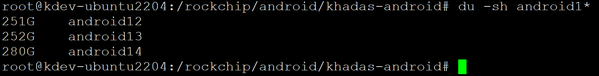
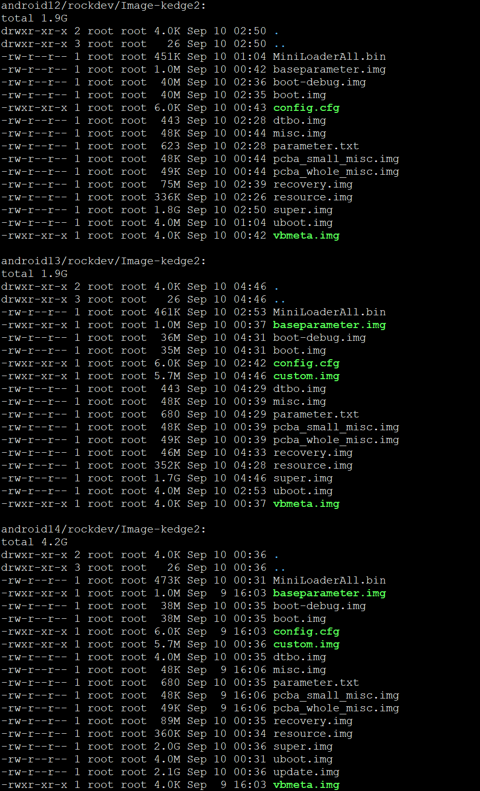
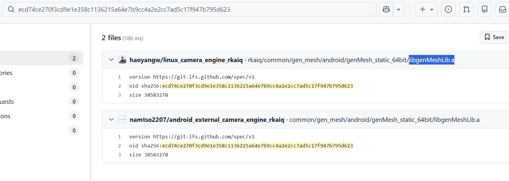

# android14适配

## 安卓系统体积






## 代码同步问题

```shell
<remote fetch="https://git.khadas.com/" name="gitkhadas" />
...
<project name="android_device_khadas_rk3588" path="device/khadas/rk3588" remote="gitkhadas" revision="fb77780d339ad7044ecb01be4b13271dc1a2be66"/>


https://git.khadas.com/android_device_khadas_rk3588

```

解决办法：

```shell
./repo init -u https://github.com/khadas/android_manifest.git -b khadas-edge2-android13
sed -i 's/fb77780d339ad7044ecb01be4b13271dc1a2be66/khadas-edge2-android13/g' .repo/manifests/default.xml
```

## lfs缺失问题

* <https://github.com/haoyangw/linux_camera_engine_rkaiq>

```shell
cp ./IspFec/src/gen_mesh/android/genMesh_static_32bit/libgenMeshLib.a /rockchip/android/khadas-android/android13/external/camera_engine_rkaiq/IspFec/src/gen_mesh/android/genMesh_static_32bit/libgenMeshLib.a
cp ./IspFec/src/gen_mesh/android/genMesh_static_64bit/libgenMeshLib.a /rockchip/android/khadas-android/android13/external/camera_engine_rkaiq/IspFec/src/gen_mesh/android/genMesh_static_64bit/libgenMeshLib.a
cp ./rkaiq/common/gen_mesh/android/genMesh_static_32bit/libgenMeshLib.a /rockchip/android/khadas-android/android13/external/camera_engine_rkaiq/common/gen_mesh/android/genMesh_static_32bit/libgenMeshLib.a
cp ./rkaiq/common/gen_mesh/android/genMesh_static_64bit/libgenMeshLib.a /rockchip/android/khadas-android/android13/external/camera_engine_rkaiq/common/gen_mesh/android/genMesh_static_64bit/libgenMeshLib.a
```

lfs文件在其他仓库有，建议github全局检索




```shell
# find . -name libgenMeshLib.a |xargs -i ls -alh {}
-rwxr-xr-x 1 root root 101M Sep 10 12:16 ./IspFec/src/gen_mesh/android/genMesh_static_32bit/libgenMeshLib.a
-rwxr-xr-x 1 root root 109M Sep 10 12:16 ./IspFec/src/gen_mesh/android/genMesh_static_64bit/libgenMeshLib.a
-rwxr-xr-x 1 root root 164K Sep 10 12:13 ./IspFec/src/gen_mesh/linux/genMesh_static_32bit/libgenMeshLib.a
-rwxr-xr-x 1 root root 562K Sep 10 12:13 ./IspFec/src/gen_mesh/linux/genMesh_static_64bit/libgenMeshLib.a
-rwxr-xr-x 1 root root 36M Sep 10 12:16 ./rkaiq/common/gen_mesh/android/genMesh_static_32bit/libgenMeshLib.a
-rwxr-xr-x 1 root root 37M Sep 10 12:16 ./rkaiq/common/gen_mesh/android/genMesh_static_64bit/libgenMeshLib.a
-rwxr-xr-x 1 root root 505K Sep 10 12:13 ./rkaiq/common/gen_mesh/linux/genMesh_static_32bit/libgenMeshLib.a
-rwxr-xr-x 1 root root 562K Sep 10 12:13 ./rkaiq/common/gen_mesh/linux/genMesh_static_64bit/libgenMeshLib.a
```

超过100MB，github会提示用lfs。但lfs不要钱么？


## 鸭佬android13


```shell
127|console:/ # uname -a
Linux localhost 5.10.157 #2 SMP PREEMPT Fri Aug 14 01:46:50 UTC 2026 aarch64 Toybox
console:/ # lsblk
/system/bin/sh: lsblk: inaccessible or not found
127|console:/ # df -h
Filesystem            Size Used Avail Use% Mounted on
tmpfs                 7.7G 1.2M  7.7G   1% /dev
tmpfs                 7.7G 4.0K  7.7G   1% /mnt
/dev/block/mmcblk0p11  10M  80K   10M   1% /metadata
/dev/block/dm-0       1.0G 1.0G  3.3M 100% /
/dev/block/dm-3       392M 391M  1.1M 100% /vendor
/dev/block/dm-5       720K 716K  4.0K 100% /odm
/dev/block/dm-1       232K  36K  196K  16% /system_dlkm
/dev/block/dm-2       170M 169M  520K 100% /system_ext
/dev/block/dm-4        26M  26M   80K 100% /vendor_dlkm
/dev/block/dm-6       232K  36K  196K  16% /odm_dlkm
/dev/block/dm-7       274M 273M  840K 100% /product
tmpfs                 7.7G 8.0K  7.7G   1% /apex
tmpfs                 7.7G 492K  7.7G   1% /linkerconfig
/dev/block/mmcblk0p10 320M 140K  320M   1% /cache
/dev/block/mmcblk0p15 109G  68M  109G   1% /data
tmpfs                 7.7G    0  7.7G   0% /data_mirror
/dev/fuse             109G  68M  109G   1% /mnt/user/0/emulated
console:/ # ip -br a
lo               UNKNOWN        127.0.0.1/8 ::1/128 
dummy0           UNKNOWN        fe80::f4d7:b4ff:fe73:c61b/64 
eth0             DOWN           
eth1             DOWN           
eth2             DOWN           
eth3             UP             192.168.33.44/24 fe80::daee:203f:3d37:4442/64 
ip_vti0@NONE     DOWN           
ip6_vti0@NONE    DOWN           
sit0@NONE        DOWN           
ip6tnl0@NONE     DOWN           
console:/ # ip a
1: lo: <LOOPBACK,UP,LOWER_UP> mtu 65536 qdisc noqueue state UNKNOWN group default qlen 1000
    link/loopback 00:00:00:00:00:00 brd 00:00:00:00:00:00
    inet 127.0.0.1/8 scope host lo
       valid_lft forever preferred_lft forever
    inet6 ::1/128 scope host 
       valid_lft forever preferred_lft forever
2: dummy0: <BROADCAST,NOARP,UP,LOWER_UP> mtu 1500 qdisc noqueue state UNKNOWN group default qlen 1000
    link/ether f6:d7:b4:73:c6:1b brd ff:ff:ff:ff:ff:ff
    inet6 fe80::f4d7:b4ff:fe73:c61b/64 scope link 
       valid_lft forever preferred_lft forever
3: eth0: <BROADCAST,MULTICAST> mtu 1500 qdisc noop state DOWN group default qlen 1000
    link/ether 2e:6e:87:ee:bc:d8 brd ff:ff:ff:ff:ff:ff
4: eth1: <BROADCAST,MULTICAST> mtu 1500 qdisc noop state DOWN group default qlen 1000
    link/ether 2e:21:01:74:c2:3d brd ff:ff:ff:ff:ff:ff
5: eth2: <NO-CARRIER,BROADCAST,MULTICAST,UP> mtu 1500 qdisc pfifo_fast state DOWN group default qlen 1000
    link/ether 52:c1:bd:d9:45:d9 brd ff:ff:ff:ff:ff:ff
6: eth3: <BROADCAST,MULTICAST,UP,LOWER_UP> mtu 1500 qdisc pfifo_fast state UP group default qlen 1000
    link/ether e6:26:91:81:7c:ab brd ff:ff:ff:ff:ff:ff
    inet 192.168.33.44/24 brd 192.168.33.255 scope global eth3
       valid_lft forever preferred_lft forever
    inet6 fe80::daee:203f:3d37:4442/64 scope link stable-privacy 
       valid_lft forever preferred_lft forever
7: ip_vti0@NONE: <NOARP> mtu 1480 qdisc noop state DOWN group default qlen 1000
    link/ipip 0.0.0.0 brd 0.0.0.0
8: ip6_vti0@NONE: <NOARP> mtu 1364 qdisc noop state DOWN group default qlen 1000
    link/tunnel6 :: brd ::
9: sit0@NONE: <NOARP> mtu 1480 qdisc noop state DOWN group default qlen 1000
    link/sit 0.0.0.0 brd 0.0.0.0
10: ip6tnl0@NONE: <NOARP> mtu 1452 qdisc noop state DOWN group default qlen 1000
    link/tunnel6 :: brd ::
console:/ # 

```


## khadas edge2 android 


