# edk2 uefi适配


## 参考

* <https://github.com/tianocore/edk2>
* <https://www.tianocore.org/tianocore-wiki.github.io/>

## aarch64运行UEFI原理
EDK2 适配 RK3588 的核心原理，本质上是用 **UEFI 标准固件替换掉传统 U-Boot 引导链路**，让 ARM 设备获得与 x86 平台一致的标准启动环境。

### 启动链路替换原理

RK3588 原生启动流程是：`BootROM → SPL → ATF(bl31) → U-Boot → Linux`。

适配 EDK2 后，链路变为：`BootROM → SPL → ATF(bl31) → EDK2 UEFI → OS`。

关键改动在第三级之后——ATF 降权到 EL2 后不再交给 U-Boot，而是跳转至 EDK2 构建的 UEFI 固件。UEFI 接管后完成硬件初始化（PCIe、USB、显示等），提供 ACPI/SMBIOS 表，然后按标准 UEFI 规范加载操作系统。

### aarch64异常等级

ARMv8/ARMv9 架构只定义了 4 个异常等级（Exception Levels），分别是 EL0、EL1、EL2、EL3。数字越大，特权级越高。


在启动链路 `BootROM → SPL → ATF(BL31) → U-Boot → Linux` 中，各阶段与异常等级的对应关系及特别模式如下：

1. EL3（最高特权级 / Secure Monitor）

*   **对应组件**：**ATF (BL31)**
*   **核心角色**：安全监控器（Secure Monitor），是可信世界（Secure World）与非可信世界（Non-secure World）之间的桥梁。
*   **特别模式/功能**：
    *   **SMC 处理**：捕获并处理来自低特权级的 Secure Monitor Call (SMC) 指令，实现安全/非安全世界的上下文切换。
    *   **PSCI 服务**：实现 Power State Coordination Interface，负责 CPU 上下电、系统挂起/唤醒、热迁移等电源管理。
    *   **TrustZone 控制**：配置 TZPC/TZMA 等硬件，划分安全内存和外设区域。
    *   **SPD/SPMC**：运行 Secure Partition（如 OP-TEE），提供 TEE 可信执行环境服务。
    *   **GIC 安全配置**：初始化中断控制器，将安全中断路由到 EL3/Secure EL1，非安全中断路由到 Non-secure EL1/EL2。

2. EL2（虚拟化层 / Hypervisor）

*   **对应组件**：**U-Boot**（可选）或 **Hypervisor**（如 Xen、KVM host）
*   **核心角色**：虚拟机监控器，提供硬件虚拟化支持。
*   **特别模式/功能**：
    *   **虚拟化扩展**：通过 HCR_EL2 寄存器控制 EL1/EL0 的虚拟化行为（如拦截敏感指令、虚拟内存翻译第二阶段 Stage-2 Translation）。
    *   **VGIC/vTimer**：提供虚拟中断控制器和虚拟定时器给 Guest OS。
    *   **SVE/SME 陷阱控制**：控制低级是否可以使用高级 SIMD 指令集。
    *   **注意**：在大多数嵌入式 Linux 启动流程中，**U-Boot 通常运行在 EL2 但会主动降级到 EL1** 进入 Linux（因为 Linux 内核默认不需要 Hypervisor 功能）。只有在使用 KVM/Xen 时，EL2 才会被真正利用。如果系统不需要虚拟化，ATF 可以直接将 U-Boot/Linux 放到 EL2 或降到 EL1。

3. EL1（操作系统内核 / Kernel Mode）

*   **对应组件**：**Linux Kernel**（内核态）、U-Boot（若不保留 EL2）
*   **核心角色**：操作系统内核，管理硬件资源和进程调度。
*   **特别模式/功能**：
    *   **MMU 管理**：完整的虚拟内存管理、页表映射。
    *   **外设驱动**：直接访问所有非安全外设寄存器。
    *   **系统调用入口**：通过 SVC 指令从 EL0 陷入 EL1 处理系统调用。
    *   **AArch64/AArch32 切换**：EL1 可以决定下层 EL0 运行在 64 位还是 32 位模式。

4. EL0（用户态 / User Mode）

*   **对应组件**：**Linux 用户空间进程**
*   **核心角色**：应用程序运行环境。
*   **特别模式/功能**：
    *   **最低特权**：无法直接访问硬件寄存器、无法执行特权指令。
    *   **受控访问**：只能通过系统调用（SVC）请求 EL1 服务。
    *   **PAN/UAO 保护**：EL1 可配置禁止内核直接访问 EL0 用户内存（Privileged Access Never），防止提权攻击。


启动链中的 EL 切换总结：

```
BootROM  ──→  SPL      ──→  ATF(BL31)  ──→  U-Boot     ──→  Linux
  EL3         EL3           EL3            EL2→EL1          EL1(内核)+EL0(用户)
  (安全)      (安全)        (安全监控)      (虚拟化/降级)     (非安全OS)
```

| 异常等级 | 典型软件 | 世界 | 关键能力 |
|---------|---------|------|---------|
| **EL3** | ATF BL31 | Secure | SMC处理、PSCI、TrustZone、安全分区 |
| **EL2** | Hypervisor/U-Boot | Non-secure | 硬件虚拟化、Stage-2 MMU、VGIC |
| **EL1** | Linux Kernel | Non-secure | OS内核、驱动、MMU、系统调用处理 |
| **EL0** | 用户进程 | Non-secure | 应用代码、受限访问 |


工程结构与核心模块：

RK3588 的 EDK2 代码主要分布在两个目录：

- **`edk2-platforms/Silicon/Rockchip`**：通用驱动、头文件、库文件，以及 RK3588 专有 IP 驱动，提供 `Rockchip.dsc.inc` 等通用配置
- **`edk2-platforms/Platform/Rockchip`**：存放设备树（`rk3588.dtb`）、ACPI 表、启动 logo 等资源，RK3588 子目录包含专属编译配置（`.dsc/.fdf`）和驱动模块

编译时通过 `Conf/target.txt` 指定 `ACTIVE_PLATFORM` 指向 RK3588 的 `.dsc` 文件，配合 `aarch64-linux-gnu-gcc` 交叉工具链生成固件。

编译与烧录流程：

RK3588 Linux SDK 提供两种编译方式：

- **方式一**：进入 SDK 的 `uefi` 目录执行 `./make.sh rk3588`，需手动拷贝 DTB 到指定路径
- **方式二**：在 SDK 根目录执行 `./build.sh uefi`，自动同步 Kernel 的 DTB 文件

编译产物有两个核心固件：
- `uboot_uefi.img`：适用于 eMMC 启动
- `RK3588_NOR_FLASH.img`：适用于 SPI Nor Flash 启动

烧录时需进入 **Maskrom 模式**（按住 Maskrom 键上电），使用 `rkdeveloptool` 或 `RKDevTool` 将固件写入 SPI Flash。

适配价值与限制：

UEFI 的优势在于标准化——支持 ACPI/Device Tree 双模式、多系统引导（Android Boot + Grub）、PCIe/USB/NVMe 等外设的标准化配置，大幅降低跨平台开发成本。

但需注意：RK3588 的 Windows 驱动支持目前仍不理想，GPU、网卡等硬件依赖社区整合包，仅建议尝鲜体验。


## 工程结构

```shell

# cat .gitmodules 
[submodule "edk2"]
	path = edk2
	url = https://github.com/tianocore/edk2.git
[submodule "edk2-non-osi"]
	path = edk2-non-osi
	url = https://github.com/tianocore/edk2-non-osi.git
[submodule "misc/rkbin"]
	path = misc/rkbin
	url = https://github.com/rockchip-linux/rkbin.git
[submodule "arm-trusted-firmware"]
	path = arm-trusted-firmware
	url = https://github.com/worproject/arm-trusted-firmware
	branch = rk3588
[submodule "devicetree/mainline/upstream"]
	path = devicetree/mainline/upstream
	url = https://kernel.googlesource.com/pub/scm/linux/kernel/git/devicetree/devicetree-rebasing.git
[submodule "edk2-platforms"]
	path = edk2-platforms
	url = https://github.com/tianocore/edk2-platforms.git
	
# ll
total 6.0M
drwxr-xr-x 16 root root 4.0K Sep 21 09:08 .
drwxr-xr-x 31 root root 4.0K Sep 20 23:54 ..
drwxr-xr-x 20 root root 4.0K Sep  8 10:22 arm-trusted-firmware
-rwxr-xr-x  1 root root 9.6K Sep  8 08:35 build.sh
drwxr-xr-x  2 root root 4.0K Sep  8 10:47 configs
drwxr-xr-x  4 root root   36 Sep  8 08:35 devicetree
drwxr-xr-x 36 root root 4.0K Sep  8 10:22 edk2
drwxr-xr-x  6 root root  120 Sep  8 09:44 edk2-non-osi
drwxr-xr-x  2 root root   60 Sep  8 08:35 edk2-patches
drwxr-xr-x  7 root root 4.0K Sep  8 09:44 edk2-platforms
drwxr-xr-x  4 root root   37 Sep  8 08:35 edk2-rockchip
drwxr-xr-x  3 root root   21 Sep  8 08:35 edk2-rockchip-non-osi
drwxr-xr-x  9 root root 4.0K Sep 21 09:10 .git
drwxr-xr-x  3 root root   23 Sep  8 08:35 .github
-rw-r--r--  1 root root  106 Sep  8 10:39 .gitignore
-rw-r--r--  1 root root  698 Sep  8 08:35 .gitmodules
drwxr-xr-x  2 root root   32 Sep  8 08:35 images
drwxr-xr-x  4 root root 4.0K Sep  8 08:35 misc
-rw-r--r--  1 root root  29K Sep  8 08:35 README.md
-rw-r--r--  1 root root 6.6M Sep 21 09:08 RK3588_NOR_FLASH.img
drwxr-xr-x  4 root root 4.0K Sep 21 09:08 workspace

```

这个仓库是一个针对 **Rockchip RK3588** 平台的 **EDK2 UEFI 固件构建工程**。它的主要作用是将标准的 UEFI 开源代码与 Rockchip 专有代码、设备树、ARM 可信固件等整合在一起，最终编译出可以在 RK3588 硬件上启动的 UEFI 固件（如 `RK3588_NOR_FLASH.img`）。

### 1. 核心 UEFI 框架

*   **`edk2`**: TianoCore EDK2 主仓库。这是 UEFI 固件的核心基础框架，提供了 UEFI PI/SEC/PEI/DXE/BDS 等各阶段的通用实现、标准库和驱动模型。
*   **`edk2-platforms`**: EDK2 平台扩展仓库。包含非 Intel 官方参考平台的板级支持包（BSP），这里可能包含了通用的 ARM SoC 平台定义或 Rockchip 上游已合入的平台代码。
*   **`edk2-non-osi`**: 存放不符合 OSI（开源倡议）许可协议的代码。通常包含某些厂商专有的二进制 blob 或受限许可的头文件/驱动，UEFI 构建系统需要它们但无法将其放在主 edk2 仓库中。

### 2. Rockchip 平台适配层

*   **`edk2-rockchip`**: **（关键）** Rockchip 平台的 EDK2 板级支持包。包含 RK3588 特有的 DXE/SMBIOS/ACPI 驱动、平台初始化代码、内存映射定义等。这是让通用 EDK2 能在 RK3588 上运行的核心适配层。
*   **`edk2-rockchip-non-osi`**: Rockchip 专有的非开源组件。可能包含某些闭源的初始化代码、安全启动相关模块或特定 IP 的驱动。
*   **`configs`**: 存放针对不同开发板（如你目录名暗示的 BDY_G98）的构建配置文件（`.dsc` / `.fdf` / `.cfg`），定义了该板子启用哪些驱动、内存布局、启动设备等。

### 3. 底层固件与运行时服务

*   **`arm-trusted-firmware` (ATF)**: ARM 可信固件，运行在 EL3 最高特权级。负责 PSCI 电源管理、Secure Monitor 调用、TrustZone 配置等。这里使用的是 `worproject` 维护的 `rk3588` 分支，说明是针对 RK3588 深度定制的 ATF 版本。UEFI 运行在 EL2/EL1，需要通过 SMC 调用 ATF 来完成底层硬件操作。
*   **`misc/rkbin`**: Rockchip 官方二进制工具集。包含 DDR 初始化 blob、BL31/BL32 预编译二进制、`trust_merger`、`loader` 等打包工具。EDK2 编译流程中会用到这些来生成最终可烧录的镜像。

### 4. 硬件描述

*   **`devicetree/mainline/upstream`**: Linux 内核主线设备树仓库。UEFI 在启动过程中需要读取设备树来获取硬件拓扑信息（内存、外设地址、时钟等），并将其传递给操作系统。使用上游 rebasing 仓库确保设备树与内核主线保持同步。

### 5. 构建与输出

*   **`build.sh` / `kdev-build.sh`**: 构建脚本。封装了 EDK2 复杂的 `build` 命令链，自动处理子模块检查、环境变量设置、ATF 编译、镜像打包等流程。
*   **`workspace`**: EDK2 构建工作空间目录，存放编译中间产物和最终的 `.fd` / `.img` 文件。
*   **`images`**: 可能存放预编译的二进制文件或构建输出的目标镜像目录。
*   **`RK3588_NOR_FLASH.img`**: **最终产物**。可直接烧录到 NOR Flash 或 eMMC 的完整 UEFI 固件镜像，包含了 SPL/DDR init + ATF + UEFI payload。
*   **`edk2-patches`**: 对上游 edk2 的本地补丁。用于修复尚未合入上游的 bug 或添加 RK3588 必需的临时修改。

### 总结架构图

```
┌─────────────────────────────────────┐
│         RK3588_NOR_FLASH.img        │ ← 最终可烧录固件
├─────────────────────────────────────┤
│  build.sh + configs + edk2-patches  │ ← 构建编排与板级配置
├──────────┬──────────┬───────────────┤
│  edk2    │ edk2-    │ edk2-rockchip │ ← UEFI 框架 + 平台适配
│ (通用)   │ platforms│ (RK3588 BSP)  │
├──────────┴──────────┴───────────────┤
│  arm-trusted-firmware + misc/rkbin  │ ← EL3 安全固件 + 二进制工具
├─────────────────────────────────────┤
│     devicetree + edk2-non-osi       │ ← 硬件描述 + 非开源依赖
└─────────────────────────────────────┘
```


## build构建脚本 - 构建入口

```shell
export WORKSPACE="${OUTDIR}/workspace"
[ -d "${WORKSPACE}" ] || mkdir "${WORKSPACE}"

ROOTDIR="$(realpath "$(dirname "$0")")"
cd "${ROOTDIR}" || exit 1

# Exit on first error
set -e

if [ "${DEVICE}" == "all" ]
then
    for i in configs/*.conf; do
        DEV="$(basename "$i" .conf)"
        if [ "${DEV}" != "RK3588" ]
        then
            echo "Building ${DEV}"
            _build "${DEV}"
        fi
    done
else
    _build "${DEVICE}"
fi


```

* 如果目标DEVICE是all，就逐个执行`_build ${DEVICE}`
* DEVICE必须在configs下存在conf文件

```shell
function _build(){
    local DEVICE="${1}"; shift

    #
    # Grab platform parameters
    #
    if [ -f "configs/${DEVICE}.conf" ]
    then source "configs/${DEVICE}.conf"    # conf是变量，直接source
    else _error "Device configuration not found"
    fi
    if [ -f "configs/${SOC}.conf" ]
    then source "configs/${SOC}.conf"       # SOC=RK3588 configs/rk3588.conf
    else _error "SoC configuration not found"
    fi
    typeset -l SOC_L="$SOC"           # 改为小写，例如SOC=RK3588，则SOC_L=rk3588

    rm -f "${OUTDIR}/RK35*_NOR_FLASH.img"   # 删除构建输出

    #
    # Build TF-A
    #
    if ${OPEN_TFA}; then
        apply_patchset "${ROOTDIR}/arm-trusted-firmware-patches" "${ROOTDIR}/arm-trusted-firmware" || exit 1

        pushd arm-trusted-firmware

        if [ ${RELEASE_TYPE} == "DEBUG" ]; then
            DEBUG=1
        else
            DEBUG=0
        fi

        make PLAT=${TFA_PLAT} DEBUG=${DEBUG} all ${TFA_FLAGS}

        popd
    fi

    #
    # Build EDK2
    #
    apply_patchset "${ROOTDIR}/edk2-patches" "${ROOTDIR}/edk2" || exit 1
    apply_patchset "${ROOTDIR}/devicetree/mainline/patches" "${ROOTDIR}/devicetree/mainline/upstream" || exit 1

    [ -d "${WORKSPACE}/Conf" ] || mkdir -p "${WORKSPACE}/Conf"

    export GCC_AARCH64_PREFIX="${CROSS_COMPILE}"
    export CLANG38_AARCH64_PREFIX="${CROSS_COMPILE}"
    PACKAGES_PATH="${ROOTDIR}"
    PACKAGES_PATH+=":${ROOTDIR}/devicetree"
    PACKAGES_PATH+=":${ROOTDIR}/edk2"
    PACKAGES_PATH+=":${ROOTDIR}/edk2-non-osi"
    PACKAGES_PATH+=":${ROOTDIR}/edk2-platforms"
    PACKAGES_PATH+=":${ROOTDIR}/edk2-rockchip"
    PACKAGES_PATH+=":${ROOTDIR}/edk2-rockchip-non-osi"
    export PACKAGES_PATH

    make -C "${ROOTDIR}/edk2/BaseTools"
    source "${ROOTDIR}/edk2/edksetup.sh"

    build \
        -s \
        -n 0 \
        -a AARCH64 \
        -t "${TOOLCHAIN}" \
        -p "${ROOTDIR}/${DSC_FILE}" \
        -b "${RELEASE_TYPE}" \
        -D FIRMWARE_VER="${GIT_COMMIT}" \
        -D NETWORK_ALLOW_HTTP_CONNECTIONS=TRUE \
        -D NETWORK_ISCSI_ENABLE=TRUE \
        -D INCLUDE_TFTP_COMMAND=TRUE \
        --pcd gRockchipTokenSpaceGuid.PcdFitImageFlashAddress=0x100000 \
        ${EDK2_FLAGS}

    #
    # Compile final image
    #
    _pack_image

    echo "Build done: RK3588_NOR_FLASH.img"
}


```

有非常多的变量

```shell
# cat configs/bdy-g98.conf 
DSC_FILE=edk2-rockchip/Platform/Rockchip/BDY-G98/BDY-G98.dsc
PLATFORM_NAME=BDY-G98
SOC=RK3588

# cat configs/RK3588.conf 
MINIALL_INI=RK3588MINIALL.ini
TRUST_INI=RK3588TRUST.ini
TFA_PLAT=rk3588_reference_pmic

```


## edk2构建

### 一、 EDK2 工程结构

EDK2 采用了高度模块化和基于“包（Package）”的架构设计。其核心代码结构通常包含以下几个关键部分：

#### 1. 核心目录与基础包 (Packages)

EDK2 的代码被组织在多个以 `Pkg` 结尾的目录中，每个包代表一组功能相关的模块和库：
*   **`MdePkg` (Module Development Environment):** 最基础的包。包含 UEFI/PI 规范定义的行业标准头文件、库类（Library Classes）的接口定义以及最基础的库实现。所有其他包都依赖它。
*   **`MdeModulePkg`:** 包含核心的 UEFI 模块实现，如 DXE 核心、BDS (Boot Device Selection)、HII (Human Interface Infrastructure)、变量服务等。
*   **`UefiCpuPkg`:** 包含与 CPU 架构相关的库、驱动和模块。
*   **`SecurityPkg`:** 包含安全启动 (Secure Boot)、TPM (可信平台模块) 等安全相关的驱动和库。
*   **`CryptoPkg`:** 提供加密服务，通常是对 OpenSSL 等第三方加密库的封装。
*   **`NetworkPkg`:** 包含 UEFI 网络协议栈（IPv4/IPv6, TCP, UDP, HTTP 等）。
*   **`ShellPkg`:** 包含 UEFI Shell 及其相关命令的实现。

#### 2. 平台与虚拟机支持包

*   **`OvmfPkg`:** 用于构建在 QEMU/KVM 等 x86 虚拟机上运行的 UEFI 固件。
*   **`ArmVirtPkg`:** 用于构建在 ARM 架构虚拟机上运行的 UEFI 固件。
*   *(注：真实的物理硬件平台代码通常不在 edk2 主仓库中，而是放在 `edk2-platforms` 仓库中。)*

#### 3. 配置文件与构建系统目录

*   **`BaseTools/`:** 包含 EDK2 构建系统所需的所有 Python 脚本和 C 语言编写的辅助工具（如 GenFv, GenSec, VfrCompile 等）。
*   **`Conf/`:** 编译配置目录（在运行 `edksetup` 后生成）。包含三个核心配置文件：
    *   `target.txt`: 定义编译目标（如 DEBUG/RELEASE）、工具链（如 GCC5, VS2019）和目标架构（如 X64, AARCH64）。
    *   `tools_def.txt`: 定义各种工具链的具体编译器路径和编译选项。
    *   `build_rule.txt`: 定义不同文件类型（.c, .asm, .vfr 等）的编译规则和依赖关系。

#### 4. 包级别的核心配置文件

在每个 `Pkg` 目录下，通常包含以下关键文件：
*   **`.dec` (Declaration File):** 包声明文件。定义该包提供的公共头文件路径、GUID、Protocol/PPI 定义以及库类（Library Class）接口。
*   **`.dsc` (Description File):** 平台/包描述文件。定义该平台使用的库实例（Library Instances）、Pcd（平台配置数据库）的值，以及需要编译的模块列表。
*   **`.fdf` (Flash Description File):** 闪存布局描述文件。定义最终生成的固件映像（FD 文件）的内存布局、Region 划分以及 FFS (Firmware File System) 的组织方式。


### 二、 如何构建 EDK2

构建 EDK2 通常遵循以下标准流程（以 Linux 环境和 OVMF 为例）：

#### 1. 环境准备

安装必要的依赖工具：
```bash
sudo apt-get install build-essential uuid-dev iasl git nasm python3-distutils gcc-aarch64-linux-gnu
```

#### 2. 获取源码并初始化

```bash
git clone https://github.com/tianocore/edk2.git
cd edk2
git submodule update --init  # 拉取必要的子模块（如 CryptoPkg 依赖的 OpenSSL）
```

#### 3. 编译 BaseTools

构建 EDK2 自身的构建工具（通常只需在首次或工具链更新时执行）：
```bash
make -C BaseTools
```

#### 4. 初始化编译环境

加载环境变量并生成 `Conf` 目录下的默认配置文件：
```bash
source edksetup.sh
```

#### 5. 配置编译目标 (可选)
编辑 `Conf/target.txt`，设置 `ACTIVE_PLATFORM` (如 `OvmfPkg/OvmfPkgX64.dsc`)、`TARGET` (如 `DEBUG`)、`TARGET_ARCH` (如 `X64`) 和 `TOOL_CHAIN_TAG` (如 `GCC5`)。或者直接在 `build` 命令中通过参数指定。

#### 6. 执行构建
使用 `build` 命令开始编译：
```bash
# 使用配置文件中的默认设置
build 

# 或者直接在命令行指定参数
build -a X64 -p OvmfPkg/OvmfPkgX64.dsc -t GCC5 -b DEBUG
```
编译成功后，生成的固件映像（如 `OVMF.fd`）通常位于 `Build/OvmfX64/DEBUG_GCC5/FV/` 目录下。

---

### 三、 构建原理

EDK2 的构建系统（基于 Python 的 `build` 命令和 `BaseTools`）非常复杂，其核心原理可以概括为 **“元数据解析 -> 依赖解析 -> 模块化编译 -> 固件镜像生成”** 四个阶段：

#### 1. 元数据解析 (Metadata Parsing)

*   `build` 工具首先读取 `.dsc` 和 `.dec` 文件。
*   它解析出当前平台需要编译哪些模块（.inf），每个模块依赖哪些库类（Library Classes），以及 PCD（Platform Configuration Database）的配置值。

#### 2. 依赖解析与库实例化 (Dependency Resolution & Library Instantiation)

*   **库类映射:** EDK2 的核心设计是“库类”与“库实例”分离。模块的 `.inf` 文件只声明它需要哪个“库类”（如 `DebugLib`），而具体的“库实例”（如 `BaseDebugLibSerialPort`）是在 `.dsc` 文件的 `[LibraryClasses]` 节中定义的。构建工具会将库类映射到具体的库实例源码上。
*   **PCD 注入:** 构建工具会收集 `.dsc` 中定义的 PCD 值，并在编译时通过宏定义或生成 C 代码的方式，将这些配置值注入到各个模块中。

#### 3. 模块化编译 (Module Compilation)

*   根据 `build_rule.txt` 中定义的规则，`BaseTools` 调用底层的编译器（GCC/MSVC/Clang）和汇编器（NASM）。
*   每个模块（由 `.inf` 描述）被独立编译为一个 **PE/COFF 格式** 的可执行文件或库文件（即使是 Linux 环境下也使用 PE/COFF 格式，因为 UEFI 规范要求）。
*   同时，VFR (Visual Form Representation) 源码会被 `VfrCompile` 工具编译为 IFR (Internal Forms Representation) 二进制数据。

#### 4. 固件镜像生成 (Firmware Image Generation)

这是 EDK2 构建的最后一步，主要由 `GenFfs` 和 `GenFv` 工具完成：
*   **FFS 生成:** 编译好的 PE/COFF 模块被打包成 **FFS (Firmware File System)** 文件。每个 FFS 文件包含一个 GUID 和特定的类型（如 Driver, Application, PEIM）。
*   **FV 生成:** 多个 FFS 文件被组合成 **FV (Firmware Volume)**。FV 是 UEFI 固件中用于存储和检索文件的逻辑容器。
*   **FD 生成:** 最后，根据 `.fdf` 文件定义的闪存布局（Flash Layout），`GenFv` 工具将多个 FV、原始二进制数据（如微代码、ACPI 表）以及特定的引导块（SEC 阶段代码）按指定的偏移量拼接起来，生成最终的 **FD (Flash Device)** 镜像文件（如 `.fd` 或 `.bin`），该文件可直接烧录到 SPI Flash 中或供虚拟机加载。


## edk2如何结合rk3588

`build.sh` 只是“外壳”，真正的结合发生在 **EDK2 源码内部** 以及 **EDK2 与 Rockchip 平台包的交互** 中。

在 EDK2 生态中，支持一款新 SoC（如 RK3588）并不是修改 EDK2 核心代码，而是通过 **Platform Package（平台包）** + **Silicon Package（芯片包）** + **Device Tree（设备树）** 三者配合实现的。

以下是 EDK2 与 RK3588 结合的深层技术细节：

### 1. 代码仓库的分层架构

EDK2 采用模块化设计，RK3588 的支持被拆分到多个独立仓库中（对应脚本中的 `PACKAGES_PATH`）：

| 仓库 | 角色 | RK3588 相关内容 |
| :--- | :--- | :--- |
| `edk2` | UEFI 核心框架 | MdePkg, ArmPkg, NetworkPkg 等通用模块，**不包含**任何 RK3588 代码 |
| `edk2-rockchip` | **SoC 硅片支持包** | RK3588 的寄存器定义、时钟/电源/PCIe/USB 等外设驱动、ACPI 表生成器 |
| `edk2-platforms` | 通用平台模板 | 提供 ARM 平台的通用启动流程模板 |
| `edk2-rockchip-non-osi` | 闭源/专有组件 | Rockchip 专有的二进制库或受限制的驱动 |
| `devicetree` | 硬件描述 | RK3588 的设备树源文件，供 UEFI 运行时使用 |

> **关键点：** EDK2 核心代码对 RK3588 完全无感知。所有 SoC 相关逻辑都封装在 `edk2-rockchip` 中，通过 EDK2 的 **Library Class / Protocol / PCD** 接口与核心框架对接。

### 2. DSC/FDF 文件：结合的"蓝图"

`build.sh` 中 `-p "${ROOTDIR}/${DSC_FILE}"` 指定的 DSC 文件是 EDK2 与 RK3588 结合的**入口点**。它通常位于 `edk2-rockchip/Platform/Rockchip/RK3588/` 下，定义了：

#### 2.1 Library Class 映射（最核心的结合机制）

EDK2 核心代码调用抽象接口，RK3588 平台包提供具体实现：

```ini
# RK3588.dsc 示例
[LibraryClasses.common]
  # EDK2 核心的定时器接口 → RK3588 专用实现
  TimerLib|Silicon/Rockchip/RK3588/Library/RK3588TimerLib/RK3588TimerLib.inf
  
  # EDK2 核心的串口输出 → RK3588 UART 驱动
  SerialPortLib|Silicon/Rockchip/RK3588/Library/RK3588SerialPortLib/RK3588SerialPortLib.inf
  
  # ARM 通用中断控制器 → RK3588 GIC-600 实现
  ArmGicArchLib|Silicon/Rockchip/RK3588/Library/RK3588GicLib/RK3588GicLib.inf
  
  # PCIe 主机控制器 → RK3588 PCIe 驱动
  PciHostBridgeLib|Silicon/Rockchip/RK3588/Library/RK3588PciHostBridgeLib/RK3588PciHostBridgeLib.inf
  
  # 平台特定的内存初始化
  MemoryInitPeiLib|Silicon/Rockchip/RK3588/Library/RK3588MemoryInitPeiLib/RK3588MemoryInitPeiLib.inf
```

> **这就是 EDK2 的"依赖注入"模式：** 核心代码只依赖 `TimerLib` 这个抽象类，编译时由 DSC 文件决定链接哪个具体实现。换一款 SoC 只需更换这些映射，核心代码零修改。

#### 2.2 PCD（Platform Configuration Database）

PCD 是 EDK2 的配置系统，RK3588 通过 PCD 向核心代码传递硬件参数：

```ini
# RK3588.dsc 中的 PCD 配置
[PcdsFixedAtBuild]
  # UART 基地址和波特率
  gEfiMdeModulePkgTokenSpaceGuid.PcdSerialRegisterBase|0xFE660000
  gEfiMdeModulePkgTokenSpaceGuid.PcdSerialBaudRate|1500000
  
  # 内存布局
  gArmTokenSpaceGuid.PcdSystemMemoryBase|0x00000000
  gArmTokenSpaceGuid.PcdSystemMemorySize|0x80000000
  
  # FIT 镜像在 NOR Flash 中的位置（与 build.sh 中 dd 写入位置必须一致！）
  gRockchipTokenSpaceGuid.PcdFitImageFlashAddress|0x100000
  
  # PCIe 配置
  gRockchipTokenSpaceGuid.PcdPcieLaneCount|4
  gRockchipTokenSpaceGuid.PcdPcieGen|3
```

#### 2.3 FDF（Flash Description File）

定义 NOR Flash 的分区布局，与 `build.sh` 中的 `dd` 命令严格对应：

```
# RK3588.fdf
FD.NOR_FLASH
  BaseAddress   = 0x00000000
  Size          = 0x00800000    # 8MB
  
  # UEFI 变量存储区
  0x00000000|0x00040000
    NV_VARIABLE_STORE
    
  # UEFI FTW 备用区
  0x00040000|0x00080000
    NV_FTW_SPARE
    
  # BL33_AP_UEFI.Fv 存放区
  0x00080000|0x00780000
    FV.BL33_AP_UEFI
```

### 3. 设备树的结合方式

RK3588 UEFI 同时使用 **ACPI** 和 **Device Tree** 两种硬件描述：

- **启动阶段：** TF-A 将 DTB 传递给 UEFI（通过 FIT 镜像中的 `rk3588_spl.dtb`），UEFI 解析 DTB 获取内存大小、CPU 拓扑等早期信息
- **运行时：** `edk2-rockchip` 中包含 ACPI 表生成器，根据 DTB 和 PCD 动态生成 ACPI 表（DSDT/SSDT）传递给 OS
- **设备树绑定：** UEFI 驱动通过 DTB 中的 `compatible` 字符串匹配设备，例如：
    ```c
    // RK3588 PCIe 驱动中的匹配表
    STATIC CONST EFI_ACPI_DEVICE_ID gRK3588PcieIds[] = {
      { "rockchip,rk3588-pcie", ... },
      { NULL }
    };
    ```

### 4. 启动链中的交接协议

EDK2 不是独立运行的，它与前后级固件有严格的交接约定：

```
┌─────────────┐     ┌──────────────┐     ┌─────────────────┐
│  TF-A (BL31) │────▶│  UEFI (BL33) │────▶│   OS Kernel      │
└─────────────┘     └──────────────┘     └─────────────────┘
      │                    │                      │
  • x0 = DTB地址       • 读取DTB获取内存信息    • ACPI表
  • x1 = 0             • 初始化UART/GIC/Timer   • SMBIOS表
  • EL2模式进入         • 枚举PCIe/USB/SATA     • DTB(可选)
  • MMU已关闭           • 安装ACPI/SMBIOS表      • UEFI Runtime Services
                        • 加载Bootloader/OS     
```

**关键交接点：**
- **TF-A → UEFI：** 通过 ARM 调用约定（x0=DTB, x1=board_id）传递参数。`edk2-rockchip` 的 `PlatformPeiLib` 负责解析这些参数
- **UEFI → OS：** 通过 ACPI 表暴露硬件。`edk2-rockchip` 包含完整的 RK3588 ACPI 表生成器（DSDT.asl），定义了 CPU、PCIe、I2C、SPI、GPIO 等设备节点

### 5. 总结：结合的本质

EDK2 与 RK3588 的结合**不是代码层面的硬编码集成**，而是通过三层抽象实现的：

1.  **接口抽象层（Library Class）：** EDK2 定义标准接口，`edk2-rockchip` 提供 RK3588 实现
2.  **配置数据层（PCD + DTB）：** 硬件参数通过数据和配置传递，而非硬编码
3.  **构建编排层（build.sh + DSC/FDF）：** 将分散的模块按 RK3588 的硬件要求组装成完整固件

这种架构使得同一套 EDK2 核心代码可以同时支持数百种不同的 ARM SoC，而 RK3588 的所有特殊性都被隔离在 `edk2-rockchip` 这一个平台包中。当你看到 `build.sh` 设置 `PACKAGES_PATH` 时，它实际上就是在告诉 EDK2 构建系统："去这些目录里找 RK3588 的实现来填充那些抽象接口"。

## 仅包含dtb是否也可以适配edk2 uefi

**完全可以。** 

对于 Rockchip RK3588 这类 ARM SoC，**Device Tree (DTB) 才是 EDK2 UEFI 适配的“一等公民”和首选硬件描述方式**。

UEFI 完全可以基于纯 DTB 运行并引导 Linux/Android。

以下是仅凭 DTB 适配 EDK2 UEFI 的具体技术路径：

### 1. 核心原理：DTB 如何驱动 EDK2

EDK2 对 DTB 的支持已经非常成熟（通过 `EmbeddedPkg` 和 `FdtLib`）。其工作机制是：

```
TF-A/Bootloader 传入 DTB → EDK2 PlatformPei 解析 DTB → 动态配置 PCD/内存/外设 → OS 接收同一份 DTB
```

- **早期初始化：** UEFI 的 PEI 阶段从 DTB 中读取内存节点 (`/memory`)、UART 节点 (`/serial`)、定时器节点来初始化控制台和内存控制器
- **驱动匹配：** UEFI 设备驱动通过 `compatible` 字符串与 DTB 节点绑定（类似 Linux 的 OF 匹配机制）
- **运行时传递：** UEFI 将 DTB 原样或修补后通过 `EFI_DEVICE_TREE_TABLE_GUID` 传递给 OS

### 2. 你需要做的适配工作

#### ✅ 第一步：确保 DTB 包含 UEFI 所需的最小节点集

你的 DTB **必须**包含以下节点，否则 UEFI 无法启动：

| 必需节点 | 用途 | 关键属性 |
| :--- | :--- | :--- |
| `/memory@...` | 内存布局 | `reg`, `device_type = "memory"` |
| `/chosen/stdout-path` | 串口控制台 | 指向 UART 节点的引用 |
| `/timer` | 系统定时器 | `compatible = "arm,armv8-timer"`, `interrupts` |
| `/interrupt-controller` | GIC 中断控制器 | `compatible = "arm,gic-v3"` 或 `"arm,gic-400"` |
| `/cpus/cpu@...` | CPU 拓扑 | `device_type = "cpu"`, `reg`, `enable-method` |
| `/reserved-memory` | 保留内存 | TF-A/OP-TEE/SPL 占用的内存区域 |

> ⚠️ **常见坑点：** 很多厂商提供的 DTB 缺少 `/reserved-memory` 节点，导致 UEFI 覆盖了 TF-A 或 OP-TEE 的内存区域而崩溃。务必确认这部分信息。

#### ✅ 第二步：选择正确的 EDK2 平台基线

你有两条路线：

**路线 A：基于 edk2-rockchip（推荐）**
- 已有 RK3588 的 Library 实现（Timer、GIC、SerialPort 等）
- 这些 Library 内部已经实现了 DTB 解析逻辑
- 你只需替换/修补 DTB 文件，调整 PCD 即可

**路线 B：基于 SBSA/QEMU 通用 ARM 平台**
- 如果 `edk2-rockchip` 不适用，可使用 `ArmVirtPkg/ArmVirtQemuKernel.dsc` 作为起点
- 这个平台**完全基于 DTB 驱动**，不依赖任何 ACPI
- 需要自行编写 RK3588 特有的驱动（PCIe、USB 等），但基础框架开箱即用

#### ✅ 第三步：修改 DSC/FDF 以使用 DTB 模式

在你的平台 DSC 文件中确保启用 DTB 支持：

```ini
[LibraryClasses.common]
  # 启用 FDT 解析库
  FdtLib|EmbeddedPkg/Library/FdtLib/FdtLib.inf
  
  # 使用基于 DTB 的平台初始化
  PlatformPeiLib|YourPlatform/Library/FdtPlatformPeiLib/FdtPlatformPeiLib.inf
  
  # 禁用 ACPI 相关模块（可选，纯 DTB 模式下不需要）
  # AcpiTableProtocolLib|MdeModulePkg/Library/DxeAcpiTableLib/DxeAcpiTableLib.inf

[PcdsFixedAtBuild]
  # 告知 UEFI DTB 的来源方式
  gEmbeddedTokenSpaceGuid.PcdDeviceTreeInitialBaseAddress|0x0  # 0表示从寄存器/参数获取
  
  # 如果使用固定地址加载 DTB
  # gEmbeddedTokenSpaceGuid.PcdDeviceTreeBaseAddress|0x10000000
```

#### ✅ 第四步：DTB 传递方式

根据你的 BootROM/SPL 能力，选择一种 DTB 传递方式：

| 方式 | 适用场景 | 实现 |
| :--- | :--- | :--- |
| **FIT 镜像内嵌** | 最常用，build.sh 已支持 | DTB 打包在 `.itb` 中，TF-A 解析后通过 x0 传给 UEFI |
| **固定内存地址** | SPL 不支持 FIT | UEFI 从硬编码地址读取 DTB，需设置 `PcdDeviceTreeBaseAddress` |
| **UEFI 文件系统加载** | 开发调试 | DTB 放在 ESP 分区，U-Boot/UEFI Shell 手动加载 |
| **SMBIOS/ACPI 回退** | 不推荐 | 仅在无 DTB 时使用 |

### 3. 纯 DTB vs DTB+ACPI 对比

| 维度 | 纯 DTB 模式 | DTB + ACPI 混合模式 |
| :--- | :--- | :--- |
| **OS 兼容性** | Linux/Android ✅ / Windows ❌ | Linux ✅ / Windows ✅ |
| **适配难度** | ⭐⭐ 低 | ⭐⭐⭐⭐ 高（需编写 ASL） |
| **DTB 要求** | 标准 ePAPR 兼容即可 | 需额外生成 ACPI 表 |
| **UEFI 复杂度** | 低，无需 ACPI 表生成器 | 高，需维护 DSDT/SSDT |
| **适合场景** | 嵌入式 Linux、Android、BSD | 需要跑 Windows on ARM |

### 4. 实操建议

1.  **先验证 DTB 完整性：** 用 `dtc -I dtb -O dts your.dtb` 反编译检查上述必需节点是否齐全
2.  **从最小启动开始：** 先只跑通 SerialPort + Timer + Memory Init，能看到 UEFI Shell 就算成功
3.  **利用现有驱动：** `edk2-rockchip` 中的驱动大多已经是 DTB 驱动的，直接复用
4.  **避免 ACPI 陷阱：** 如果你的目标 OS 是 Linux/Android，**不要浪费时间写 ACPI 表**，纯 DTB 模式更简单、更稳定、与 Rockchip BSP 生态一致
5.  **注意 DTB 版本兼容：** UEFI 使用的 DTB 和 Linux 内核使用的 DTB 可以是同一个文件，但 UEFI 对某些绑定（binding）的要求可能比 Linux 更严格，参考 [UEFI DT Binding Spec](https://uefi.org/specifications)

**总结：** “只能提供 DTB” 对于 RK3588 UEFI 适配来说是完全正常的输入条件。EDK2 的 ARM 平台支持本身就是围绕 DTB 设计的，ACPI 只是可选的上层附加物。你只需要确保 DTB 包含 UEFI 早期初始化所需的最小节点集，然后选择合适的平台基线进行 Library 对接即可。


## 鲲鹏服务器BIOS


TianoCore 提-艾-诺-科尔


**国产鲲鹏（Kunpeng）服务器的 BIOS/UEFI 固件确实是基于 EDK2 修改和深度定制的**。

这不仅是技术选型的结果，也是 ARM 服务器生态的必然要求。以下是关于鲲鹏 BIOS 与 EDK2 关系的详细解析：

1. 核心架构关系

*   **基础框架**：鲲鹏 UEFI 固件直接使用了 TianoCore EDK2 作为底层框架，遵循 UEFI PI (Platform Initialization) 规范。
*   **SoC 支持包**：华为向 EDK2 社区贡献了 `Silicon/Hisilicon` 目录，包含鲲鹏920（Hi1616）、鲲鹏930等处理器的初始化代码、PPI/DXE 驱动和 ACPI 生成器。这部分是开源的，你可以在官方 edk2-platforms 仓库中找到。
*   **平台板级包**：具体的服务器主板（如泰山系列 TaiShan 200/500）的板级配置位于 `Platform/Hisilicon` 下，定义了内存映射、PCIe 拓扑、BMC 交互等硬件相关逻辑。

2. 鲲鹏在 EDK2 上的主要定制点

虽然基于开源 EDK2，但鲲鹏 BIOS 做了大量企业级服务器特有的增强：

| 定制领域 | 具体内容 | 与标准 EDK2 的区别 |
| :--- | :--- | :--- |
| **RAS (可靠性)** | 完整的 WHEA/HEST/BERT/GHES 错误上报链路，与 BMC/iBMC 深度联动 | 标准 EDK2 仅有基础 RAS 框架 |
| **安全启动** | 国密算法(SM2/SM3/SM4)支持，TCM/TPCM 集成，华为自研安全链 | 标准 SB 仅支持 RSA/ECC + SHA |
| **性能优化** | 针对鲲鹏多核架构的 MP 初始化并行化、DDR 训练加速 | 通用 ARM 启动流程较慢 |
| **管理接口** | Redfish/IPMI over KCS/BT 完整实现，与 iBMC 固件协同 | 社区版本功能不完整 |
| **ACPI 合规** | 针对 Linux/Windows on ARM 的 SBSA/SBBR 严格认证 | 需满足 ARM Server Ready 标准 |
| **热插拔** | PCIe/CXL/内存热插拔 UEFI 运行时服务 | 桌面级 EDK2 通常不支持 |

3. 开源与闭源的边界

- ✅ **开源部分**：SoC 基础初始化、标准 UEFI 协议实现、ACPI 表生成框架、SBSA 参考平台
- ❌ **闭源/受限部分**：
    - 最新一代鲲鹏芯片的微码/SCP固件加载逻辑
    - iBMC 私有通信协议栈
    - 生产级安全密钥管理和签名工具链
    - 特定 OEM 客户的定制化 BDS 策略
    - DDR 训练二进制 blob（部分以 lib 形式提供）

4. 与其他国产 ARM 平台的对比

| 平台 | EDK2 使用方式 | 特点 |
| :--- | :--- | :--- |
| **鲲鹏 (Huawei)** | 深度参与上游贡献，有独立 Silicon/Platform 目录 | 最接近国际标准，SBSA 认证最完善 |
| **飞腾 (Phytium)** | 基于 EDK2，但上游合入较少，多为内部维护 | 侧重信创生态兼容 |
| **倚天 (Alibaba)** | 基于 EDK2 + 阿里云定制，部分开源至 OpenAnolis | 云原生优化，CIPU 联动 |
| **RK3588** | 社区驱动为主，edk2-rockchip 非官方主线 | 偏向嵌入式/开发者板，服务器特性弱 |


## 如何修改版本号

添加CUSTOM_FIRMWARE_VER变量定义即可

```shell
TIMESTAMP=$(date +%Y%m%d)
CUSTOM_FIRMWARE_VER="v1.1-28_yifengyou-${TIMESTAMP}"

export EDK2_SECUREBOOT_FLAGS=" \
  -D DEFAULT_KEYS=TRUE \
  -D PK_DEFAULT_FILE=keys/pk.cer \
  -D KEK_DEFAULT_FILE1=keys/ms_kek.cer \
  -D DB_DEFAULT_FILE1=keys/ms_db1.cer \
  -D DB_DEFAULT_FILE2=keys/ms_db2.cer \
  -D DBX_DEFAULT_FILE1=keys/arm64_dbx.bin \
  -D SECURE_BOOT_ENABLE=TRUE"

export EDK2_BUILD_FLAGS=" \
  ${EDK2_SECUREBOOT_FLAGS} \
  -D FIRMWARE_VER=${CUSTOM_FIRMWARE_VER}"

./build.sh --device bdy-g98 --release Release --edk2-flags "${EDK2_BUILD_FLAGS}"

```

```shell

workspace/Build/BDY-G98/DEBUG_GCC/BuildOptions:1:gCommandLineDefines: {'FIRMWARE_VER': 'v1.1-28-g57bf372e', 'NETWORK_ALLOW_HTTP_CONNECTIONS': 'TRUE', 'NETWORK_ISCSI_ENABLE': 'TRUE', 'INCLUDE_TFTP_COMMAND': 'TRUE', 'DEFAULT_KEYS': 'TRUE', 'PK_DEFAULT_FILE': 'keys/pk.cer', 'KEK_DEFAULT_FILE1': 'keys/ms_kek.cer', 'DB_DEFAULT_FILE1': 'keys/ms_db1.cer', 'DB_DEFAULT_FILE2': 'keys/ms_db2.cer', 'DBX_DEFAULT_FILE1': 'keys/arm64_dbx.bin', 'SECURE_BOOT_ENABLE': 'TRUE', 'ARCH': 'AARCH64'}
grep: workspace/Build/BDY-G98/DEBUG_GCC/GlobalVar_a1b2c3d4-e5f6-7890-abcd-ef1234567890_AARCH64.bin: binary file matches

```


## uefi 2.5G r8125驱动


NETWORK_ENABLE=TRUE来启用RtkUndiDxe.efi

RtkUndiDxe.efi中包含了8125/8126/8127/8168/8169


```shell
On branch bdy-g98
Your branch is up to date with 'origin/bdy-g98'.

Changes not staged for commit:
  (use "git add <file>..." to update what will be committed)
  (use "git restore <file>..." to discard changes in working directory)
  (commit or discard the untracked or modified content in submodules)
	modified:   edk2 (modified content, untracked content)
	modified:   edk2-rockchip/Platform/BDY/BDY-G98/BDY-G98.Modules.fdf.inc
	modified:   edk2-rockchip/Platform/BDY/BDY-G98/BDY-G98.dsc

Untracked files:
  (use "git add <file>..." to include in what will be committed)
	edk2-rockchip/Platform/BDY/Drivers/RealtekLan/

no changes added to commit (use "git add" and/or "git commit -a")
[root@7945HX /rockchip/BDY_G98_RK3588.git/edk2-uefi.git]# git diff
diff --git a/edk2 b/edk2
--- a/edk2
+++ b/edk2
@@ -1 +1 @@
-Subproject commit 46548b1adac82211d8d11da12dd914f41e7aa775
+Subproject commit 46548b1adac82211d8d11da12dd914f41e7aa775-dirty
diff --git a/edk2-rockchip/Platform/BDY/BDY-G98/BDY-G98.Modules.fdf.inc b/edk2-rockchip/Platform/BDY/BDY-G98/BDY-G98.Modules.fdf.inc
index 93c57c91..cf1252bb 100644
--- a/edk2-rockchip/Platform/BDY/BDY-G98/BDY-G98.Modules.fdf.inc
+++ b/edk2-rockchip/Platform/BDY/BDY-G98/BDY-G98.Modules.fdf.inc
@@ -14,3 +14,7 @@
 
   # Splash screen logo
   INF $(VENDOR_DIRECTORY)/Drivers/LogoDxe/LogoDxe.inf
+^M
+  # RTL8125 2.5G Ethernet^M
+  INF $(VENDOR_DIRECTORY)/Drivers/RealtekLan/RealtekLanDxe.inf^M
+
diff --git a/edk2-rockchip/Platform/BDY/BDY-G98/BDY-G98.dsc b/edk2-rockchip/Platform/BDY/BDY-G98/BDY-G98.dsc
index 5165c480..a80eee6d 100644
--- a/edk2-rockchip/Platform/BDY/BDY-G98/BDY-G98.dsc
+++ b/edk2-rockchip/Platform/BDY/BDY-G98/BDY-G98.dsc
@@ -136,3 +136,6 @@
   # Splash screen logo
   $(VENDOR_DIRECTORY)/Drivers/LogoDxe/LogoDxe.inf
 
+  # RTL8125 2.5G Ethernet^M
+  $(VENDOR_DIRECTORY)/Drivers/RealtekLan/RealtekLanDxe.inf


```


```shell

/edk2-uefi.git/edk2-non-osi/Drivers/Realtek
/edk2-uefi.git/edk2-non-osi/Drivers/Realtek/License.txt
/edk2-uefi.git/edk2-non-osi/Drivers/Realtek/Bus
/edk2-uefi.git/edk2-non-osi/Drivers/Realtek/Bus/Pcie
/edk2-uefi.git/edk2-non-osi/Drivers/Realtek/Bus/Pcie/PcieNetworking
/edk2-uefi.git/edk2-non-osi/Drivers/Realtek/Bus/Pcie/PcieNetworking/License.txt
/edk2-uefi.git/edk2-non-osi/Drivers/Realtek/Bus/Pcie/PcieNetworking/RtkUndiDxe.inf
/edk2-uefi.git/edk2-non-osi/Drivers/Realtek/Bus/Pcie/PcieNetworking/AArch64
/edk2-uefi.git/edk2-non-osi/Drivers/Realtek/Bus/Pcie/PcieNetworking/AArch64/RtkUndiDxe.efi
/edk2-uefi.git/edk2-non-osi/Drivers/Realtek/Bus/Usb
/edk2-uefi.git/edk2-non-osi/Drivers/Realtek/Bus/Usb/UsbNetworking
/edk2-uefi.git/edk2-non-osi/Drivers/Realtek/Bus/Usb/UsbNetworking/RtkUsbUndiDxe.inf
/edk2-uefi.git/edk2-non-osi/Drivers/Realtek/Bus/Usb/UsbNetworking/AArch64
/edk2-uefi.git/edk2-non-osi/Drivers/Realtek/Bus/Usb/UsbNetworking/AArch64/RtkUsbUndiDxe.efi


```

根据日志，已经集成了efi文件

```shell

edk2-uefi.git/workspace]# rg RtkUndiDxe
Build/BDY-G98/DEBUG_GCC/FV/Guid.xref
97:22DE1691-D65D-456A-993E-A253DD1F308C RtkUndiDxe

Build/BDY-G98/DEBUG_GCC/FV/FVMAIN.inf
123:EFI_FILE_NAME = /rockchip/BDY_G98_RK3588.git/edk2-uefi.git/workspace/Build/BDY-G98/DEBUG_GCC/FV/Ffs/22DE1691-D65D-456A-993E-A253DD1F308CRtkUndiDxe/22DE1691-D65D-456A-993E-A253DD1F308C.ffs

Build/BDY-G98/DEBUG_GCC/FV/Ffs/22DE1691-D65D-456A-993E-A253DD1F308CRtkUndiDxe/22DE1691-D65D-456A-993E-A253DD1F308C.ffs.txt
1:GenFfs -t EFI_FV_FILETYPE_DRIVER -g 22DE1691-D65D-456A-993E-A253DD1F308C -o /rockchip/BDY_G98_RK3588.git/edk2-uefi.git/workspace/Build/BDY-G98/DEBUG_GCC/FV/Ffs/22DE1691-D65D-456A-993E-A253DD1F308CRtkUndiDxe/22DE1691-D65D-456A-993E-A253DD1F308C.ffs -i /rockchip/BDY_G98_RK3588.git/edk2-uefi.git/workspace/Build/BDY-G98/DEBUG_GCC/FV/Ffs/22DE1691-D65D-456A-993E-A253DD1F308CRtkUndiDxe/22DE1691-D65D-456A-993E-A253DD1F308CSEC2.1.pe32 -i /rockchip/BDY_G98_RK3588.git/edk2-uefi.git/workspace/Build/BDY-G98/DEBUG_GCC/FV/Ffs/22DE1691-D65D-456A-993E-A253DD1F308CRtkUndiDxe/22DE1691-D65D-456A-993E-A253DD1F308CSEC3.ui -i /rockchip/BDY_G98_RK3588.git/edk2-uefi.git/workspace/Build/BDY-G98/DEBUG_GCC/FV/Ffs/22DE1691-D65D-456A-993E-A253DD1F308CRtkUndiDxe/22DE1691-D65D-456A-993E-A253DD1F308CSEC4.ver

Build/BDY-G98/DEBUG_GCC/FV/Ffs/22DE1691-D65D-456A-993E-A253DD1F308CRtkUndiDxe/22DE1691-D65D-456A-993E-A253DD1F308CSEC4.ver.txt
1:GenSec -s EFI_SECTION_VERSION -n 1.0 -o /rockchip/BDY_G98_RK3588.git/edk2-uefi.git/workspace/Build/BDY-G98/DEBUG_GCC/FV/Ffs/22DE1691-D65D-456A-993E-A253DD1F308CRtkUndiDxe/22DE1691-D65D-456A-993E-A253DD1F308CSEC4.ver

Build/BDY-G98/DEBUG_GCC/FV/Ffs/22DE1691-D65D-456A-993E-A253DD1F308CRtkUndiDxe/22DE1691-D65D-456A-993E-A253DD1F308CSEC2.1.pe32.txt
1:GenSec -s EFI_SECTION_PE32 -o /rockchip/BDY_G98_RK3588.git/edk2-uefi.git/workspace/Build/BDY-G98/DEBUG_GCC/FV/Ffs/22DE1691-D65D-456A-993E-A253DD1F308CRtkUndiDxe/22DE1691-D65D-456A-993E-A253DD1F308CSEC2.1.pe32 /edk2-uefi.git/edk2-non-osi/Drivers/Realtek/Bus/Pcie/PcieNetworking/AArch64/RtkUndiDxe.efi
[root@7945HX /rockchip/BDY_G98_RK3588.git/edk2-uefi.git/workspace]# rg RtkUndiDxe
Build/BDY-G98/DEBUG_GCC/FV/FVMAIN.inf
123:EFI_FILE_NAME = /rockchip/BDY_G98_RK3588.git/edk2-uefi.git/workspace/Build/BDY-G98/DEBUG_GCC/FV/Ffs/22DE1691-D65D-456A-993E-A253DD1F308CRtkUndiDxe/22DE1691-D65D-456A-993E-A253DD1F308C.ffs

Build/BDY-G98/DEBUG_GCC/FV/Guid.xref
97:22DE1691-D65D-456A-993E-A253DD1F308C RtkUndiDxe

Build/BDY-G98/DEBUG_GCC/FV/Ffs/22DE1691-D65D-456A-993E-A253DD1F308CRtkUndiDxe/22DE1691-D65D-456A-993E-A253DD1F308CSEC2.1.pe32.txt
1:GenSec -s EFI_SECTION_PE32 -o /rockchip/BDY_G98_RK3588.git/edk2-uefi.git/workspace/Build/BDY-G98/DEBUG_GCC/FV/Ffs/22DE1691-D65D-456A-993E-A253DD1F308CRtkUndiDxe/22DE1691-D65D-456A-993E-A253DD1F308CSEC2.1.pe32 /edk2-uefi.git/edk2-non-osi/Drivers/Realtek/Bus/Pcie/PcieNetworking/AArch64/RtkUndiDxe.efi

Build/BDY-G98/DEBUG_GCC/FV/Ffs/22DE1691-D65D-456A-993E-A253DD1F308CRtkUndiDxe/22DE1691-D65D-456A-993E-A253DD1F308C.ffs.txt
1:GenFfs -t EFI_FV_FILETYPE_DRIVER -g 22DE1691-D65D-456A-993E-A253DD1F308C -o /rockchip/BDY_G98_RK3588.git/edk2-uefi.git/workspace/Build/BDY-G98/DEBUG_GCC/FV/Ffs/22DE1691-D65D-456A-993E-A253DD1F308CRtkUndiDxe/22DE1691-D65D-456A-993E-A253DD1F308C.ffs -i /rockchip/BDY_G98_RK3588.git/edk2-uefi.git/workspace/Build/BDY-G98/DEBUG_GCC/FV/Ffs/22DE1691-D65D-456A-993E-A253DD1F308CRtkUndiDxe/22DE1691-D65D-456A-993E-A253DD1F308CSEC2.1.pe32 -i /rockchip/BDY_G98_RK3588.git/edk2-uefi.git/workspace/Build/BDY-G98/DEBUG_GCC/FV/Ffs/22DE1691-D65D-456A-993E-A253DD1F308CRtkUndiDxe/22DE1691-D65D-456A-993E-A253DD1F308CSEC3.ui -i /rockchip/BDY_G98_RK3588.git/edk2-uefi.git/workspace/Build/BDY-G98/DEBUG_GCC/FV/Ffs/22DE1691-D65D-456A-993E-A253DD1F308CRtkUndiDxe/22DE1691-D65D-456A-993E-A253DD1F308CSEC4.ver

Build/BDY-G98/DEBUG_GCC/FV/Ffs/22DE1691-D65D-456A-993E-A253DD1F308CRtkUndiDxe/22DE1691-D65D-456A-993E-A253DD1F308CSEC4.ver.txt
1:GenSec -s EFI_SECTION_VERSION -n 1.0 -o /rockchip/BDY_G98_RK3588.git/edk2-uefi.git/workspace/Build/BDY-G98/DEBUG_GCC/FV/Ffs/22DE1691-D65D-456A-993E-A253DD1F308CRtkUndiDxe/22DE1691-D65D-456A-993E-A253DD1F308CSEC4.ver
[root@7945HX /rockchip/BDY_G98_RK3588.git/edk2-uefi.git/workspace]# rg RtkUndiDxe
Build/BDY-G98/DEBUG_GCC/FV/Guid.xref
97:22DE1691-D65D-456A-993E-A253DD1F308C RtkUndiDxe

Build/BDY-G98/DEBUG_GCC/FV/FVMAIN.inf
123:EFI_FILE_NAME = /rockchip/BDY_G98_RK3588.git/edk2-uefi.git/workspace/Build/BDY-G98/DEBUG_GCC/FV/Ffs/22DE1691-D65D-456A-993E-A253DD1F308CRtkUndiDxe/22DE1691-D65D-456A-993E-A253DD1F308C.ffs

Build/BDY-G98/DEBUG_GCC/FV/Ffs/22DE1691-D65D-456A-993E-A253DD1F308CRtkUndiDxe/22DE1691-D65D-456A-993E-A253DD1F308C.ffs.txt
1:GenFfs -t EFI_FV_FILETYPE_DRIVER -g 22DE1691-D65D-456A-993E-A253DD1F308C -o /rockchip/BDY_G98_RK3588.git/edk2-uefi.git/workspace/Build/BDY-G98/DEBUG_GCC/FV/Ffs/22DE1691-D65D-456A-993E-A253DD1F308CRtkUndiDxe/22DE1691-D65D-456A-993E-A253DD1F308C.ffs -i /rockchip/BDY_G98_RK3588.git/edk2-uefi.git/workspace/Build/BDY-G98/DEBUG_GCC/FV/Ffs/22DE1691-D65D-456A-993E-A253DD1F308CRtkUndiDxe/22DE1691-D65D-456A-993E-A253DD1F308CSEC2.1.pe32 -i /rockchip/BDY_G98_RK3588.git/edk2-uefi.git/workspace/Build/BDY-G98/DEBUG_GCC/FV/Ffs/22DE1691-D65D-456A-993E-A253DD1F308CRtkUndiDxe/22DE1691-D65D-456A-993E-A253DD1F308CSEC3.ui -i /rockchip/BDY_G98_RK3588.git/edk2-uefi.git/workspace/Build/BDY-G98/DEBUG_GCC/FV/Ffs/22DE1691-D65D-456A-993E-A253DD1F308CRtkUndiDxe/22DE1691-D65D-456A-993E-A253DD1F308CSEC4.ver

Build/BDY-G98/DEBUG_GCC/FV/Ffs/22DE1691-D65D-456A-993E-A253DD1F308CRtkUndiDxe/22DE1691-D65D-456A-993E-A253DD1F308CSEC4.ver.txt
1:GenSec -s EFI_SECTION_VERSION -n 1.0 -o /rockchip/BDY_G98_RK3588.git/edk2-uefi.git/workspace/Build/BDY-G98/DEBUG_GCC/FV/Ffs/22DE1691-D65D-456A-993E-A253DD1F308CRtkUndiDxe/22DE1691-D65D-456A-993E-A253DD1F308CSEC4.ver

Build/BDY-G98/DEBUG_GCC/FV/Ffs/22DE1691-D65D-456A-993E-A253DD1F308CRtkUndiDxe/22DE1691-D65D-456A-993E-A253DD1F308CSEC2.1.pe32.txt
1:GenSec -s EFI_SECTION_PE32 -o /rockchip/BDY_G98_RK3588.git/edk2-uefi.git/workspace/Build/BDY-G98/DEBUG_GCC/FV/Ffs/22DE1691-D65D-456A-993E-A253DD1F308CRtkUndiDxe/22DE1691-D65D-456A-993E-A253DD1F308CSEC2.1.pe32 /edk2-uefi.git/edk2-non-osi/Drivers/Realtek/Bus/Pcie/PcieNetworking/AArch64/RtkUndiDxe.efi

```


---


## 测试情况

## BDY-G98_UEFI_Release_v2.img

HDMI 正常，基于radxa修改，显示radxa logo

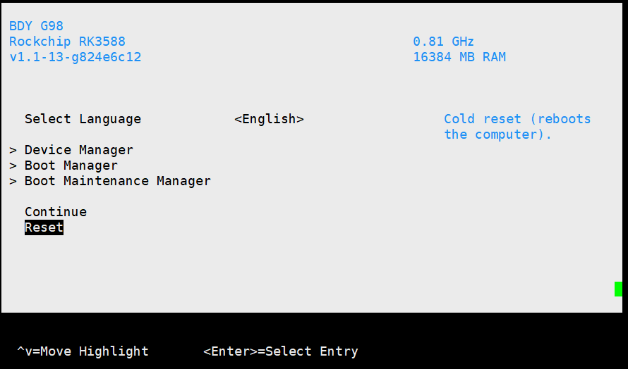

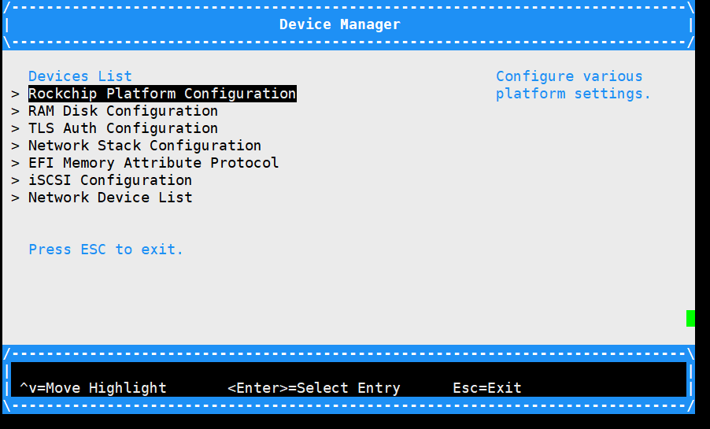

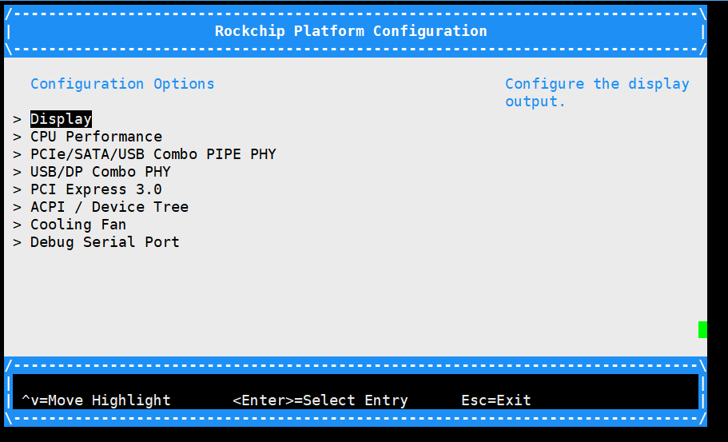

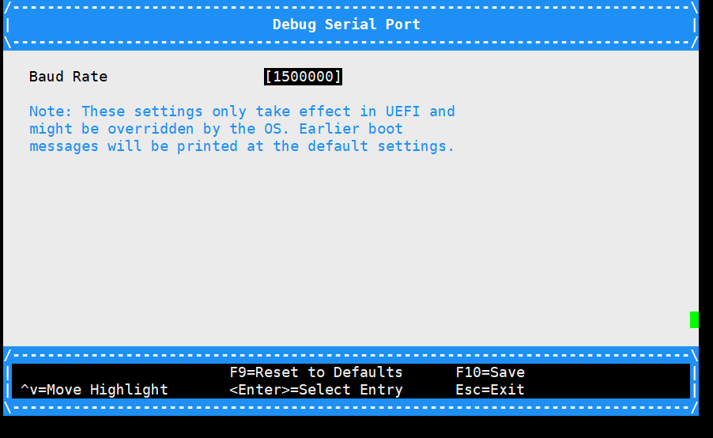

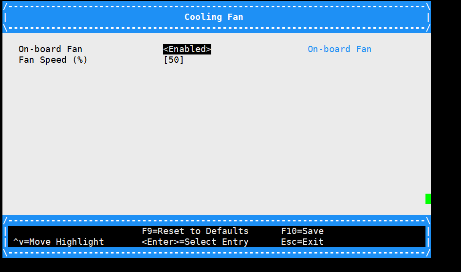

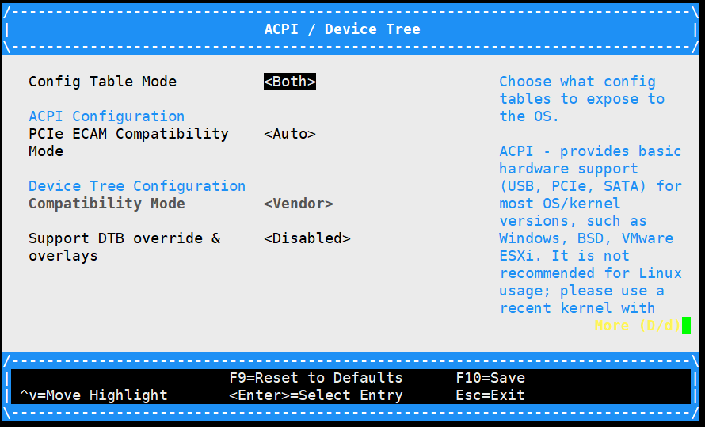

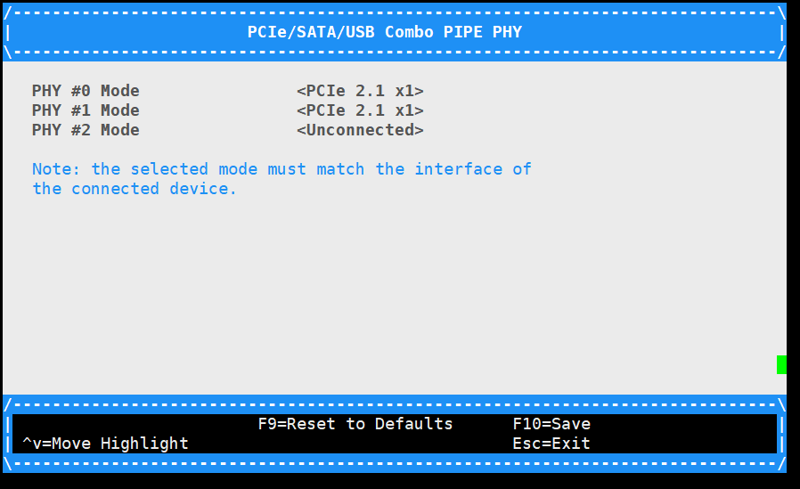

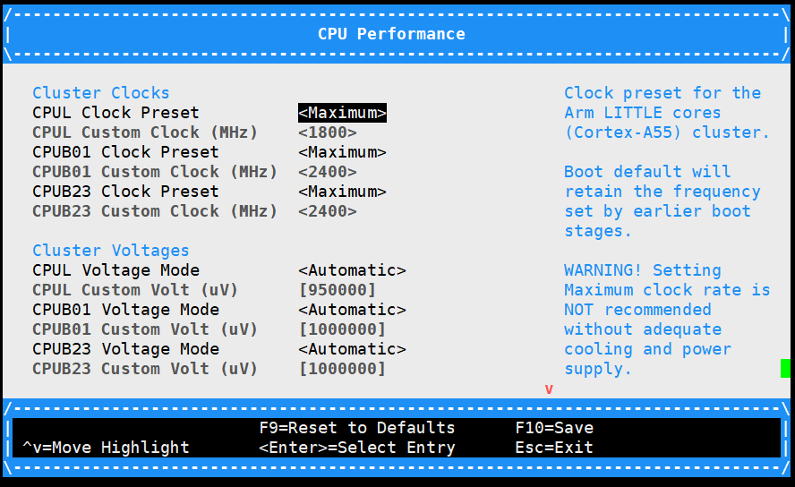

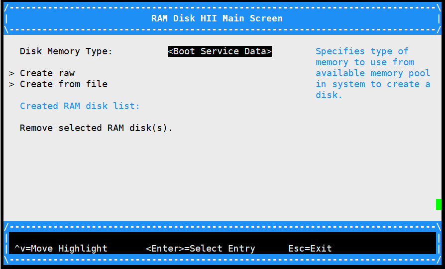

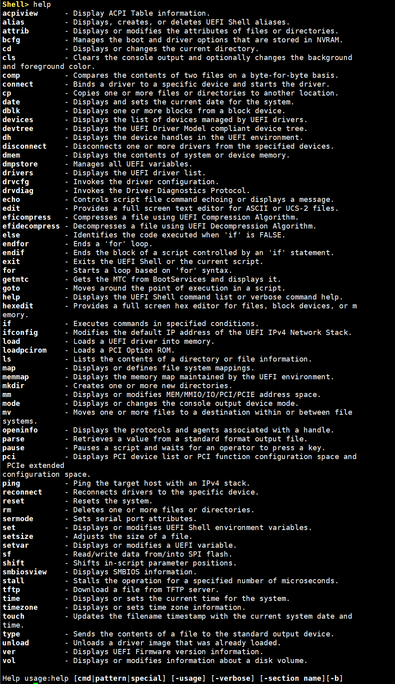

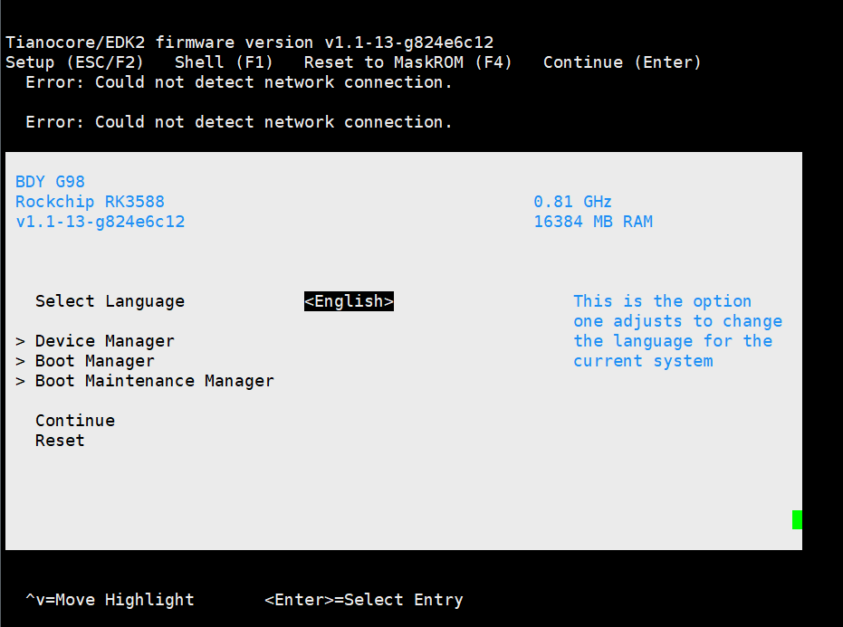

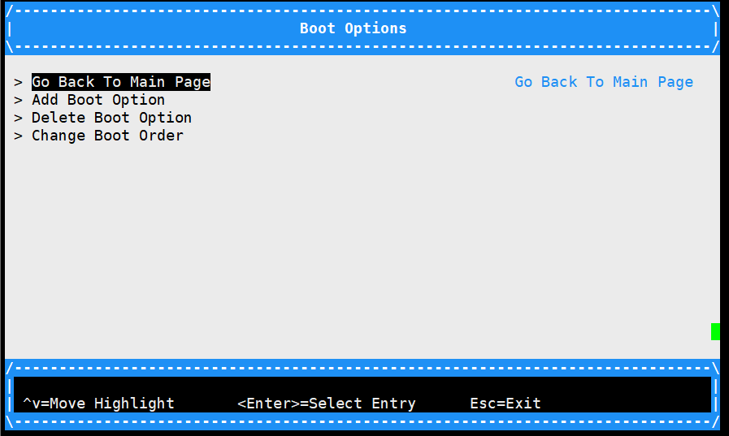

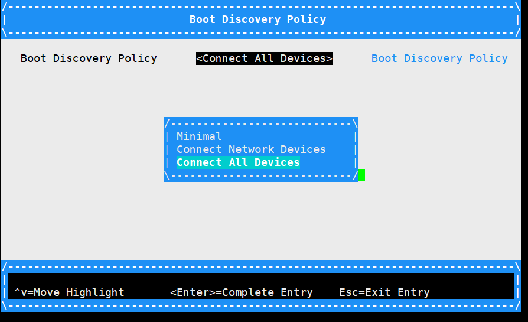


## RK3588_PHOENIX_UEFI_NOR_FLASH.img


HDMI不显示

## RK3588_NOR_FLASH.img

HDMI不显示


