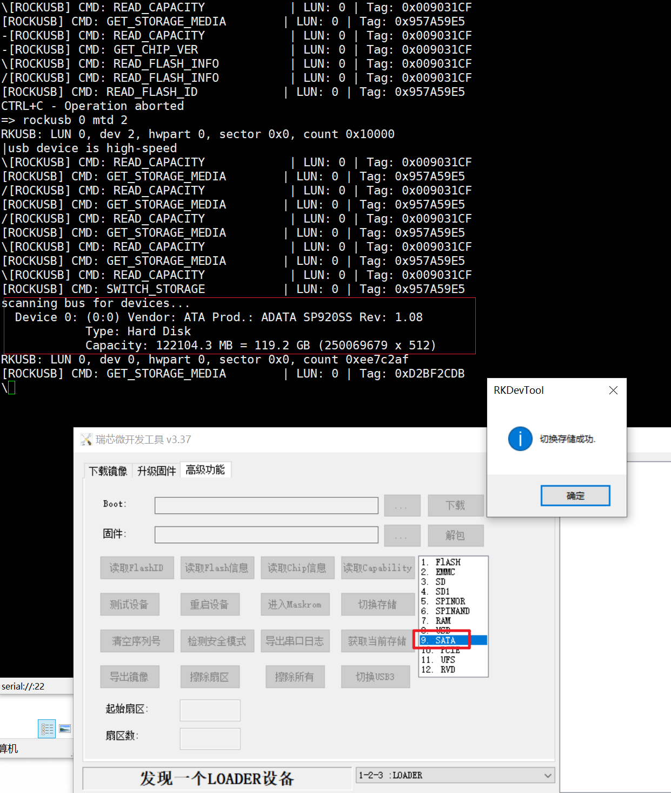
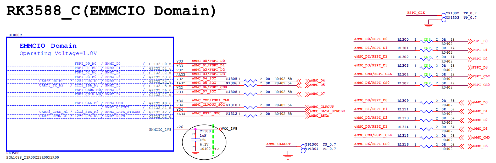

# uboot 适配


## uboot v2017 - istoreos partuuid问题

```shell
=> scsi scan 
scanning bus for devices...
Target spinup took 0 ms.
AHCI 0001.0300 32 slots 1 ports 6 Gbps 0x1 impl SATA mode
flags: ncq stag pm led clo only pmp fbss pio slum part ccc apst 
Repair the Primary gpt table OK!
  Device 0: (0:0) Vendor: ATA Prod.: ADATA SP920SS Rev: 1.08
            Type: Hard Disk
            Capacity: 122104.3 MB = 119.2 GB (250069679 x 512)
=> part list scsi 0

Partition Map for SCSI device 0  --   Partition Type: EFI

Part	Start LBA	End LBA		Name
	Attributes
	Type GUID
	Partition GUID
  1	0x00008000	0x001077ff	"primary"
	attrs:	0x0000000000000000
	type:	0fc63daf-8483-4772-8e79-3d69d8477de4
	guid:	b175691c-c9fe-45e5-b456-6ac6be956aa8
  2	0x00108000	0x0ee7c28d	"primary"
	attrs:	0x0000000000000000
	type:	0fc63daf-8483-4772-8e79-3d69d8477de4
	guid:	d2ec8bc5-cf41-43f5-bd10-c4e28774339c
=>
```

```shell
/dev/loop2p2: BLOCK_SIZE="262144" TYPE="squashfs" PARTUUID="a41d59eb-02"
/dev/loop2p1: LABEL="kernel" UUID="84173db5-fa99-e35a-95c6-28613cc79ea9" BLOCK_SIZE="4096" TYPE="ext4" PARTUUID="a41d59eb-01"

[root@bdy-g98 ~]# blkid /dev/sda1
/dev/sda1: LABEL="kernel" UUID="84173db5-fa99-e35a-95c6-28613cc79ea9" BLOCK_SIZE="4096" TYPE="ext4" PARTUUID="a41d59eb-01"
[root@bdy-g98 ~]# blkid /dev/sda2
/dev/sda2: BLOCK_SIZE="262144" TYPE="squashfs" PARTUUID="a41d59eb-02"

```


```shell
[root@bdy-g98 ~]# hexdump -C /dev/sda | head -n 100
00000000  50 52 45 56 45 4e 54 20  22 53 4d 41 52 54 22 20  |PREVENT "SMART" |
00000010  50 41 52 54 45 44 20 46  52 4f 4d 20 4d 4f 44 49  |PARTED FROM MODI|
00000020  46 59 49 4e 47 20 4d 42  52 20 44 49 53 4b 49 44  |FYING MBR DISKID|
00000030  0a 00 00 00 00 00 00 00  00 00 00 00 00 00 00 00  |................|
00000040  00 00 00 00 00 00 00 00  00 00 00 00 00 00 00 00  |................|
*
000001b0  00 00 00 00 00 00 00 00  eb 59 1d a4 00 00 80 08  |.........Y......|
000001c0  09 20 83 08 28 a2 00 80  00 00 00 00 02 00 00 09  |. ..(...........|
000001d0  0a a4 83 0b 8b ac 00 88  02 00 00 00 08 00 00 0b  |................|
000001e0  ac ae 83 0b bb ef 00 90  0a 00 00 00 40 00 00 00  |............@...|
000001f0  00 00 00 00 00 00 00 00  00 00 00 00 00 00 55 aa  |..............U.|
00000200  45 46 49 20 50 41 52 54  00 00 01 00 5c 00 00 00  |EFI PART....\...|
00000210  74 33 c4 14 00 00 00 00  01 00 00 00 00 00 00 00  |t3..............|
00000220  ae c2 e7 0e 00 00 00 00  22 00 00 00 00 00 00 00  |........".......|
00000230  8d c2 e7 0e 00 00 00 00  be 6c 45 11 a0 63 71 46  |.........lE..cqF|
00000240  9b d5 d8 58 5c 07 41 ae  02 00 00 00 00 00 00 00  |...X\.A.........|
00000250  80 00 00 00 80 00 00 00  1b cf 52 c3 00 00 00 00  |..........R.....|
00000260  00 00 00 00 00 00 00 00  00 00 00 00 00 00 00 00  |................|
*
00000400  af 3d c6 0f 83 84 72 47  8e 79 3d 69 d8 47 7d e4  |.=....rG.y=i.G}.|
00000410  1c 69 75 b1 fe c9 e5 45  b4 56 6a c6 be 95 6a a8  |.iu....E.Vj...j.|
00000420  00 80 00 00 00 00 00 00  ff 77 10 00 00 00 00 00  |.........w......|
00000430  00 00 00 00 00 00 00 00  70 00 72 00 69 00 6d 00  |........p.r.i.m.|
00000440  61 00 72 00 79 00 00 00  00 00 00 00 00 00 00 00  |a.r.y...........|
00000450  00 00 00 00 00 00 00 00  00 00 00 00 00 00 00 00  |................|
```

eb 59 1d a4，小端序读取为 a41d59eb

```shell
# file istoreos2410-rockchip-armv8-bdy_g98-nas-squashfs-sysupgrade-2026083018.img 
istoreos2410-rockchip-armv8-bdy_g98-nas-squashfs-sysupgrade-2026083018.img: DOS/MBR boot sector; partition 1 : ID=0x83, active, start-CHS (0x20,8,9), end-CHS (0xa2,8,40), startsector 32768, 131072 sectors; partition 2 : ID=0x83, start-CHS (0xa4,9,10), end-CHS (0x2ac,11,11), startsector 165888, 524288 sectors; partition 3 : ID=0x83, start-CHS (0x2ae,11,44), end-CHS (0x2ef,11,59), startsector 692224, 4194304 sectors
```

```shell
# blkid istoreos2410-rockchip-armv8-bdy_g98-nas-squashfs-sysupgrade-2026083018.img 
istoreos2410-rockchip-armv8-bdy_g98-nas-squashfs-sysupgrade-2026083018.img: PTUUID="a41d59eb" PTTYPE="dos"
```

blkid 输出的 a41d59eb-01 是 Linux 用 MBR 磁盘签名 + 分区号 拼凑出来的，MBR 规范本身没有 PARTUUID

```shell
[root@armbian ~]# blkid /dev/sda1
/dev/sda1: LABEL="kernel" UUID="84173db5-fa99-e35a-95c6-28613cc79ea9" BLOCK_SIZE="4096" TYPE="ext4" PARTLABEL="primary" PARTUUID="b175691c-c9fe-45e5-b456-6ac6be956aa8"
[root@armbian ~]# blkid /dev/sda2
/dev/sda2: PARTLABEL="primary" PARTUUID="d2ec8bc5-cf41-43f5-bd10-c4e28774339c"

```


```shell
=> part list scsi 0

Partition Map for SCSI device 0  --   Partition Type: EFI

Part	Start LBA	End LBA		Name
	Attributes
	Type GUID
	Partition GUID
  1	0x00008000	0x001077ff	"primary"
	attrs:	0x0000000000000000
	type:	0fc63daf-8483-4772-8e79-3d69d8477de4
	guid:	b175691c-c9fe-45e5-b456-6ac6be956aa8
  2	0x00108000	0x0ee7c28d	"primary"
	attrs:	0x0000000000000000
	type:	0fc63daf-8483-4772-8e79-3d69d8477de4
	guid:	d2ec8bc5-cf41-43f5-bd10-c4e28774339c
=>
```


结论：

* uboot获取的partuuid正确，无错误
* mbr信息优先被内核采用，所以导致找不到分区
* is不支持sata盘，即使改成gpt也会应为没有sda而无法引导。
* uboot 2017版本默认优先识别efi、然后才是dos


/* Declare a new U-Boot partition 'driver' */
#define U_BOOT_PART_TYPE(__name)                                        \
        ll_entry_declare(struct part_driver, __name, part_driver)

```c
commit ed196f71ce099892a4a4513f05c1bab174fb0b1d (HEAD -> kdev, origin/kdev)
Author: yifengyou <842056007@qq.com>
Date:   Mon Aug 31 15:07:20 2026 +0800

    修改分区识别顺序
    
    默认按照字符编码顺序
    
    System.map:5879:00000000003512a0 D _u_boot_list_2_part_driver_2_a_a_rkram_part
    System.map:5885:00000000003512c8 D _u_boot_list_2_part_driver_2_a_efi
    System.map:5886:00000000003512f0 D _u_boot_list_2_part_driver_2_dos
    
    对dos修改为a_dos，调整到efi之前
    
    0000000000351190 D _u_boot_list_2_part_driver_2_a_a_rkram_part
    00000000003511b8 D _u_boot_list_2_part_driver_2_a_dos
    00000000003511e0 D _u_boot_list_2_part_driver_2_a_efi
    
    Signed-off-by: yifengyou <842056007@qq.com>

diff --git a/disk/part_dos.c b/disk/part_dos.c
index 850a538e83..528b762164 100644
--- a/disk/part_dos.c
+++ b/disk/part_dos.c
@@ -297,7 +297,7 @@ int write_mbr_partition(struct blk_desc *dev_desc, void *buf)
        return 0;
 }
 
-U_BOOT_PART_TYPE(dos) = {
+U_BOOT_PART_TYPE(a_dos) = {
        .name           = "DOS",
        .part_type      = PART_TYPE_DOS,
        .max_entries    = DOS_ENTRY_NUMBERS,

```


## uboot v2017 - 启动顺序配置


* 默认uboot启动过程中执行bootcmd环境变量定义的命令

bsp默认启动命令：

```shell
boot_android ${devtype} ${devnum};boot_fit;bootrkp;run distro_bootcmd;
```

### 增加boot.scr和extlinux.conf支持

```shell

#define ENV_MEM_LAYOUT_SETTINGS \
	"scriptaddr=0x00500000\0" \
	"pxefile_addr_r=0x00600000\0" \
	"fdt_addr_r=0x08300000\0" \
	"kernel_addr_r=0x00400000\0" \
	"kernel_addr_c=0x05480000\0" \
	"ramdisk_addr_r=0x0a200000\0" \
	"try_bootscr_boot=" \
		"for distro_bootpart in 1 2 3 4; do " \
			"if test -e ${devtype} ${devnum}:${distro_bootpart} /; then " \
				"for prefix in / /boot/; do " \
					"echo Try ${devtype} ${devnum}:${distro_bootpart} ${prefix}boot.scr; " \
					"if test -e ${devtype} ${devnum}:${distro_bootpart} ${prefix}boot.scr; then " \
						"echo Found boot.scr on ${devtype} ${devnum}:${distro_bootpart}; " \
						"load ${devtype} ${devnum}:${distro_bootpart} ${scriptaddr} ${prefix}boot.scr; " \
						"source ${scriptaddr}; " \
						"echo boot.scr returned, trying next...; " \
					"fi; " \
				"done; " \
			"fi; " \
		"done; \0" \
	"try_extlinux_boot=" \
		"for distro_bootpart in 1 2 3 4; do " \
			"if test -e ${devtype} ${devnum}:${distro_bootpart} /; then " \
				"for extlinux_path in /boot/extlinux/extlinux.conf /extlinux/extlinux.conf /extlinux.conf; do " \
					"echo Try ${devtype} ${devnum}:${distro_bootpart} ${extlinux_path}; then " \
					"if test -e ${devtype} ${devnum}:${distro_bootpart} ${extlinux_path}; then " \
						"echo Found extlinux.conf on ${devtype} ${devnum}:${distro_bootpart}; " \
						"sysboot ${devtype} ${devnum}:${distro_bootpart} ${scriptaddr} ${extlinux_path}; " \
						"echo sysboot returned, trying next...; " \
					"fi; " \
				"done; " \
			"fi; " \
		"done; \0" \
	"boot_one_dev=" \
		"run try_bootscr_boot; " \
		"run try_extlinux_boot; \0" \
	"bootcmd_nvme=" \
		"echo NVMe: pci enum; pci enum; " \
		"nvme scan; " \
		"setenv devtype nvme; " \
		"setenv devnum 0; if nvme dev 0; then run boot_one_dev; fi; " \
		"setenv devnum 1; if nvme dev 1; then run boot_one_dev; fi; " \
		"echo NVMe: no nvme bootable media; \0" \
	"bootcmd_usb=" \
		"echo USB: start; usb start; " \
		"setenv devtype usb; " \
		"setenv devnum 0; if usb dev 0; then run boot_one_dev; fi; " \
		"setenv devnum 1; if usb dev 1; then run boot_one_dev; fi; " \
		"echo USB: no usb bootable media; \0" \
	"bootcmd_scsi=" \
		"echo SCSI: scsi scan; scsi scan; " \
		"setenv devtype scsi; " \
		"setenv devnum 0; if scsi dev 0; then run boot_one_dev; fi; " \
		"setenv devnum 1; if scsi dev 1; then run boot_one_dev; fi; " \
		"echo SCSI: no scsi bootable media; \0" \
	"bootcmd=run bootcmd_usb; run bootcmd_nvme; run bootcmd_scsi; " \
		"echo ERROR: No bootable device found; \0"


```

---

## uboot v2017 - rockusb支持多后端存储

### 前提

* 协议本质：rockusb 确实是 Rockchip 私有协议，运行在 USB Bulk Transfer 基础信道之上，用于固件烧录、分区读写、设备调试等。它不是标准的 USB Mass Storage (UMS) 或 DFU 协议。
* U-Boot 命令：rockusb 是 U-Boot 侧的服务端命令，执行后 U-Boot 进入等待状态，监听宿主机（如 RKDevTool、upgrade_tool、rkdeveloptool）发来的私有协议指令。

```shell
=> rockusb 
rockusb - Use the rockusb Protocol

Usage:
rockusb <USB_controller> <devtype> <dev[:part]>  e.g. rockusb 0 mmc 0

=>
```

* ```<USB_controller>```：不是存储设备编号，而是 USB OTG/Device 控制器的索引。例如 0 通常指板子上连接 PC 的那个 USB Device 口（通常是 OTG 口）。这个参数决定了通过哪个物理
  USB 端口进行 rockusb 通信。
* ```<devtype> + <dev[:part]>```：这才是指定 rockusb 协议默认操作的后端存储介质。当宿主机发送"读/写 LBA"等不指定设备的简化指令时，U-Boot 会使用这里指定的 mmc/nand/spi
  作为默认目标。

```rockusb 0 mmc 0```的意思是：

**"通过 USB 控制器 0 启动 rockusb 服务，并将 mmc 0 设为默认操作的后端存储"。**

### rockusb如何指定spi nor flash作为后端存储

step1：确认spi nor flash类型

```shell
=> dm uclass

uclass 13: blk
  [   ] ramdisk-ro.blk @ ebae9550 | ramdisk0 *
  [   ] flash@0.blk @ ebaeb480 | mtd1 *
  [ + ] flash@1.blk @ ebaeb710, seq 0, (req -1) | mtd2 *
  [   ] mmc@fe2c0000.blk @ ebaebab0 | mmc1 *
  [   ] mmc@fe2e0000.blk @ ebaebe10 | mmc0 *
  [   ] ahci_scsi.id0lun0 @ ebaf7b70 | scsi0 *
  [   ] usb_mass_storage.lun0 @ ebb26450 | usb0 *
=> dm tree
 ebaeb390    mtd        [   ]   spi_nand                   |   |-- flash@0 *
 ebaeb480    blk        [   ]   mtd_blk                    |   |   `-- flash@0.blk *
 ebaeb620    spi_flash  [ + ]   spi_flash_std              |   `-- flash@1 *
 ebaeb710    blk        [ + ]   mtd_blk                    |       `-- flash@1.blk *

```

在blk类型，可见mtd2某人启用。另外spi股灾spi_flash下的作为mtd_blk

```shell
=> printenv devtype
devtype=mtd
=> printenv devnum
devnum=2
=> rockusb 0 mtd 2
RKUSB: LUN 0, dev 2, hwpart 0, sector 0x0, count 0x10000
\usb device is high-speed
```

### rockusb支持哪些命令

* windows端不同rkdevtool版本差异部分命令不支持
* 已测试g98 配套rockchip uboot bsp，最合适的rkdevtool是v3.37

| 功能分类 | 命令宏定义 | 核心作用 | 备注 / 实现细节 |
| :--- | :--- | :--- | :--- |
| 核心存储读写 | `RKUSB_LBA_READ_10` | 按 LBA 读取存储数据 | 转换为标准 SCSI `SC_READ_10` 处理，复用 UMS 逻辑 |
| | `RKUSB_LBA_WRITE_10` | 按 LBA 写入存储数据 | 转换为标准 SCSI `SC_WRITE_10` 处理，复用 UMS 逻辑 |
| | `RKUSB_LBA_ERASE` | LBA 级别擦除 | 用于 eMMC TRIM 或 NAND 块擦除 |
| | `RKUSB_READ_CAPACITY` | 获取存储容量信息 | 返回总块数与块大小 |
| 设备识别与信息 | `RKUSB_TEST_UNIT_READY` | 测试设备就绪状态 | 类似 SCSI TUR，用于握手验证 |
| | `RKUSB_GET_CHIP_VER` | 获取 SoC 芯片版本 | 上位机据此区分 RK3588/RK3568 等型号 |
| | `RKUSB_READ_FLASH_ID` | 读取 Flash 原厂 ID | 识别 NAND/eMMC/SPI NOR 厂商与型号 |
| | `RKUSB_READ_FLASH_INFO` | 读取 Flash 详细参数 | 包含页大小、块大小、ECC 信息等 |
| | `RKUSB_GET_STORAGE_MEDIA` | 获取当前存储介质类型 | 返回当前绑定的后端存储类型 |
| 高级存储管理 | `RKUSB_SWITCH_STORAGE` | 动态切换后端存储 | 关键能力：无需重启即可切换 mmc/sd/spi 等后端 |
| | `RKUSB_TEST_BAD_BLOCK` | 检测 NAND 坏块 | 仅适用于 NAND Flash 介质 |
| | `RKUSB_ERASE_10_FORCE` | 强制擦除 | 忽略写保护限制，具有破坏性 |
| | `RKUSB_VS_READ` | 厂商自定义区读取 | 访问 OOB、Metadata 等非数据区 |
| | `RKUSB_VS_WRITE` | 厂商自定义区写入 | 写入厂商配置区，需谨慎使用 |
| 系统控制与调试 | `RKUSB_RESET` | 软复位设备 | 烧录完成后常用，触发设备重启 |
| | `RKUSB_SWITCH_USB3` | 切换至 USB3.0 模式 | 运行时提升传输速率，需硬件支持 |
| | `RKUSB_UART_READ` | 通过 USB 回读 UART 日志 | 依赖 `CONFIG_PSTORE`，无串口时获取崩溃日志 |
| | `RKUSB_READ_OTP_DATA` | 读取 OTP/eFuse 数据 | 依赖 `CONFIG_ROCKCHIP_OTP`，读取 SN/MAC/密钥等 |
| 已废弃 / 不支持 | `RKUSB_READ_10` / `WRITE_10` | 旧版 RAW 读写 | 打印提示使用新版工具，已被 LBA 版本取代 |
| | `RKUSB_SDRAM_*` | SDRAM 读写与执行 | MaskROM 阶段能力，U-Boot 阶段不再需要 |
| | `RKUSB_READ/WRITE_SPARE` | 旧版 Spare/OOB 操作 | 已被 VS 命令整合替代 |
| | `RKUSB_LOW_FORMAT` 等 | 低级格式化/设置ID等 | 遗留命令，直接返回 `UNKNOWN_CMND` |

```c
static int rkusb_cmd_process(struct fsg_common *common,
			     struct fsg_buffhd *bh, int *reply)
{
	struct usb_request	*req = bh->outreq;
	struct fsg_bulk_cb_wrap	*cbw = req->buf;
	int rc;

	dump_cbw(cbw);

	if (rkusb_check_lun(common)) {
		*reply = -EINVAL;
		return RKUSB_RC_ERROR;
	}

	switch (common->cmnd[0]) {
	case RKUSB_TEST_UNIT_READY:
		*reply = rkusb_do_test_unit_ready(common, bh);
		rc = RKUSB_RC_FINISHED;
		break;

	case RKUSB_READ_FLASH_ID:
		*reply = rkusb_do_read_flash_id(common, bh);
		rc = RKUSB_RC_FINISHED;
		break;

	case RKUSB_TEST_BAD_BLOCK:
		*reply = rkusb_do_test_bad_block(common, bh);
		rc = RKUSB_RC_FINISHED;
		break;

	case RKUSB_ERASE_10_FORCE:
		*reply = rkusb_do_erase_force(common, bh);
		rc = RKUSB_RC_FINISHED;
		break;

	case RKUSB_LBA_READ_10:
		rkusb_fixup_cbwcb(common, bh);
		common->cmnd[0] = SC_READ_10;
		common->cmnd[1] = 0; /* Not support */
		rc = RKUSB_RC_CONTINUE;
		break;

	case RKUSB_LBA_WRITE_10:
		rkusb_fixup_cbwcb(common, bh);
		common->cmnd[0] = SC_WRITE_10;
		common->cmnd[1] = 0; /* Not support */
		rc = RKUSB_RC_CONTINUE;
		break;

	case RKUSB_READ_FLASH_INFO:
		*reply = rkusb_do_read_flash_info(common, bh);
		rc = RKUSB_RC_FINISHED;
		break;

	case RKUSB_GET_CHIP_VER:
		*reply = rkusb_do_get_chip_info(common, bh);
		rc = RKUSB_RC_FINISHED;
		break;

	case RKUSB_LBA_ERASE:
		*reply = rkusb_do_lba_erase(common, bh);
		rc = RKUSB_RC_FINISHED;
		break;

	case RKUSB_VS_WRITE:
		*reply = rkusb_do_vs_write(common);
		rc = RKUSB_RC_FINISHED;
		break;

	case RKUSB_VS_READ:
		*reply = rkusb_do_vs_read(common);
		rc = RKUSB_RC_FINISHED;
		break;

#ifdef CONFIG_PSTORE
	case RKUSB_UART_READ:
		rkusb_fixup_cbwcb(common, bh);
		*reply = rkusb_do_uart_debug_read(common);
		rc = RKUSB_RC_FINISHED;
		break;
#endif

	case RKUSB_SWITCH_STORAGE:
		*reply = rkusb_do_switch_storage(common);
		rc = RKUSB_RC_FINISHED;
		break;

	case RKUSB_GET_STORAGE_MEDIA:
		*reply = rkusb_do_get_storage_info(common, bh);
		rc = RKUSB_RC_FINISHED;
		break;

	case RKUSB_READ_CAPACITY:
		*reply = rkusb_do_read_capacity(common, bh);
		rc = RKUSB_RC_FINISHED;
		break;

	case RKUSB_SWITCH_USB3:
		*reply = rkusb_do_switch_to_usb3(common, bh);
		rc = RKUSB_RC_FINISHED;
		break;

	case RKUSB_RESET:
		*reply = rkusb_do_reset(common, bh);
		rc = RKUSB_RC_FINISHED;
		break;

#ifdef CONFIG_ROCKCHIP_OTP
	case RKUSB_READ_OTP_DATA:
		*reply = rkusb_do_read_otp(common, bh);
		rc = RKUSB_RC_FINISHED;
		break;
#endif

	case RKUSB_READ_10:
	case RKUSB_WRITE_10:
		printf("CMD Not support, pls use new version Tool\n");
	case RKUSB_SET_DEVICE_ID:
	case RKUSB_ERASE_10:
	case RKUSB_WRITE_SPARE:
	case RKUSB_READ_SPARE:
	case RKUSB_GET_VERSION:
	case RKUSB_ERASE_SYS_DISK:
	case RKUSB_SDRAM_READ_10:
	case RKUSB_SDRAM_WRITE_10:
	case RKUSB_SDRAM_EXECUTE:
	case RKUSB_LOW_FORMAT:
	case RKUSB_SET_RESET_FLAG:
	case RKUSB_SPI_READ_10:
	case RKUSB_SPI_WRITE_10:
		/* Fall through */
	default:
		rc = RKUSB_RC_UNKNOWN_CMND;
		break;
	}

	return rc;
}
```

### rockusb如何切换设备

* 已测试在v3.37下，sata、pcie（nvme）、spi

```shell
static int rkusb_do_switch_storage(struct fsg_common *common)
{
	enum if_type type, cur_type = ums[common->lun].block_dev.if_type;
	int devnum, cur_devnum = ums[common->lun].block_dev.devnum;
	struct blk_desc *block_dev;
	u32 media = BOOT_TYPE_UNKNOWN;

	media = 1 << common->cmnd[1];

	switch (media) {
#ifdef CONFIG_MMC
	case BOOT_TYPE_EMMC:
		type = IF_TYPE_MMC;
		devnum = 0;
		mmc_initialize(gd->bd);
		break;
#endif
	case BOOT_TYPE_MTD_BLK_NAND:
		type = IF_TYPE_MTD;
		devnum = 0;
		break;
	case BOOT_TYPE_MTD_BLK_SPI_NAND:
		type = IF_TYPE_MTD;
		devnum = 1;
		break;
	case BOOT_TYPE_MTD_BLK_SPI_NOR:
		type = IF_TYPE_MTD;
		devnum = 2;
		break;
#if defined(CONFIG_SCSI) && defined(CONFIG_CMD_SCSI) && (defined(CONFIG_AHCI) || defined(CONFIG_UFS))
	case BOOT_TYPE_SATA:
		type = IF_TYPE_SCSI;
		devnum = 0;
		scsi_scan(true);
		break;
#endif
	case BOOT_TYPE_PCIE:
		type = IF_TYPE_NVME;
		devnum = 0;
		break;
	default:
		printf("Bootdev 0x%x is not support\n", media);
		return -ENODEV;
	}

	if (cur_type == type && cur_devnum == devnum)
		return 0;

#if CONFIG_IS_ENABLED(SUPPORT_USBPLUG)
	block_dev = usbplug_blk_get_devnum_by_type(type, devnum);
#else
	block_dev = blk_get_devnum_by_type(type, devnum);
#endif
	if (!block_dev) {
		printf("Bootdev if_type=%d num=%d toggle fail\n", type, devnum);
		return -ENODEV;
	}

	common->luns[common->lun].num_sectors = block_dev->lba;
	ums[common->lun].num_sectors = block_dev->lba;
	ums[common->lun].block_dev = *block_dev;

	printf("RKUSB: LUN %d, dev %d, hwpart %d, sector %#x, count %#x\n",
	       0,
	       ums[common->lun].block_dev.devnum,
	       ums[common->lun].block_dev.hwpart,
	       ums[common->lun].start_sector,
	       ums[common->lun].num_sectors);

	return 0;
}
```

* sata可以切换




* nvme可以切换


* 不支持usb，代码中就没有usb获取、切换的逻辑


暂不考虑支持usb刷写


## uboot v2017 - nvme适配

### pcie nvme

### 物理连接

aigo是靠近cpu的NVME槽位，另一个则是靠近sata口的槽位

| NVMe 设备 | Linux 平台设备名 | DTS 节点 (物理基地址) | APB 寄存器地址 | PCIe Config/MMIO 空间 |
| :--- | :--- | :--- | :--- | :--- |
| nvme0n1 (aigo) | `a40000000.pcie` | `pcie@fe150000` | `0xfe150000` | Config: `0xf0000000` / MMIO: `0x900000000` |
| nvme1n1 (KINGBANK) | `a40400000.pcie` | `pcie@fe160000` | `0xfe160000` | Config: `0xf1000000` / MMIO: `0x940000000` |

### controller与phy的分配情况


```txt
RK3588 原生支持极其灵活的 PCIe 架构：

    5个控制器 (Controllers)：
        Controller 0 (4L): PCIe 3.0 x4 (Endpoint/Root Complex)
        Controller 1 (2L): PCIe 3.0 x2 (仅 Root Complex)
        Controller 2 (1L0): PCIe 3.0 x1_0 (仅 Root Complex)
        Controller 3 (1L1): PCIe 3.0 x1_1 (仅 Root Complex)
        Controller 4 (1L2): PCIe 3.0 x1_2 (仅 Root Complex)
    5个 PHY：
        PCIe3.0 PHY0 (2 Lanes)
        PCIe3.0 PHY1 (2 Lanes)
        Combo PHY0 (PCIe2.0 / SATA3.0)
        Combo PHY1 (PCIe2.0 / SATA3.0)
        Combo PHY2 (PCIe2.0 / SATA3.0 / USB3.0)
```

设备树中实际启用了 **2个 PCIe 节点**，它们都指向了同一个 PCIe 3.0 PHY (`phys = <&pcie30phy>`)，即图中的 **PCIe3.0 PHY0 + PHY1** 组合。

*  **节点 A: `pcie3x4` (对应图中的 Controller 0)**
    *   **DTS 配置:** `num-lanes = <2>;`，`max-link-speed = <3>;`
    *   **硬件映射分析:**
        *   虽然硬件上 Controller 0 是 4 Lane 的，但设备树将其限制为了 **2 Lane (x2)**。
        *   它使用了 `pcie30phy`。根据图中连线，Controller 0 的 Lane0/Lane1 可以通过 MUX 连接到 PCIe3.0 PHY0。
        *   **结论:** 这里把原本可以跑 x4 的 Controller 0，**拆分/降级** 成了 x2 模式使用。

*  **节点 B: `pcie3x2` (对应图中的 Controller 1)**
    *   **DTS 配置:** `num-lanes = <2>;`，`max-link-speed = <3>;`
    *   **硬件映射分析:**
        *   这是原生的 2 Lane 控制器。
        *   它也使用了 `pcie30phy`。根据图中连线，Controller 1 的 Lane0/Lane1 通过 MUX 连接到了 PCIe3.0 PHY1。
        *   **结论:** 这是一个标准的 PCIe 3.0 x2 通道。

### uboot中的pcie命令

```shell
pcie@fe160000: PCIe Linking... LTSSM is 0x0
pcie@fe160000: PCIe Linking... LTSSM is 0x0
pcie@fe160000: PCIe Linking... LTSSM is 0x0
pcie@fe160000: PCIe-2 Link Fail
=> pci write.w 1.0.0 0x04 0x0000
=> pci write.w 0.0.0 0x04 0x0000
=> pci write.w 0.0.0 0x1a 0x0101
=> pci write.l 0.0.0 0x20 0xf02ff020
=> pci write.l 0.0.0 0x24 0xf02ff020
=> pci write.l 0.0.0 0x28 0x00000000
=> pci write.l 0.0.0 0x2c 0x00000000
=> pci write.w 0.0.0 0x04 0x0007
=> pci write.l 1.0.0 0x10 0xf0200000
=> pci write.l 1.0.0 0x14 0x00000000
=> pci write.w 1.0.0 0x04 0x0006
=> md 0xf0200000 4
f0200000: ff0103ff 00200030 00010400 00000000    ....0. .........
=> nvme scan
try to probe
=> nvme info
Device 0: Vendor: 0x1e4b Rev: SN10660 Prod: 0000307150297
            Type: Hard Disk
            Capacity: 244198.3 MB = 238.4 GB (500118192 x 512)
```


##### Type 0 Header (Endpoint, 如 NVMe SSD 1.0.0)

| 偏移 | 长度 | 字段名称 | 作用 | 备注 |
| :--- | :--- | :--- | :--- | :--- |
| 0x00 | 2 | Vendor ID | 厂商标识 | 0x1e4b (Maxio/联芸科技) |
| 0x02 | 2 | Device ID | 设备标识 | 0x1202 (特定 NVMe 主控型号) |
| 0x04 | 2 | Command | 设备控制 | Bit0:IO, Bit1:Mem, Bit2:BusMaster, Bit6:ParityErr |
| 0x06 | 2 | Status | 状态寄存器 | 反映错误、能力支持等只读状态 |
| 0x08 | 1 | Revision ID | 硬件版本 | 芯片修订版本号 |
| 0x09 | 3 | Class Code | 设备分类 | 0x010802 = Mass Storage / NVMe Controller |
| 0x0C | 1 | Cache Line Size | 缓存行大小 | 用于优化 Burst 传输，x86 常用，ARM 常忽略 |
| 0x0D | 1 | Latency Timer | 延迟定时器 | PCIe 中已废弃，保留兼容 |
| 0x0E | 1 | Header Type | 头类型 | 0x00 = Endpoint |
| 0x10-0x24 | 24 | BAR0-BAR5 | 基地址寄存器 | 定义设备占用的内存/IO空间大小和位置 |
| 0x2C | 2 | Subsystem Vendor ID | 子系统厂商 | 板卡/模组制造商 ID |
| 0x2E | 2 | Subsystem ID | 子系统设备号 | 具体产品型号标识 |
| 0x30 | 4 | Expansion ROM Base | Option ROM 地址 | 存放固件/引导代码的 ROM 映射地址 |
| 0x3C | 1 | Interrupt Line | 中断线号 | 软件使用的中断向量号（PCIe 主要用 MSI） |
| 0x3D | 1 | Interrupt Pin | 中断引脚 | INTA/B/C/D，PCIe 中仅作兼容标识 |

##### Type 1 Header (Bridge, 如 PCIe Bridge 0.0.0)

| 偏移 | 长度 | 字段名称 | 作用 | 备注 |
| :--- | :--- | :--- | :--- | :--- |
| 0x00-0x0F | 16 | 通用字段 | 同 Type 0 | Vendor/Device/Command/Status/Class 等 |
| 0x18 | 1 | Primary Bus Number | 主总线号 | 桥片上游连接的 Bus 编号 (0x00) |
| 0x19 | 1 | Secondary Bus Number | 次级总线号 | 桥片下游直连的 Bus 编号 (0x01) |
| 0x1A | 1 | Subordinate Bus Number | 从属总线号 | 下游所有子树中最大的 Bus 编号 (0x01) |
| 0x1C | 1 | I/O Base | IO 基地址低8位 | 下游 IO 窗口起始地址 >> 8 |
| 0x1D | 1 | I/O Limit | IO 限制地址低8位 | 下游 IO 窗口结束地址 >> 8 |
| 0x20 | 2 | Memory Base | 内存基地址 | 下游非预取内存窗口起始 >> 16 |
| 0x22 | 2 | Memory Limit | 内存限制地址 | 下游非预取内存窗口结束 >> 16 |
| 0x24 | 2 | Prefetchable Mem Base | 预取内存基地址 | 下游预取内存窗口起始 >> 16 |
| 0x26 | 2 | Prefetchable Mem Limit | 预取内存限制 | 下游预取内存窗口结束 >> 16 |
| 0x28 | 4 | Prefetch Base Upper 32 | 预取基地址高32位 | 支持 64-bit 预取内存窗口 |
| 0x2C | 4 | Prefetch Limit Upper 32 | 预取限制高32位 | 支持 64-bit 预取内存窗口 |
| 0x3E | 2 | Bridge Control | 桥片控制 | 奇偶校验、SERR、复位等桥片特有控制位 |


### 测试环境

```shell
root@G98:/# lsblk
NAME        MAJ:MIN RM   SIZE RO TYPE MOUNTPOINTS
sda           8:0    0 119.2G  0 disk 
├─sda1        8:1    0   330M  0 part /boot
└─sda2        8:2    0    32G  0 part /
sdb           8:16   1  29.3G  0 disk 
├─sdb1        8:17   1  29.3G  0 part /vol00/DataTraveler_3.0
└─sdb2        8:18   1    32M  0 part /vol00/DataTraveler_3.0_1
zram0       252:0    0   7.8G  0 disk [SWAP]
nvme0n1     259:0    0 119.2G  0 disk /vol00/aigo NVMe SSD P2000
nvme1n1     259:1    0 238.5G  0 disk 
├─nvme1n1p1 259:2    0   330M  0 part /vol00/KINGBANK KP230
└─nvme1n1p2 259:3    0    32G  0 part /vol00/KINGBANK KP230_1
root@G98:/# find /sys -name nvme0n1
/sys/kernel/debug/block/nvme0n1
/sys/class/block/nvme0n1
/sys/devices/platform/a40000000.pcie/pci0000:00/0000:00:00.0/0000:01:00.0/nvme/nvme0/nvme0n1
/sys/fs/ext4/nvme0n1
/sys/block/nvme0n1
root@G98:/# find /sys -name nvme1n1
/sys/kernel/debug/block/nvme1n1
/sys/class/block/nvme1n1
/sys/devices/platform/a40400000.pcie/pci0001:10/0001:10:00.0/0001:11:00.0/nvme/nvme1/nvme1n1
/sys/block/nvme1n1
root@G98:/# lspci -nn
0000:00:00.0 PCI bridge [0604]: Rockchip Electronics Co., Ltd RK3588 [1d87:3588] (rev 01)
0000:01:00.0 Non-Volatile memory controller [0108]: MAXIO Technology (Hangzhou) Ltd. NVMe SSD Controller MAP1202 [1e4b:1202] (rev 01)
0001:10:00.0 PCI bridge [0604]: Rockchip Electronics Co., Ltd RK3588 [1d87:3588] (rev 01)
0001:11:00.0 Non-Volatile memory controller [0108]: MAXIO Technology (Hangzhou) Ltd. NVMe SSD Controller MAP1202 [1e4b:1202] (rev 01)
0002:20:00.0 PCI bridge [0604]: Rockchip Electronics Co., Ltd RK3588 [1d87:3588] (rev 01)
0002:21:00.0 Ethernet controller [0200]: Realtek Semiconductor Co., Ltd. RTL8125 2.5GbE Controller [10ec:8125] (rev 05)
0003:30:00.0 PCI bridge [0604]: Rockchip Electronics Co., Ltd RK3588 [1d87:3588] (rev 01)
0003:31:00.0 Ethernet controller [0200]: Realtek Semiconductor Co., Ltd. RTL8125 2.5GbE Controller [10ec:8125] (rev 05)
root@G98:/# 
```


### 命令行修复

```shell
setenv preboot 'pci enum; pci write.w 1.0.0 0x04 0x0000; pci write.w 0.0.0 0x04 0x0000; pci write.w 0.0.0 0x1a 0x0101; pci write.l 0.0.0 0x20 0xf02ff020; pci write.l 0.0.0 0x24 0xf02ff020; pci write.w 0.0.0 0x04 0x0007; pci write.l 1.0.0 0x10 0xf0200000; pci write.w 1.0.0 0x04 0x0006'
run preboot

nvme scan
nvme info
```


### nvme单盘crash缺陷分析

问题描述：

1. uboot启动时候扫描pcie顺序是固定的， 先扫fe150000,再扫fe160000
2. 如果fe150000有设备并正常初始化，但fe160000没有接设备，pci数据会被毒化，nvme scan读到的数据有问题，就crash
3. 如果fe150000未接设备，fe160000接了设备，pci数据毒化后又被修改，反而正常
4. 如果都没有设备，没有毒化过程，都正常

针对描述2中，毒化的具体表现为: pci 能读取到fe150000的pci头信息，但是信息是异常的。也就是说因为fe160000扫描破坏了正常fe150000内容

```shell
=> pci enum 
pcie@fe150000: PCIe Linking... LTSSM is 0x0
pcie@fe150000: PCIe Linking... LTSSM is 0x0
pcie@fe150000: PCIe Linking... LTSSM is 0x2
pcie@fe150000: PCIe Linking... LTSSM is 0x210022
pcie@fe150000: PCIe Link up, LTSSM is 0x230011
pcie@fe150000: PCIE-0: Link up (Gen3-x2, Bus0)
pcie@fe160000: PCIe Linking... LTSSM is 0x0
pcie@fe160000: PCIe Linking... LTSSM is 0x0
pcie@fe160000: PCIe Linking... LTSSM is 0x0
pcie@fe160000: PCIe Linking... LTSSM is 0x0
pcie@fe160000: PCIe Linking... LTSSM is 0x0
pcie@fe160000: PCIe Linking... LTSSM is 0x0
pcie@fe160000: PCIe Linking... LTSSM is 0x0
pcie@fe160000: PCIe Linking... LTSSM is 0x0
pcie@fe160000: PCIe Linking... LTSSM is 0x0
pcie@fe160000: PCIe Linking... LTSSM is 0x0
pcie@fe160000: PCIe Linking... LTSSM is 0x0
pcie@fe160000: PCIe Linking... LTSSM is 0x0
pcie@fe160000: PCIe Linking... LTSSM is 0x0
pcie@fe160000: PCIe Linking... LTSSM is 0x0
pcie@fe160000: PCIe Linking... LTSSM is 0x0
pcie@fe160000: PCIe Linking... LTSSM is 0x0
pcie@fe160000: PCIe Linking... LTSSM is 0x0
pcie@fe160000: PCIe Linking... LTSSM is 0x0
pcie@fe160000: PCIe Linking... LTSSM is 0x0
pcie@fe160000: PCIe Linking... LTSSM is 0x0
pcie@fe160000: PCIe Linking... LTSSM is 0x0
pcie@fe160000: PCIe Linking... LTSSM is 0x0
pcie@fe160000: PCIe Linking... LTSSM is 0x0
pcie@fe160000: PCIe Linking... LTSSM is 0x0
pcie@fe160000: PCIe Linking... LTSSM is 0x0
pcie@fe160000: PCIe Linking... LTSSM is 0x1
pcie@fe160000: PCIe Linking... LTSSM is 0x0
pcie@fe160000: PCIe Linking... LTSSM is 0x0
pcie@fe160000: PCIe Linking... LTSSM is 0x0
pcie@fe160000: PCIe Linking... LTSSM is 0x1
pcie@fe160000: PCIe Linking... LTSSM is 0x0
pcie@fe160000: PCIe Linking... LTSSM is 0x0
pcie@fe160000: PCIe Linking... LTSSM is 0x0
pcie@fe160000: PCIe Linking... LTSSM is 0x1
pcie@fe160000: PCIe Linking... LTSSM is 0x0
pcie@fe160000: PCIe Linking... LTSSM is 0x0
pcie@fe160000: PCIe Linking... LTSSM is 0x0
pcie@fe160000: PCIe Linking... LTSSM is 0x0
pcie@fe160000: PCIe Linking... LTSSM is 0x0
pcie@fe160000: PCIe Linking... LTSSM is 0x0
pcie@fe160000: PCIe Linking... LTSSM is 0x0
pcie@fe160000: PCIe Linking... LTSSM is 0x0
pcie@fe160000: PCIe Linking... LTSSM is 0x0
pcie@fe160000: PCIe Linking... LTSSM is 0x0
pcie@fe160000: PCIe Linking... LTSSM is 0x0
pcie@fe160000: PCIe Linking... LTSSM is 0x0
pcie@fe160000: PCIe Linking... LTSSM is 0x0
pcie@fe160000: PCIe Linking... LTSSM is 0x0
pcie@fe160000: PCIe Linking... LTSSM is 0x0
pcie@fe160000: PCIe Linking... LTSSM is 0x0
pcie@fe160000: PCIe-2 Link Fail
pcie@fe160000: PCIe Linking... LTSSM is 0x5
pcie@fe160000: PCIe Linking... LTSSM is 0x0
pcie@fe160000: PCIe Linking... LTSSM is 0x0
pcie@fe160000: PCIe Linking... LTSSM is 0x0
pcie@fe160000: PCIe Linking... LTSSM is 0x0
pcie@fe160000: PCIe Linking... LTSSM is 0x0
pcie@fe160000: PCIe Linking... LTSSM is 0x0
pcie@fe160000: PCIe Linking... LTSSM is 0x0
pcie@fe160000: PCIe Linking... LTSSM is 0x0
pcie@fe160000: PCIe Linking... LTSSM is 0x0
pcie@fe160000: PCIe Linking... LTSSM is 0x0
pcie@fe160000: PCIe Linking... LTSSM is 0x0
pcie@fe160000: PCIe Linking... LTSSM is 0x0
pcie@fe160000: PCIe Linking... LTSSM is 0x0
pcie@fe160000: PCIe Linking... LTSSM is 0x0
pcie@fe160000: PCIe Linking... LTSSM is 0x0
pcie@fe160000: PCIe Linking... LTSSM is 0x0
pcie@fe160000: PCIe Linking... LTSSM is 0x0
pcie@fe160000: PCIe Linking... LTSSM is 0x0
pcie@fe160000: PCIe Linking... LTSSM is 0x0
pcie@fe160000: PCIe Linking... LTSSM is 0x0
pcie@fe160000: PCIe Linking... LTSSM is 0x0
pcie@fe160000: PCIe Linking... LTSSM is 0x0
pcie@fe160000: PCIe Linking... LTSSM is 0x0
pcie@fe160000: PCIe Linking... LTSSM is 0x0
pcie@fe160000: PCIe Linking... LTSSM is 0x1
pcie@fe160000: PCIe Linking... LTSSM is 0x0
pcie@fe160000: PCIe Linking... LTSSM is 0x0
pcie@fe160000: PCIe Linking... LTSSM is 0x0
pcie@fe160000: PCIe Linking... LTSSM is 0x1
pcie@fe160000: PCIe Linking... LTSSM is 0x0
pcie@fe160000: PCIe Linking... LTSSM is 0x0
pcie@fe160000: PCIe Linking... LTSSM is 0x0
pcie@fe160000: PCIe Linking... LTSSM is 0x1
pcie@fe160000: PCIe Linking... LTSSM is 0x0
pcie@fe160000: PCIe Linking... LTSSM is 0x0
pcie@fe160000: PCIe Linking... LTSSM is 0x0
pcie@fe160000: PCIe Linking... LTSSM is 0x0
pcie@fe160000: PCIe Linking... LTSSM is 0x0
pcie@fe160000: PCIe Linking... LTSSM is 0x0
pcie@fe160000: PCIe Linking... LTSSM is 0x0
pcie@fe160000: PCIe Linking... LTSSM is 0x0
pcie@fe160000: PCIe Linking... LTSSM is 0x0
pcie@fe160000: PCIe Linking... LTSSM is 0x0
pcie@fe160000: PCIe Linking... LTSSM is 0x0
pcie@fe160000: PCIe Linking... LTSSM is 0x0
pcie@fe160000: PCIe Linking... LTSSM is 0x0
pcie@fe160000: PCIe Linking... LTSSM is 0x0
pcie@fe160000: PCIe Linking... LTSSM is 0x0
pcie@fe160000: PCIe Linking... LTSSM is 0x0
pcie@fe160000: PCIe-2 Link Fail
=> pci         
BusDevFun  VendorId   DeviceId   Device Class       Sub-Class
_____________________________________________________________
00.00.00   0x1d87     0x3588     Bridge device           0x04
01.00.00   0x1e4b     0x1202     Mass storage controller 0x08
=> pci header 00.00.00
  vendor ID =                   0x1d87
  device ID =                   0x3588
  command register ID =         0x0000
  status register =             0x0010
  revision ID =                 0x01
  class code =                  0x06 (Bridge device)
  sub class code =              0x04
  programming interface =       0x00
  cache line =                  0x00
  latency time =                0x00
  header type =                 0x01
  BIST =                        0x00
  base address 0 =              0x00000000
  base address 1 =              0x00000000
  primary bus number =          0x00
  secondary bus number =        0x00
  subordinate bus number =      0x00
  secondary latency timer =     0x00
  IO base =                     0x00
  IO limit =                    0x00
  secondary status =            0x0000
  memory base =                 0x0000
  memory limit =                0x0000
  prefetch memory base =        0x0001
  prefetch memory limit =       0x0001
  prefetch memory base upper =  0x00000000
  prefetch memory limit upper = 0x00000000
  IO base upper 16 bits =       0x0000
  IO limit upper 16 bits =      0x0000
  expansion ROM base address =  0x00000000
  interrupt line =              0xff
  interrupt pin =               0x01
  bridge control =              0x0000
=> pci header 01.00.00
  vendor ID =                   0x1e4b
  device ID =                   0x1202
  command register ID =         0x0000
  status register =             0x0010
  revision ID =                 0x01
  class code =                  0x01 (Mass storage controller)
  sub class code =              0x08
  programming interface =       0x02
  cache line =                  0x00
  latency time =                0x00
  header type =                 0x00
  BIST =                        0x00
  base address 0 =              0x00000004
  base address 1 =              0x00000000
  base address 2 =              0x00000000
  base address 3 =              0x00000000
  base address 4 =              0x00000000
  base address 5 =              0x00000000
  cardBus CIS pointer =         0x00000000
  sub system vendor ID =        0x1e4b
  sub system ID =               0x1202
  expansion ROM base address =  0x00000000
  interrupt line =              0xff
  interrupt pin =               0x01
  min Grant =                   0x00
  max Latency =                 0x00
=> 
```

```shell
setenv preboot 'pci enum; pci write.w 1.0.0 0x04 0x0000; pci write.w 0.0.0 0x04 0x0000; pci write.w 0.0.0 0x1a 0x0101; pci write.l 0.0.0 0x20 0xf02ff020; pci write.l 0.0.0 0x24 0xf02ff020; pci write.w 0.0.0 0x04 0x0007; pci write.l 1.0.0 0x10 0xf0200000; pci write.w 1.0.0 0x04 0x0006'
run preboot
```

执行这个uboot命令可以临时解决。但终归是驱动代码上的问题


---


## uboot v2017 - miniloader适配


### 制作方式

```c
# ./ddrbin_tool 
version v1.18 20230919
For more details, please refer to the ddrbin_tool_user_guide.txt
This tools support two functions
for example:
function 1: modify ddr.bin file from ddrbin_param.txt.
	1) modify 'ddrbin_param.txt', set ddr frequency, uart info etc what you want.
	If want to keep items default, please keep these items blank.
	like: ./ddrbin_tool px30 ddrbin_param.txt px30_ddr_333MHz_v1.13.bin

function 2: get ddr.bin file config to gen_param.txt file
	If want to get ddrbin file config, please run like that:
	./ddrbin_tool px30 -g gen_param.txt px30_ddr_333MHz_v1.15.bin
	The config will show in gen_param.txt.

Note:	The function 1 and function 2 are two separate functions
The gen_param.txt file which is generated by function 2 is no need used in function 1.

For more details, please refer to the ddrbin_tool_user_guide.txt

```

1. 优先基于rkbin中已有的bin进行参数提取，修改后更新进去
2. 可能有些默认的bin通信频率是115200，有些是1500000。一般差一点包括：

```shell
# diff 1.txt 2.txt 
1c1
< /* DDR cb12b99cc23 hcy 26/04/07-12:02.24,fwver: v1.21 */
---
> /* DDR cb12b99cc23 hcy 25/10/17-18:57:13,fwver: v1.21 */
9c9
< lp4x_freq=1800
---
> lp4x_freq=2112
13c13
< uart baudrate=115200
---
> uart baudrate=1500000
```


## uboot v2017 - led适配

待补充

## uboot v2017 - emmc适配


### rk3588中的EMMC

```shell
MMC:   mmc@fe2c0000: 1, mmc@fe2e0000: 0
```
在 Rockchip RK3588 平台中，设备树（Device Tree）里的 `mmc@fe2c0000` 和 `mmc@fe2e0000` 分别对应芯片内部不同的 SD/MMC 控制器实例。根据 RK3588 的技术参考手册（TRM）和通用 BSP 定义，它们的对应关系如下：

1. mmc@fe2c0000 → SDMMC (通常标记为 sdmmc / sdhci)
-   **控制器：** SD/MMC Host Controller
-   **基地址：** `0xFE2C0000`
-   **典型用途：** 这个控制器通常用于连接 **SD 卡槽**、**TF 卡** 或 **SDIO WiFi/蓝牙模块**。
-   **特点：** 支持标准 SD/SDIO 协议，一般不支持 eMMC 的 HS400 等高速模式。在 Linux 设备树节点中，它常被命名为 `sdmmc` 或 `sdio`。

2. mmc@fe2e0000 → EMMC (通常标记为 emmc / sdhci)
-   **控制器：** Enhanced MMC Host Controller (eMMC PHY)
-   **基地址：** `0xFE2E0000`
-   **典型用途：** 这个控制器专门用于连接板载 **eMMC 存储芯片**。
-   **特点：** 集成了专用的 eMMC PHY，支持 HS400/HS400ES 等高速传输模式。在 Linux 设备树节点中，它常被命名为 `emmc`。

---

这两个缩写分别代表：

**S**ecure **D**igital **M**ulti**M**edia **C**ard / **C**ontroller

-   这是一个组合术语，涵盖了 **SD**（Secure Digital）和 **MMC**（MultiMediaCard）两种存储卡标准。
-   在 RK3588 等设备树中，`sdmmc` 节点表示该控制器**同时兼容** SD 卡和 MMC 卡协议，是一个通用的存储卡接口控制器。

**S**ecure **D**igital **I**nput/**O**utput

-   它是 SD 协议的扩展，允许通过 SD 卡接口连接**非存储类外设**。
-   最常见的用途是连接 **WiFi 模块**、**蓝牙模块**、GPS 模块等。
-   虽然物理接口与 SD 卡相同，但传输的是 I/O 数据而非单纯的块存储数据。

| 缩写 | 全称 | 主要用途 |
| :--- | :--- | :--- |
| **SDMMC** | Secure Digital MultiMedia Card/Controller | 存储设备（SD卡、TF卡、MMC卡） |
| **SDIO** | Secure Digital Input/Output | I/O 外设（WiFi、蓝牙、传感器等） |

### 引脚冲突的精确分析

先明确 RK3588 SFC（SPI5）与 eMMC 在 GPIO2 上的实际引脚映射：

| SFC 信号 | RK3588 引脚 | eMMC 信号 | 是否冲突 |
|----------|-----------|----------|---------|
| SFC_CLK  | GPIO2_C4  | —        | ❌ 不冲突 |
| SFC_CS0  | GPIO2_C5  | —        | ❌ 不冲突 |
| SFC_D0 (MOSI) | GPIO2_C6 | —   | ❌ 不冲突 |
| SFC_D1 (MISO) | GPIO2_C7 | —   | ❌ 不冲突 |
| SFC_D2   | **GPIO2_D0** | EMMC_D0 | ✅ **冲突** |
| SFC_D3   | **GPIO2_D1** | EMMC_D1 | ✅ **冲突** |

> **只有 SFC_D2/D3（四线模式的额外两根数据线）与 EMMC_D0/D1 冲突。**
> SFC 的单线/双线模式（CLK + CS + D0 + D1）使用的引脚与 eMMC **完全不重叠**。

---

### g98中的EMMC

```shell
root@iStoreOS:~# lsblk
NAME         MAJ:MIN RM   SIZE RO TYPE MOUNTPOINTS
nbd0          43:0    0     0B  0 disk 
nbd1          43:32   0     0B  0 disk 
nbd2          43:64   0     0B  0 disk 
nbd3          43:96   0     0B  0 disk 
nbd4          43:128  0     0B  0 disk 
nbd5          43:160  0     0B  0 disk 
nbd6          43:192  0     0B  0 disk 
nbd7          43:224  0     0B  0 disk 
mmcblk0      179:0    0 116.6G  0 disk 
├─mmcblk0p1  179:1    0    64M  0 part /boot
├─mmcblk0p2  179:2    0   256M  0 part /rom
└─mmcblk0p3  179:3    0     2G  0 part /overlay/upper/opt/docker
                                       /overlay
mmcblk0boot0 179:32   0     4M  1 disk 
mmcblk0boot1 179:64   0     4M  1 disk 
zram0        252:0    0     0B  0 disk 
nbd8          43:256  0     0B  0 disk 
nbd9          43:288  0     0B  0 disk 
nbd10         43:320  0     0B  0 disk 
nbd11         43:352  0     0B  0 disk 
nbd12         43:384  0     0B  0 disk 
nbd13         43:416  0     0B  0 disk 
nbd14         43:448  0     0B  0 disk 
nbd15         43:480  0     0B  0 disk 
root@iStoreOS:~# find /sys -name mmcblk0boot0
/sys/kernel/debug/block/mmcblk0boot0
/sys/class/block/mmcblk0boot0
/sys/devices/platform/fe2e0000.mmc/mmc_host/mmc0/mmc0:0001/block/mmcblk0/mmcblk0boot0
/sys/block/mmcblk0boot0
root@iStoreOS:~# find /sys -name mmcblk0p1
/sys/class/block/mmcblk0p1
/sys/devices/platform/fe2e0000.mmc/mmc_host/mmc0/mmc0:0001/block/mmcblk0/mmcblk0p1
/sys/fs/ext4/mmcblk0p1
root@iStoreOS:~# 
```


```shell
[    3.634444] mmc0: SDHCI controller on fe2e0000.mmc [fe2e0000.mmc] using ADMA
[    3.644160] NET: Registered PF_INET6 protocol family
[    3.645808] Segment Routing with IPv6
[    3.646150] In-situ OAM (IOAM) with IPv6
[    3.646529] NET: Registered PF_PACKET protocol family
[    3.646995] bridge: filtering via arp/ip/ip6tables is no longer available by default. Update your scripts to load br_netfilter if you need this.
[    3.648543] 8021q: 802.1Q VLAN Support v1.8
[    3.668538] sdhci-dwcmshc fe2e0000.mmc: Can't reduce the clock below 52MHz in HS200/HS400 mode
[    3.669772] mmc0: new HS400 Enhanced strobe MMC card at address 0001
[    3.671326] mmcblk0: mmc0:0001 Y29128 117 GiB
[    3.673645]  mmcblk0: p1 p2 p3
[    3.674618] mmcblk0boot0: mmc0:0001 Y29128 4.00 MiB
[    3.676232] mmcblk0boot1: mmc0:0001 Y29128 4.00 MiB
[    3.677553] mmcblk0rpmb: mmc0:0001 Y29128 4.00 MiB, chardev (243:0)
```


```shell
U-Boot next-dev-ga7159c6b5c-250929-dirty #root (Aug 08 2026 - 11:15:44 +0800)

Model: BYD G98 Compiled By yifengyou
MPIDR: 0x0
PreSerial: 2, raw, 0xfeb50000
DRAM:  16 GiB
Sysmem: init
Relocation Offset: ed8e6000
Relocation fdt: eb7f67d0 - eb7fecb8, kfdt: 0037c000 - 10037bfff
CR: M/C/I
Using default environment

optee api revision: 2.0
mmc@fe2e0000: 0   <- emmc
Bootdev(atags): mmc 0
MMC0: HS200, 200Mhz
PartType: EFI
TEEC: Waring: Could not find security partition
DM: v2
No misc partition
boot mode: None
FIT: No boot partition
```


### SPI与EMMC复用问题




RK3588 的 **eMMC 控制器**和 **FSPI（Flexible Serial Peripheral Interface）控制器**在 **FSPI_M0** 这组复用引脚上是**物理共享**的，即同一组 GPIO 引脚通过 IOMUX 寄存器只能二选一：

| 复用组 | 功能 A | 功能 B | 能否同时使用 |
|:---|:---|:---|:---|
| **FSPI_M0** | eMMC（CLK/CMD/DATA[0:7]/RSTn） | FSPI SPI NOR Flash（CLK/CS/D0~D3） | ❌ 互斥 |
| **FSPI_M1** | — | FSPI SPI NOR Flash（CLK/CS/D0~D3） | ✅ 独立引脚 |

> 这意味着：**eMMC 和 FSPI_M0 的 SPI NOR Flash 不能同时使用**，它们争夺的是同一组物理焊盘。

---

方案 1：使用 FSPI_M1 引出 SPI NOR Flash（推荐）

如果你的设计**同时需要 eMMC + SPI NOR Flash**，将 SPI NOR Flash 连接到 **FSPI_M1** 对应的另一组物理引脚上，彻底避开 eMMC 占用的 FSPI_M0 引脚。

**硬件改动：**
- SPI NOR Flash（如 W25Q128）的 CLK / CS / D0~D3 走线改接到 FSPI_M1 对应的 GPIO 引脚
- 参考 RK3588 TRM 中 FSPI_M1 的引脚定义（通常位于 GPIO2_C / GPIO2_D 区域，具体以你的芯片版本数据手册为准）

**设备树配置示例：**
```dts
/* 使用 FSPI_M1 引脚组 */
&fspi {
    status = "okay";
    pinctrl-names = "default";
    pinctrl-0 = <&fspim1_pins>;   /* 关键：选择 M1 而非 M0 */

    flash@0 {
        compatible = "jedec,spi-nor";
        reg = <0>;
        spi-max-frequency = <100000000>;
    };
};

/* eMMC 正常使用，不受影响 */
&emmc {
    status = "okay";
    /* ... 标准 eMMC 配置 ... */
};
```

2：二选一设计（只用 eMMC 或只用 SPI NOR）

如果产品只需要一种启动/存储介质：

- **只用 eMMC**：引导代码（Loader + U-Boot + Kernel）全部放在 eMMC 中，FSPI_M0 引脚全部留给 eMMC，不贴 SPI NOR Flash。
- **只用 SPI NOR Flash**：不贴 eMMC，FSPI_M0 引脚用于 SPI NOR Flash 启动。


---

启动引导（Boot）注意事项

| 启动介质 | BootROM 行为 | 引导代码位置 |
|:---|:---|:---|
| eMMC | BootROM 从 eMMC 的 User/Boot 分区加载 IDB → U-Boot → Kernel | eMMC 内部 |
| SPI NOR (FSPI) | BootROM 从 SPI NOR Flash 偏移 0 处加载 | SPI NOR Flash 内部 |

**使用 eMMC 启动时：**
- `BOOT_SEL` 引脚配置为 eMMC 启动模式
- 引导代码（idbloader.img / uboot.img / boot.img）烧写到 eMMC
- 无需 SPI NOR Flash 参与启动

**使用 SPI NOR 启动时：**
- `BOOT_SEL` 引脚配置为 SPI 启动模式
- 引导代码烧写到 SPI NOR Flash
- 此时 eMMC 不可用（引脚被 FSPI 占用）

---

> **核心原则：** eMMC 和 FSPI_M0 是硬件级互斥，无法通过软件切换同时使用。要两者共存，**唯一出路是让 SPI NOR Flash 走 FSPI_M1 引脚组**。设计 PCB 时务必提前规划好 FSPI_M1 的走线。

### 分时复用 + 限制 SPI 为单线/双线模式

RK3588 eMMC接口和FSPI Flash（一个复用口FSPI_M0）接口复用，在eMMC接口设计时，eMMC信号接法请按参考原理图，包含各路电源去耦电容。

使用eMMC时，引导代码放置在eMMC里。

**在 U-Boot 中通过时序控制，让 eMMC 和 SPI NOR 分时使用冲突引脚，并将 SPI NOR 限制在不使用冲突引脚的工作模式下。**


```shell
上电 → BootROM 从介质A加载 U-Boot → DDR 中运行
                                         ↓
                              此时介质A"使命完成"
                                         ↓
                         软件切换 IOMUX → 引脚改接介质B
                                         ↓
                              访问介质B（读配置/固件等）
                                         ↓
                         软件切换 IOMUX → 引脚切回介质A
```


### 方案架构

```
时间线：
━━━━━━━━━━━━━━━━━━━━━━━━━━━━━━━━━━━━━━━━━━━━━
阶段1: SPL早期     阶段2: eMMC初始化    阶段3: SPI NOR访问
━━━━━━━━━━━━━━━━━━━━━━━━━━━━━━━━━━━━━━━━━━━━━
GPIO2_D0/D1 →     GPIO2_D0/D1 →       GPIO2_D0/D1 →
  未配置/SPI功能     eMMC功能(func=1)     临时切回SPI或保持eMMC
  
SFC控制器:         SFC控制器:           SFC控制器:
  可能短暂probe      disabled/挂起        活跃(1-line/2-line)
━━━━━━━━━━━━━━━━━━━━━━━━━━━━━━━━━━━━━━━━━━━━━
```

#### 具体实现方法（三种可能路径）


### 四、实现路径详解

#### 路径 A：SPI NOR 强制单线模式（最可能的方案）⭐

这是最优雅且最常见的做法：

##### 原理
SPI NOR Flash 支持 1-1-1（标准 SPI）、1-1-2（双线读）、1-1-4（四线读）等模式。**单线模式（1-1-1）只使用 CLK + CS + MOSI(D0) + MISO(D1) 四根线**，对应 GPIO2_C4~C7，与 eMMC 零冲突。

##### 设备树修改

```dts
spi@fe2b0000 {
    compatible = "rockchip,sfc";
    reg = <0x00 0xfe2b0000 0x00 0x4000>;
    status = "okay";                          // ← 改为启用
    u-boot,dm-spl;
    #address-cells = <0x01>;
    #size-cells = <0x00>;
    pinctrl-names = "default";
    pinctrl-0 = <&sfc_clk &sfc_cs0 &sfc_d0 &sfc_d1>;  // ← 只配4根线

    flash@0 {
        compatible = "jedec,spi-nor";
        label = "sfc_nor";
        reg = <0x00>;
        spi-tx-bus-width = <1>;               // ← 强制单线写
        spi-rx-bus-width = <1>;               // ← 强制单线读（关键！不用D2/D3）
        spi-max-frequency = <80000000>;       // 适当降频
    };
};
```

#### 新增 pinctrl（只用不冲突的引脚）

```dts
sfc {
    sfc_clk {
        rockchip,pins = <0x02 0x14 0x01 &pcfg_pull_none>;   // GPIO2_C4
    };
    sfc_cs0 {
        rockchip,pins = <0x02 0x15 0x01 &pcfg_pull_up>;     // GPIO2_C5
    };
    sfc_d0 {
        rockchip,pins = <0x02 0x16 0x01 &pcfg_pull_up>;     // GPIO2_C6
    };
    sfc_d1 {
        rockchip,pins = <0x02 0x17 0x01 &pcfg_pull_up>;     // GPIO2_C7
    };
    // 注意：故意不配置 GPIO2_D0/D1 (SFC_D2/D3)
};
```

#### 为什么这能工作？

```
eMMC 8-bit 占用:  GPIO2_D0(D0) ~ GPIO2_D7(D7) + GPIO2_B0~B3(CLK/CMD/RST/DS)
SPI 1-line 占用:  GPIO2_C4(CLK) ~ GPIO2_C7(D1)

两组引脚集合完全不相交 → 可以同时存在！
```

SPI NOR 在单线模式下速度约 **10 MB/s**（80MHz × 1bit / 8），对于 32MB 的 NOR Flash 来说，读取整个芯片约 3.2 秒，在 U-Boot 环境下完全可以接受。

---

### 路径 B：运行时动态切换 IOMUX（更复杂但更灵活）

如果需要在某些时刻使用四线模式加速 SPI 读取：

#### 核心代码逻辑（U-Boot driver 层修改）

```c
// drivers/spi/rockchip_sfc.c 或 board_init 中

static int rockchip_sfc_probe(struct udevice *dev)
{
    // 1. 先将冲突引脚(GPIO2_D0/D1)从 eMMC 功能切换到 SFC 功能
    rk3588_iomux_set(GPIO2_D0, SFC_D2_FUNC);  // func switch
    rk3588_iomux_set(GPIO2_D1, SFC_D3_FUNC);
    
    // 2. 初始化 SFC 控制器，执行 JEDEC ID 读取等操作
    sfc_hw_init(priv);
    spi_nor_scan(nor);
    
    // 3. 操作完成后，将引脚切回 eMMC 功能
    rk3588_iomux_set(GPIO2_D0, EMMC_D0_FUNC);
    rk3588_iomux_set(GPIO2_D1, EMMC_D1_FUNC);
    
    return 0;
}

// 每次 SPI 读写操作前后都需要切换
static int rockchip_sfc_transfer(struct udevice *dev, ...)
{
    // 切入 SPI 模式
    iomux_switch_to_sfc();
    
    // 执行 SPI 传输
    do_transfer(...);
    
    // 切回 eMMC 模式
    iomux_switch_to_emmc();
    
    return 0;
}
```

#### IOMUX 寄存器操作

RK3588 的引脚复用通过 GRF（General Register File）控制：

```c
// GPIO2_D0 的 IOMUX 寄存器在 IOC_GRF 或 PMU2_IOC_GRF 中
// bit[3:0] 控制功能选择:
//   0b00 = GPIO
//   0b01 = EMMC_D0 (func1)  
//   0b10 = SFC_D2  (func2)  ← 部分封装可能是其他值

#define GRF_GPIO2D_IOMUX  0x0148  // 示例偏移

void iomux_switch_to_sfc(void) {
    regmap_write(grf, GRF_GPIO2D_IOMUX,
        (0x3 << (0*4+16)) | (0x2 << (0*4)));  // D0 → SFC_D2
    regmap_write(grf, GRF_GPIO2D_IOMUX,
        (0x3 << (2*4+16)) | (0x2 << (2*4)));  // D1 → SFC_D3
}

void iomux_switch_to_emmc(void) {
    regmap_write(grf, GRF_GPIO2D_IOMUX,
        (0x3 << (0*4+16)) | (0x1 << (0*4)));  // D0 → EMMC_D0
    regmap_write(grf, GRF_GPIO2D_IOMUX,
        (0x3 << (2*4+16)) | (0x1 << (2*4)));  // D1 → EMMC_D1
}
```

---

### 路径 C：调整 Probe 顺序 + 延迟初始化

```c
// board/rk3588/bdy_g98.c

int board_late_init(void)
{
    // 此时 eMMC 已经完成初始化并处于 idle 状态
    // eMMC 在 idle 时不会驱动数据线，引脚处于高阻
    
    // 临时借用 GPIO2_D0/D1 给 SFC 做 JEDEC ID 读取
    // (NOR Flash 的 RDID 命令只需要单线即可)
    
    enable_sfc_with_1line_mode();
    
    return 0;
}
```

---

### 五、最可能的实际方案判定

| 线索 | 分析 |
|------|------|
| `Prod: sfc_nor` | 设备树中 `label = "sfc_nor"` 被保留，说明 flash@1 节点被启用 |
| `Capacity: 32.0 MB` | 256Mbit NOR Flash，典型容量 |
| `Bus Width: 8-bit` (eMMC) | eMMC 仍为 8-bit，**没有降位宽** |
| `Timing Interface: HS200` | eMMC 工作在 HS200 而非 HS400（可能是稳定性考虑） |
| 两者同时可用 | 必然是分时或分引脚方案 |

**最大概率是路径 A（SPI 单线模式）**，原因：
1. 实现最简单，只需改设备树，不需要改 C 代码
2. 32MB NOR Flash 在单线下性能足够
3. eMMC 8-bit 不受任何影响
4. 不需要运行时的 IOMUX 切换，无竞态风险

---

### 六、完整修改方案（推荐）

#### 设备树改动汇总

```dts
/dts-v1/;

/ {
    // ... 其他不变 ...

    aliases {
        // 添加 spi5 alias（如果原来没有）
        spi5 = "/spi@fe2b0000";
        // mmc0/mmc1 保持不变
    };

    spi@fe2b0000 {
        compatible = "rockchip,sfc";
        reg = <0x00 0xfe2b0000 0x00 0x4000>;
        interrupts = <0x00 0xce 0x04>;
        clocks = <&cru CLK_SFC>, <&cru PCLK_SFC>;
        #address-cells = <0x01>;
        #size-cells = <0x00>;
        status = "okay";                        // ★ 改为 okay
        u-boot,dm-spl;
        pinctrl-names = "default";
        pinctrl-0 = <&sfc_clk &sfc_cs0 &sfc_d0 &sfc_d1>;  // ★ 只配4根

        flash@0 {
            u-boot,dm-spl;
            compatible = "jedec,spi-nor";
            label = "sfc_nor";
            reg = <0x00>;
            spi-tx-bus-width = <1>;             // ★ 单线写
            spi-rx-bus-width = <1>;             // ★ 单线读（避免D2/D3冲突）
            spi-max-frequency = <80000000>;
        };
        // 删除 flash@0 (spi-nand)，只保留 nor
    };

    pinctrl {
        // ... emmc/sdmmc 配置不变 ...

        sfc {                                    // ★ 新增
            sfc_clk {
                rockchip,pins = <0x02 0x14 0x01 0x10000099>;
                u-boot,dm-spl;
            };
            sfc_cs0 {
                rockchip,pins = <0x02 0x15 0x01 0x1000009b>;
                u-boot,dm-spl;
            };
            sfc_d0 {
                rockchip,pins = <0x02 0x16 0x01 0x1000009b>;
                u-boot,dm-spl;
            };
            sfc_d1 {
                rockchip,pins = <0x02 0x17 0x01 0x1000009b>;
                u-boot,dm-spl;
            };
        };
    };

    chosen {
        u-boot,spl-boot-order = 
            "/mmc@fe2c0000",
            "/mmc@fe2e0000",
            "/spi@fe2b0000/flash@0";    // 现在可达了
    };
};
```

### 引脚分配最终视图

```
GPIO2 Bank 引脚分配（共存方案）:

GPIO2_B0 ─── EMMC_CLK     ┐
GPIO2_B1 ─── EMMC_CMD     │
GPIO2_B2 ─── EMMC_DS      ├── eMMC 专用（无冲突）
GPIO2_B3 ─── EMMC_RSTN    │
GPIO2_C4 ─── SFC_CLK      ┐
GPIO2_C5 ─── SFC_CS0      │
GPIO2_C6 ─── SFC_D0(MOSI) ├── SPI 专用（无冲突）
GPIO2_C7 ─── SFC_D1(MISO) ┘
GPIO2_D0 ─── EMMC_D0      ┐
GPIO2_D1 ─── EMMC_D1      │
GPIO2_D2 ─── EMMC_D2      │
GPIO2_D3 ─── EMMC_D3      ├── eMMC 独占（SFC_D2/D3 不使用）
GPIO2_D4 ─── EMMC_D4      │
GPIO2_D5 ─── EMMC_D5      │
GPIO2_D6 ─── EMMC_D6      │
GPIO2_D7 ─── EMMC_D7      ┘

✅ 零冲突！两者完美共存
```

---

### 七、性能影响评估

| 指标 | 原始方案（SPI disabled） | 共存方案（SPI 1-line） |
|------|------------------------|---------------------|
| eMMC 带宽 | 8-bit HS200/HS400 | 8-bit HS200（不变） |
| SPI NOR 读速度 | N/A | ~10 MB/s (80MHz×1bit) |
| SPI NOR 写速度 | N/A | ~10 MB/s |
| 32MB 全片读取 | N/A | ~3.2 秒 |
| U-Boot 启动增加耗时 | 0 | < 100ms（仅 probe + RDID） |
| 环境变量存储 | 仅 eMMC | 可选 SPI NOR（更可靠） |

**结论**：对过将 SPI NOR 限制为 **单线模式（1-1-1）**，仅使用 GPIO2_C4~C7 四根不与 eMMC 冲突的引脚，实现了两者在 U-Boot 中的共存。这是 Rockchip 平台处理此类引脚复用的标准工程实践——**用 SPI 带宽换取硬件共存能力**，在 U-Boot 场景下完全可接受。


## uboot v2017 - 2.5G r8125网卡适配


结论：uboot 2017 虽有r8169驱动源码，但不包含G98所用的rtl8125，不支持。需要移植驱动，挂载，待空闲时尝试。


### 网卡信息

1. 驱动采用r8169

| 网络接口 | PCI BDF 地址 | PCIe 控制器 (DTS节点) | 控制器物理基地址 | 网卡芯片 |
| :--- | :--- | :--- | :--- | :--- |
| enP2p33s0 | `0002:21:00.0` | `/pcie@fe170000/pcie@0,0/pcie-eth@20,0` | `0xfe170000` | RTL8125B |
| enP3p49s0 | `0003:31:00.0` | `/pcie@fe180000/pcie@0,0/pcie-eth@30,0` | `0xfe180000` | RTL8125B |

```shell
===== 1. PCIe 网卡基础映射 =====
[enP2p33s0] BDF=0002:21:00.0 | State=down | Ctrl=platform/a40800000.pcie
[enP3p49s0] BDF=0003:31:00.0 | State=down | Ctrl=platform/a40c00000.pcie

===== 2. PCI 配置空间与链路状态 =====
--- enP2p33s0 (0002:21:00.0) ---
0002:21:00.0 Ethernet controller [0200]: Realtek Semiconductor Co., Ltd. RTL8125 2.5GbE Controller [10ec:8125] (rev 05)
	Subsystem: Realtek Semiconductor Co., Ltd. RTL8125 2.5GbE Controller [10ec:8125]
	Device tree node: /sys/firmware/devicetree/base/pcie@fe170000/pcie@0,0/pcie-eth@20,0
	Control: I/O+ Mem+ BusMaster+ SpecCycle- MemWINV- VGASnoop- ParErr- Stepping- SERR- FastB2B- DisINTx+
	Status: Cap+ 66MHz- UDF- FastB2B- ParErr- DEVSEL=fast >TAbort- <TAbort- <MAbort- >SERR- <PERR- INTx-
	Latency: 0, Cache Line Size: 64 bytes
	Interrupt: pin A routed to IRQ 84
	IOMMU group: 15
	Region 0: I/O ports at 100000 [size=256]
	Region 2: Memory at f2200000 (64-bit, non-prefetchable) [size=64K]
	Region 4: Memory at f2210000 (64-bit, non-prefetchable) [size=16K]
	Capabilities: [40] Power Management version 3
		Flags: PMEClk- DSI- D1+ D2+ AuxCurrent=375mA PME(D0+,D1+,D2+,D3hot+,D3cold+)
		Status: D0 NoSoftRst+ PME-Enable- DSel=0 DScale=0 PME-
	Capabilities: [50] MSI: Enable- Count=1/1 Maskable+ 64bit+
		Address: 0000000000000000  Data: 0000
		Masking: 00000000  Pending: 00000000
	Capabilities: [70] Express (v2) Endpoint, MSI 01
		DevCap:	MaxPayload 256 bytes, PhantFunc 0, Latency L0s <512ns, L1 <64us
			ExtTag- AttnBtn- AttnInd- PwrInd- RBE+ FLReset- SlotPowerLimit 0W
		DevCtl:	CorrErr+ NonFatalErr+ FatalErr+ UnsupReq+
			RlxdOrd+ ExtTag- PhantFunc- AuxPwr- NoSnoop-
			MaxPayload 128 bytes, MaxReadReq 4096 bytes
		DevSta:	CorrErr- NonFatalErr- FatalErr- UnsupReq- AuxPwr+ TransPend-
		LnkCap:	Port #0, Speed 5GT/s, Width x1, ASPM L0s L1, Exit Latency L0s unlimited, L1 <64us
			ClockPM+ Surprise- LLActRep- BwNot- ASPMOptComp+
		LnkCtl:	ASPM Disabled; RCB 64 bytes, Disabled- CommClk+
			ExtSynch- ClockPM- AutWidDis- BWInt- AutBWInt-
		LnkSta:	Speed 5GT/s, Width x1
			TrErr- Train- SlotClk+ DLActive- BWMgmt- ABWMgmt-
		DevCap2: Completion Timeout: Range ABCD, TimeoutDis+ NROPrPrP- LTR+
			 10BitTagComp- 10BitTagReq- OBFF Via message/WAKE#, ExtFmt- EETLPPrefix-
			 EmergencyPowerReduction Not Supported, EmergencyPowerReductionInit-
			 FRS- TPHComp+ ExtTPHComp-
			 AtomicOpsCap: 32bit- 64bit- 128bitCAS-
		DevCtl2: Completion Timeout: 50us to 50ms, TimeoutDis- LTR+ 10BitTagReq- OBFF Disabled,
			 AtomicOpsCtl: ReqEn-
		LnkCap2: Supported Link Speeds: 2.5-5GT/s, Crosslink- Retimer- 2Retimers- DRS-
		LnkCtl2: Target Link Speed: 5GT/s, EnterCompliance- SpeedDis-
			 Transmit Margin: Normal Operating Range, EnterModifiedCompliance- ComplianceSOS-
			 Compliance Preset/De-emphasis: -6dB de-emphasis, 0dB preshoot
		LnkSta2: Current De-emphasis Level: -6dB, EqualizationComplete- EqualizationPhase1-
			 EqualizationPhase2- EqualizationPhase3- LinkEqualizationRequest-
			 Retimer- 2Retimers- CrosslinkRes: unsupported
	Capabilities: [b0] MSI-X: Enable+ Count=32 Masked-
		Vector table: BAR=4 offset=00000000
		PBA: BAR=4 offset=00000800
	Capabilities: [d0] Vital Product Data
		Not readable
	Capabilities: [100 v2] Advanced Error Reporting
		UESta:	DLP- SDES- TLP- FCP- CmpltTO- CmpltAbrt- UnxCmplt- RxOF- MalfTLP- ECRC- UnsupReq- ACSViol-
		UEMsk:	DLP- SDES- TLP- FCP- CmpltTO- CmpltAbrt- UnxCmplt- RxOF- MalfTLP- ECRC- UnsupReq- ACSViol-
		UESvrt:	DLP+ SDES+ TLP- FCP+ CmpltTO- CmpltAbrt- UnxCmplt- RxOF+ MalfTLP+ ECRC- UnsupReq- ACSViol-
		CESta:	RxErr- BadTLP- BadDLLP- Rollover- Timeout- AdvNonFatalErr-
		CEMsk:	RxErr- BadTLP- BadDLLP- Rollover- Timeout- AdvNonFatalErr+
		AERCap:	First Error Pointer: 00, ECRCGenCap+ ECRCGenEn- ECRCChkCap+ ECRCChkEn-
			MultHdrRecCap- MultHdrRecEn- TLPPfxPres- HdrLogCap-
		HeaderLog: 00000000 00000000 00000000 00000000
	Capabilities: [148 v1] Virtual Channel
		Caps:	LPEVC=0 RefClk=100ns PATEntryBits=1
		Arb:	Fixed- WRR32- WRR64- WRR128-
		Ctrl:	ArbSelect=Fixed
		Status:	InProgress-
		VC0:	Caps:	PATOffset=00 MaxTimeSlots=1 RejSnoopTrans-
			Arb:	Fixed- WRR32- WRR64- WRR128- TWRR128- WRR256-
			Ctrl:	Enable+ ID=0 ArbSelect=Fixed TC/VC=ff
			Status:	NegoPending- InProgress-
	Capabilities: [168 v1] Device Serial Number 00-00-00-00-00-00-00-00
	Capabilities: [178 v1] Transaction Processing Hints
		No steering table available
	Capabilities: [204 v1] Latency Tolerance Reporting
		Max snoop latency: 0ns
		Max no snoop latency: 0ns
	Capabilities: [20c v1] L1 PM Substates
		L1SubCap: PCI-PM_L1.2+ PCI-PM_L1.1+ ASPM_L1.2+ ASPM_L1.1+ L1_PM_Substates+
			  PortCommonModeRestoreTime=150us PortTPowerOnTime=150us
		L1SubCtl1: PCI-PM_L1.2- PCI-PM_L1.1- ASPM_L1.2- ASPM_L1.1-
			   T_CommonMode=0us LTR1.2_Threshold=306176ns
		L1SubCtl2: T_PwrOn=150us
	Capabilities: [21c v1] Vendor Specific Information: ID=0002 Rev=4 Len=100 <?>
	Kernel driver in use: r8169
	Kernel modules: r8169

--- enP3p49s0 (0003:31:00.0) ---
0003:31:00.0 Ethernet controller [0200]: Realtek Semiconductor Co., Ltd. RTL8125 2.5GbE Controller [10ec:8125] (rev 05)
	Subsystem: Realtek Semiconductor Co., Ltd. RTL8125 2.5GbE Controller [10ec:8125]
	Device tree node: /sys/firmware/devicetree/base/pcie@fe180000/pcie@0,0/pcie-eth@30,0
	Control: I/O+ Mem+ BusMaster+ SpecCycle- MemWINV- VGASnoop- ParErr- Stepping- SERR- FastB2B- DisINTx+
	Status: Cap+ 66MHz- UDF- FastB2B- ParErr- DEVSEL=fast >TAbort- <TAbort- <MAbort- >SERR- <PERR- INTx-
	Latency: 0, Cache Line Size: 64 bytes
	Interrupt: pin A routed to IRQ 72
	IOMMU group: 14
	Region 0: I/O ports at 1000 [size=256]
	Region 2: Memory at f3200000 (64-bit, non-prefetchable) [size=64K]
	Region 4: Memory at f3210000 (64-bit, non-prefetchable) [size=16K]
	Capabilities: [40] Power Management version 3
		Flags: PMEClk- DSI- D1+ D2+ AuxCurrent=375mA PME(D0+,D1+,D2+,D3hot+,D3cold+)
		Status: D0 NoSoftRst+ PME-Enable- DSel=0 DScale=0 PME-
	Capabilities: [50] MSI: Enable- Count=1/1 Maskable+ 64bit+
		Address: 0000000000000000  Data: 0000
		Masking: 00000000  Pending: 00000000
	Capabilities: [70] Express (v2) Endpoint, MSI 01
		DevCap:	MaxPayload 256 bytes, PhantFunc 0, Latency L0s <512ns, L1 <64us
			ExtTag- AttnBtn- AttnInd- PwrInd- RBE+ FLReset- SlotPowerLimit 0W
		DevCtl:	CorrErr+ NonFatalErr+ FatalErr+ UnsupReq+
			RlxdOrd+ ExtTag- PhantFunc- AuxPwr- NoSnoop-
			MaxPayload 128 bytes, MaxReadReq 4096 bytes
		DevSta:	CorrErr- NonFatalErr- FatalErr- UnsupReq- AuxPwr+ TransPend-
		LnkCap:	Port #0, Speed 5GT/s, Width x1, ASPM L0s L1, Exit Latency L0s unlimited, L1 <64us
			ClockPM+ Surprise- LLActRep- BwNot- ASPMOptComp+
		LnkCtl:	ASPM Disabled; RCB 64 bytes, Disabled- CommClk+
			ExtSynch- ClockPM- AutWidDis- BWInt- AutBWInt-
		LnkSta:	Speed 5GT/s, Width x1
			TrErr- Train- SlotClk+ DLActive- BWMgmt- ABWMgmt-
		DevCap2: Completion Timeout: Range ABCD, TimeoutDis+ NROPrPrP- LTR+
			 10BitTagComp- 10BitTagReq- OBFF Via message/WAKE#, ExtFmt- EETLPPrefix-
			 EmergencyPowerReduction Not Supported, EmergencyPowerReductionInit-
			 FRS- TPHComp+ ExtTPHComp-
			 AtomicOpsCap: 32bit- 64bit- 128bitCAS-
		DevCtl2: Completion Timeout: 50us to 50ms, TimeoutDis- LTR+ 10BitTagReq- OBFF Disabled,
			 AtomicOpsCtl: ReqEn-
		LnkCap2: Supported Link Speeds: 2.5-5GT/s, Crosslink- Retimer- 2Retimers- DRS-
		LnkCtl2: Target Link Speed: 5GT/s, EnterCompliance- SpeedDis-
			 Transmit Margin: Normal Operating Range, EnterModifiedCompliance- ComplianceSOS-
			 Compliance Preset/De-emphasis: -6dB de-emphasis, 0dB preshoot
		LnkSta2: Current De-emphasis Level: -6dB, EqualizationComplete- EqualizationPhase1-
			 EqualizationPhase2- EqualizationPhase3- LinkEqualizationRequest-
			 Retimer- 2Retimers- CrosslinkRes: unsupported
	Capabilities: [b0] MSI-X: Enable+ Count=32 Masked-
		Vector table: BAR=4 offset=00000000
		PBA: BAR=4 offset=00000800
	Capabilities: [d0] Vital Product Data
		Not readable
	Capabilities: [100 v2] Advanced Error Reporting
		UESta:	DLP- SDES- TLP- FCP- CmpltTO- CmpltAbrt- UnxCmplt- RxOF- MalfTLP- ECRC- UnsupReq- ACSViol-
		UEMsk:	DLP- SDES- TLP- FCP- CmpltTO- CmpltAbrt- UnxCmplt- RxOF- MalfTLP- ECRC- UnsupReq- ACSViol-
		UESvrt:	DLP+ SDES+ TLP- FCP+ CmpltTO- CmpltAbrt- UnxCmplt- RxOF+ MalfTLP+ ECRC- UnsupReq- ACSViol-
		CESta:	RxErr- BadTLP- BadDLLP- Rollover- Timeout- AdvNonFatalErr-
		CEMsk:	RxErr- BadTLP- BadDLLP- Rollover- Timeout- AdvNonFatalErr+
		AERCap:	First Error Pointer: 00, ECRCGenCap+ ECRCGenEn- ECRCChkCap+ ECRCChkEn-
			MultHdrRecCap- MultHdrRecEn- TLPPfxPres- HdrLogCap-
		HeaderLog: 00000000 00000000 00000000 00000000
	Capabilities: [148 v1] Virtual Channel
		Caps:	LPEVC=0 RefClk=100ns PATEntryBits=1
		Arb:	Fixed- WRR32- WRR64- WRR128-
		Ctrl:	ArbSelect=Fixed
		Status:	InProgress-
		VC0:	Caps:	PATOffset=00 MaxTimeSlots=1 RejSnoopTrans-
			Arb:	Fixed- WRR32- WRR64- WRR128- TWRR128- WRR256-
			Ctrl:	Enable+ ID=0 ArbSelect=Fixed TC/VC=ff
			Status:	NegoPending- InProgress-
	Capabilities: [168 v1] Device Serial Number 00-00-00-00-00-00-00-00
	Capabilities: [178 v1] Transaction Processing Hints
		No steering table available
	Capabilities: [204 v1] Latency Tolerance Reporting
		Max snoop latency: 0ns
		Max no snoop latency: 0ns
	Capabilities: [20c v1] L1 PM Substates
		L1SubCap: PCI-PM_L1.2+ PCI-PM_L1.1+ ASPM_L1.2+ ASPM_L1.1+ L1_PM_Substates+
			  PortCommonModeRestoreTime=150us PortTPowerOnTime=150us
		L1SubCtl1: PCI-PM_L1.2- PCI-PM_L1.1- ASPM_L1.2- ASPM_L1.1-
			   T_CommonMode=0us LTR1.2_Threshold=306176ns
		L1SubCtl2: T_PwrOn=150us
	Capabilities: [21c v1] Vendor Specific Information: ID=0002 Rev=4 Len=100 <?>
	Kernel driver in use: r8169
	Kernel modules: r8169


===== 3. PCIe 控制器设备树节点 =====
=== pcie@fe150000 (domain=0) ===
dtc failed for /sys/firmware/devicetree/base/pcie@fe150000/
=== pcie@fe160000 (domain=16777216) ===
dtc failed for /sys/firmware/devicetree/base/pcie@fe160000/
=== pcie@fe170000 (domain=33554432) ===
dtc failed for /sys/firmware/devicetree/base/pcie@fe170000/
=== pcie@fe180000 (domain=50331648) ===
dtc failed for /sys/firmware/devicetree/base/pcie@fe180000/
=== pcie@fe190000 (domain=67108864) ===
dtc failed for /sys/firmware/devicetree/base/pcie@fe190000/

===== 4. 相关内核日志 =====
[    3.840875] r8169 0002:21:00.0: enabling device (0000 -> 0003)
[    3.861709] r8169 0002:21:00.0: can't read MAC address, setting random one
[    3.905106] r8169 0002:21:00.0 eth2: RTL8125B, 02:f1:c3:90:f8:2a, XID 641, IRQ 124
[    3.905771] r8169 0002:21:00.0 eth2: jumbo features [frames: 16362 bytes, tx checksumming: ko]
[    4.162837] r8169 0002:21:00.0 enP2p33s0: renamed from eth2
[    4.163803] r8169 0003:31:00.0 enP3p49s0: renamed from eth1
[    4.206611] rockchip-dw-pcie a40000000.pcie: host bridge /pcie@fe150000 ranges:
[    4.207256] rockchip-dw-pcie a40000000.pcie:       IO 0x00f0100000..0x00f01fffff -> 0x00f0100000
[    4.208021] rockchip-dw-pcie a40000000.pcie:      MEM 0x00f0200000..0x00f0ffffff -> 0x00f0200000
[    4.208841] rockchip-dw-pcie a40000000.pcie:      MEM 0x0900000000..0x093fffffff -> 0x0900000000
[    4.217574] rockchip-dw-pcie a40000000.pcie: iATU: unroll T, 8 ob, 8 ib, align 64K, limit 8G
[    5.296563] rockchip-dw-pcie a40000000.pcie: Phy link never came up
[    5.297278] rockchip-dw-pcie a40000000.pcie: PCI host bridge to bus 0000:00
[    5.300518] pci 0000:00:00.0: [1d87:3588] type 01 class 0x060400 PCIe Root Port
[    5.324772] pcieport 0000:00:00.0: PME: Signaling with IRQ 154
[    5.325896] pcieport 0000:00:00.0: AER: enabled with IRQ 155
[    5.339590] rockchip-dw-pcie a40400000.pcie: host bridge /pcie@fe160000 ranges:
[    5.340236] rockchip-dw-pcie a40400000.pcie:       IO 0x00f1100000..0x00f11fffff -> 0x00f1100000
[    5.341024] rockchip-dw-pcie a40400000.pcie:      MEM 0x00f1200000..0x00f1ffffff -> 0x00f1200000
[    5.341787] rockchip-dw-pcie a40400000.pcie:      MEM 0x0940000000..0x097fffffff -> 0x0940000000
[    5.350573] rockchip-dw-pcie a40400000.pcie: iATU: unroll T, 8 ob, 8 ib, align 64K, limit 8G
[    6.416579] rockchip-dw-pcie a40400000.pcie: Phy link never came up
[    6.417323] rockchip-dw-pcie a40400000.pcie: PCI host bridge to bus 0001:10
[    6.420605] pci 0001:10:00.0: [1d87:3588] type 01 class 0x060400 PCIe Root Port
[    6.445057] pcieport 0001:10:00.0: PME: Signaling with IRQ 166
[    6.446283] pcieport 0001:10:00.0: AER: enabled with IRQ 167
[   16.871834] yt921x stmmac-1:1d: configuring for fixed/rgmii-rxid link mode
[   16.880961] yt921x stmmac-1:1d: Link is Up - 1Gbps/Full - flow control rx/tx
[   17.350866] yt921x stmmac-0:1d: configuring for fixed/rgmii-rxid link mode
[   17.359228] yt921x stmmac-0:1d: Link is Up - 1Gbps/Full - flow control rx/tx
[   18.104444] Realtek Internal NBASE-T PHY r8169-2-2100:00: attached PHY driver (mii_bus:phy_addr=r8169-2-2100:00, irq=MAC)
[   18.280620] r8169 0002:21:00.0 enP2p33s0: Link is Down
[   18.312508] Realtek Internal NBASE-T PHY r8169-3-3100:00: attached PHY driver (mii_bus:phy_addr=r8169-3-3100:00, irq=MAC)
[   18.484662] r8169 0003:31:00.0 enP3p49s0: Link is Down
[   18.502112] rk_gmac-dwmac fe1b0000.ethernet end0: configuring for fixed/rgmii-rxid link mode
[   18.502891] rk_gmac-dwmac fe1b0000.ethernet end0: Link is Up - 1Gbps/Full - flow control rx/tx
[   18.525196] rk_gmac-dwmac fe1c0000.ethernet end1: configuring for fixed/rgmii-rxid link mode
[   18.525973] rk_gmac-dwmac fe1c0000.ethernet end1: Link is Up - 1Gbps/Full - flow control rx/tx
[   18.541080] yt921x stmmac-1:1d lan1: configuring for phy/internal link mode
[   18.566972] yt921x stmmac-1:1d lan2: configuring for phy/internal link mode
[   18.598349] yt921x stmmac-1:1d lan3: configuring for phy/internal link mode
[   18.625995] yt921x stmmac-1:1d lan4: configuring for phy/internal link mode
[   18.640413] r8169 0002:21:00.0: invalid VPD tag 0x00 (size 0) at offset 0; assume missing optional EEPROM
[   18.664495] r8169 0003:31:00.0: invalid VPD tag 0x00 (size 0) at offset 0; assume missing optional EEPROM
[   18.664735] yt921x stmmac-0:1d lan5: configuring for phy/internal link mode
[   18.692907] yt921x stmmac-0:1d lan6: configuring for phy/internal link mode
[   18.723108] yt921x stmmac-0:1d lan7: configuring for phy/internal link mode
[   18.752459] yt921x stmmac-0:1d lan8: configuring for phy/internal link mode
[   20.926412] yt921x stmmac-0:1d lan6: Link is Up - 1Gbps/Full - flow control rx/tx
[   26.480973] Initializing XFRM netlink socket

===== 5. ethtool 驱动/PHY 信息 =====
--- enP2p33s0 ---
Settings for enP2p33s0:
	Supported ports: [ TP	 MII ]
	Supported link modes:   10baseT/Half 10baseT/Full
	                        100baseT/Half 100baseT/Full
	                        1000baseT/Full
	                        2500baseT/Full
	Supported pause frame use: Symmetric Receive-only
	Supports auto-negotiation: Yes
	Supported FEC modes: Not reported
	Advertised link modes:  10baseT/Half 10baseT/Full
	                        100baseT/Half 100baseT/Full
	                        1000baseT/Full
	                        2500baseT/Full
	Advertised pause frame use: Symmetric Receive-only
	Advertised auto-negotiation: Yes
	Advertised FEC modes: Not reported
	Speed: Unknown!
	Duplex: Unknown! (255)
	Auto-negotiation: on
	master-slave cfg: preferred slave
	master-slave status: unknown
	Port: Twisted Pair
	PHYAD: 0
	Transceiver: internal
	MDI-X: Unknown
	Supports Wake-on: pumbg
	Wake-on: d
	Link detected: no
driver: r8169
version: 6.18.18-trim
firmware-version: rtl8125b-2_0.0.2 07/13/20
expansion-rom-version: 
bus-info: 0002:21:00.0
supports-statistics: yes
supports-test: no
supports-eeprom-access: no
supports-register-dump: yes
supports-priv-flags: no
--- enP3p49s0 ---
Settings for enP3p49s0:
	Supported ports: [ TP	 MII ]
	Supported link modes:   10baseT/Half 10baseT/Full
	                        100baseT/Half 100baseT/Full
	                        1000baseT/Full
	                        2500baseT/Full
	Supported pause frame use: Symmetric Receive-only
	Supports auto-negotiation: Yes
	Supported FEC modes: Not reported
	Advertised link modes:  10baseT/Half 10baseT/Full
	                        100baseT/Half 100baseT/Full
	                        1000baseT/Full
	                        2500baseT/Full
	Advertised pause frame use: Symmetric Receive-only
	Advertised auto-negotiation: Yes
	Advertised FEC modes: Not reported
	Speed: Unknown!
	Duplex: Unknown! (255)
	Auto-negotiation: on
	master-slave cfg: preferred slave
	master-slave status: unknown
	Port: Twisted Pair
	PHYAD: 0
	Transceiver: internal
	MDI-X: Unknown
	Supports Wake-on: pumbg
	Wake-on: d
	Link detected: no
driver: r8169
version: 6.18.18-trim
firmware-version: rtl8125b-2_0.0.2 07/13/20
expansion-rom-version: 
bus-info: 0003:31:00.0
supports-statistics: yes
supports-test: no
supports-eeprom-access: no
supports-register-dump: yes
supports-priv-flags: no
```


```shell

# 设置为 RTL8125（设备名以 dm tree 输出为准）
setenv ethact pcie@fe180000

# 补全网络参数
setenv ipaddr 192.168.33.100
setenv serverip 192.168.33.10
setenv netmask 255.255.255.0
setenv gatewayip 192.168.33.1

saveenv
reset
```

* 暂时不考虑在uboot适配2.5G网卡，挂起


## uboot v2017 - SPI Nor Flash适配


- 接口选择：RK3588 支持多个 SPI 控制器（如 SPI0-SPI4）。通常 SPI0 被保留用于系统启动（FSPI），建议优先将 NOR Flash 连接到 FSPI/SPI0 以确保原生 BootROM 支持。
- 电压匹配：RK3588 的 IO 电平通常为 1.8V 或 3.3V（取决于电源域设计）。务必确认 NOR Flash 的 VCC 和 IO 电平与 SoC 对应 Bank 的电平一致，否则可能损坏芯片或导致通信失败。
- 容量限制：虽然 SPI NOR 理论上支持大容量，但实际在 RK3588 上常用容量为 16MB ~ 256MB。超过 128MB 可能需要启用 4-byte 地址模式，需确保 Flash 型号在 Rockchip 的兼容列表中。
- 四线模式 (Quad SPI)：为了提升读取速度（尤其是 XIP 执行代码时），硬件设计上必须连接 WP# 和 HOLD#/RESET# 引脚以支持 Quad Read

### 区别于emmc

在 RK3588 平台上，SPI NOR Flash 和 eMMC 是两种定位截然不同的存储介质。它们既可以独立使用，也可以组合使用。以下是从架构、性能、成本和应用场景四个维度的深度对比：

#### 1. 核心区别与联系

| 维度 | SPI NOR Flash | eMMC |
| :--- | :--- | :--- |
| **存储类型** | NOR 型闪存（字节寻址） | NAND 型闪存 + FTL 控制器（块寻址） |
| **接口协议** | SPI / QSPI / OSPI (FSPI) | SD/eMMC 并行总线 (HS400/HS200) |
| **片上执行 (XIP)** | ✅ **原生支持**，CPU 可直接映射运行代码 | ❌ 不支持，必须先拷贝到 RAM |
| **随机读取延迟** | 极低 (~μs 级) | 较高 (~ms 级，受 FTL 映射影响) |
| **顺序写入速度** | 慢 (通常 < 5 MB/s) | 快 (HS400 可达 150-300 MB/s) |
| **擦写寿命** | 较高 (约 10万次) | 较低 (TLC/QLC 约 1K-3K P/E) |
| **典型容量** | 16MB ~ 256MB (主流) | 8GB ~ 256GB+ |
| **单位成本** | 高 ($/GB 贵) | 低 ($/GB 便宜) |
| **启动角色** | BootROM 直接加载 SPL/U-Boot | 存储完整系统镜像 + 用户数据 |

#### 🔗 两者的联系（协同工作模式）

在 RK3588 的实际工程中，最常见的方案是 **"NOR + eMMC" 混合启动**：

- **SPI NOR**：仅存放 `idbloader.img`、`u-boot.itb`、`trust.img` 等引导固件（通常占用 2-8MB）。利用 XIP 特性实现**快速冷启动**。
- **eMMC**：存放 Kernel、RootFS、APP 和用户数据。U-Boot 从 NOR 启动后，再从 eMMC 加载内核和根文件系统。

> 💡 **为什么这样搭配？** RK3588 的 BootROM 从 SPI NOR 加载 SPL 的速度远快于 eMMC 初始化+读取。这种组合兼顾了**秒级启动**和**大容量低成本**。

#### 启动速度对比

| 阶段 | SPI NOR (QSPI 100MHz) | eMMC (HS400) | 差异原因 |
| :--- | :--- | :--- | :--- |
| BootROM → SPL | ~50ms | ~200-400ms | NOR 无需初始化控制器复杂时序 |
| SPL → U-Boot | ~80ms | ~150ms | XIP 直接执行 vs 拷贝到 RAM |
| U-Boot → Kernel Load | ~200ms | ~300-500ms | NOR 随机读快，但带宽受限 |
| **总冷启动到 U-Boot** | **~300-500ms** | **~800-1200ms** | NOR 优势明显 |

#### 吞吐量对比

| 指标 | SPI NOR (Quad SPI) | SPI NOR (OSPI) | eMMC 5.1 HS400 |
| :--- | :--- | :--- | :--- |
| 顺序读取 | 40-50 MB/s | 100-200 MB/s | 250-300 MB/s |
| 顺序写入 | 1-5 MB/s | 10-30 MB/s | 100-200 MB/s |
| 4K 随机读 IOPS | 极高（无FTL开销） | 高 | 低（FTL 映射表查找） |
| 4K 随机写 IOPS | 极低（需整扇区擦除） | 低 | 中等（有缓存/WL） |

> ⚠️ **关键瓶颈**：SPI NOR 的**写入速度极慢**。如果你的系统需要频繁写入日志或更新 OTA 包到 NOR Flash，体验会非常差。所有可写数据应放在 eMMC 上。

1. **FSPI 控制器限制**：RK3588 的 FSPI 对 NOR Flash 的 SFDP 兼容性有要求。非兼容型号可能导致 XIP 失败，只能降级为普通 SPI 模式读取（无法直接执行代码）。**务必查阅 Rockchip
   官方《SPI NOR Flash Support List》**。
2. **eMMC 启动回退**：RK3588 BootROM 支持启动失败自动回退。可以配置为 "NOR 优先 → 失败则尝试 eMMC → 再失败进 Maskrom"，增强产品鲁棒性。
3. **OSPI 选项**：如果确实需要全部固件放在 NOR 上且追求速度，可选用 **OSPI NOR**（如 Macronix MX25UM51345G），带宽接近 eMMC HS200，但单价显著高于 QSPI NOR。
4. **分区对齐**：NOR Flash 擦除单元通常为 4KB/64KB，eMMC 为 512B/4KB。混合使用时注意 `parameter.txt` 中各分区偏移量必须同时满足两者的对齐要求。

如果你能提供具体的应用场景（如产品类型、启动时间要求、系统大小），我可以给出更精确的配置建议。

### spi镜像分区

组成部分：idbloader + uboot + gpt分区表

```shell
# binwalk G98_SPI_NVME.img 

DECIMAL       HEXADECIMAL     DESCRIPTION
--------------------------------------------------------------------------------
255720        0x3E6E8         CRC32 polynomial table, little endian
330392        0x50A98         Flattened device tree, size: 5446 bytes, version: 17
524288        0x80000         Flattened device tree, size: 1975 bytes, version: 17
1320588       0x14268C        CRC32 polynomial table, little endian
1378792       0x1509E8        Android bootimg, kernel size: 1919249152 bytes, kernel addr: 0x5F6C656E, ramdisk size: 1919181921 bytes, ramdisk addr: 0x5700635F, product name: ""
1895936       0x1CEE00        Flattened device tree, size: 17558 bytes, version: 17
```


### uboot中的spi

```shell
=> printenv devnum 
devnum=2
=> printenv devtype
devtype=mtd
=> dm uclass
uclass 0: root
  [ + ] root_driver @ ebae9240, seq 0, (req -1) *

uclass 10: simple_bus
  [ + ] adc-keys @ ebaee500, seq 0, (req -1) *

uclass 11: adc
  [ + ] saradc@fec10000 @ ebaec1b0, seq 0, (req -1) *

uclass 12: ahci
  [   ] sata@fe210000 @ ebaeb000 *

uclass 13: blk
  [   ] ramdisk-ro.blk @ ebae9550 | ramdisk0 *
  [   ] flash@0.blk @ ebaeb480 | mtd1 *
  [ + ] flash@1.blk @ ebaeb710, seq 0, (req -1) | mtd2 *
  [   ] mmc@fe2c0000.blk @ ebaebab0 | mmc1 *
  [   ] mmc@fe2e0000.blk @ ebaebe10 | mmc0 *
=> dm tree
 ebaeb200    spi        [ + ]   rockchip_sfc               |-- spi@fe2b0000 *
 ebaeb390    mtd        [   ]   spi_nand                   |   |-- flash@0 *
 ebaeb480    blk        [   ]   mtd_blk                    |   |   `-- flash@0.blk *
 ebaeb620    spi_flash  [ + ]   spi_flash_std              |   `-- flash@1 *
 ebaeb710    blk        [ + ]   mtd_blk                    |       `-- flash@1.blk *


```

uclass中，2对应的就是spi

```shell
=> rockusb 0 mtd 2
RKUSB: LUN 0, dev 2, hwpart 0, sector 0x0, count 0x10000
-usb device is high-speed
```

此时可见dev是2，扇区总数就是32MB


### saveenv 到 spi 引导crash问题

```shell
=> run bootcmd_scsi
SCSI: scsi scan
scanning bus for devices...
Target spinup took 0 ms.
AHCI 0001.0300 32 slots 1 ports 6 Gbps 0x1 impl SATA mode
flags: ncq stag pm led clo only pmp fbss pio slum part ccc apst 
  Device 0: (0:0) Vendor: ATA Prod.: ADATA SP920SS Rev: 1.08
            Type: Hard Disk
            Capacity: 122104.3 MB = 119.2 GB (250069679 x 512)

Device 0: (0:0) Vendor: ATA Prod.: ADATA SP920SS Rev: 1.08
            Type: Hard Disk
            Capacity: 122104.3 MB = 119.2 GB (250069679 x 512)
... is now current device
Try scsi 0:1 /boot.scr
Found boot.scr on scsi 0:1
4222 bytes read in 18 ms (228.5 KiB/s)
## Executing script at 00500000
Booting BDY-G98 fnOS universal media (v19 fdtfile, script v5, initramfs v3)
Selected fnOS media: scsi 0:1
127 bytes read in 26 ms (3.9 KiB/s)
32926208 bytes read in 32914 ms (976.6 KiB/s)
1799671 bytes read in 64 ms (26.8 MiB/s)
133135 bytes read in 665 ms (195.3 KiB/s)
Starting fnOS from scsi 0, root PARTUUID=56e010cc-c18b-2e4f-9bd2-6429b2b82310
Fdt Ramdisk skip relocation
"Synchronous Abort" handler, esr 0x96000010

* Reason:        Exception from a Data abort, from current exception level
* PC         =   000000000028bf10
* LR         =   000000000028bd48
* SP         =   00000000eb7f4750
* ESR_EL2    =   0000000096000010
* Reloc Off  =   00000000ed8e5000

x0 : 0000000000000000 x1 : 0000000000000000
x2 : 0000000000000200 x3 : 00000000eb7f49c0
x4 : 00000000edb70d1c x5 : 00000000edc27588
x6 : 0000000000000041 x7 : 00000000edc26e68
x8 : 00000000ebb0e8c0 x9 : 0000000000000008
x10: 00000000ebb0df30 x11: 00000000ebaf6c40
x12: 0000000000000000 x13: 0000000000000200
x14: 0000000000000006 x15: 00000000ffffffff
x16: 00000000edc241e3 x17: 00000000edc241e3
x18: 00000000eb7ffcd8 x19: 00000000ebaf5c80
x20: 00000000ebaf5790 x21: 0000000000000000
x22: 00000000edc60908 x23: 0000000000000001
x24: 00000000ebaf1a80 x25: 0000000000000001
x26: 00000000eb7f49c0 x27: 000000000000000c
x28: 00000000ebb0de40 x29: 00000000eb7f4930


Call trace:
  PC:	[< 0028bf10 >]
  LR:	[< 0028bd48 >]

Stack:
	[< 0028bf10 >]
	[< 00237168 >]
	[< 0023779c >]
	[< 00235c10 >]
	[< 0022d5e8 >]
	[< 00202e4c >]
	[< 00204ab4 >]
	[< 0021d720 >]
	[< 0020ac8c >]
	[< 002343f0 >]
	[< 0021bf0c >]
	[< 0021c0ac >]
	[< 0021b7f8 >]
	[< 0021bcc8 >]
	[< 0021bb84 >]
	[< 0021bb84 >]
	[< 0021bb84 >]
	[< 0021bb84 >]
	[< 0021bb84 >]
	[< 0021c0ac >]
	[< 0021b7b0 >]
	[< 002338f4 >]
	[< 00209e08 >]
	[< 00209f10 >]
	[< 002343f0 >]
	[< 0021bf0c >]
	[< 0021c0ac >]
	[< 0021b7f8 >]
	[< 0021bcc8 >]
	[< 0021bb84 >]
	[< 0021bb84 >]
	[< 0021bb84 >]
	[< 0021c0ac >]
	[< 0021b7b0 >]
	[< 002339a4 >]
	[< 002343f0 >]
	[< 0021bf0c >]
	[< 0021c0ac >]
	[< 0021b7b0 >]
	[< 002339a4 >]
	[< 002343f0 >]
	[< 0021bf0c >]
	[< 0021bb84 >]
	[< 0021c0ac >]
	[< 0021b7b0 >]
	[< 002339a4 >]
	[< 002343f0 >]
	[< 0021bf0c >]
	[< 0021c0ac >]
	[< 0021c5f0 >]
	[< 00233a9c >]
	[< 0021a210 >]
	[< 0021cdbc >]
	[< 002c2b8c >]
	[< 0021d138 >]
	[< 00201dd0 >]

Copy info from "Call trace..." to a file(eg. dump.txt), and run
command in your U-Boot project: ./scripts/stacktrace.sh dump.txt 

Resetting CPU ...

### ERROR ### Please RESET the board ###
```

解析堆栈后如下：

```shell
# ./scripts/stacktrace.sh dump.txt 

dos2unix: converting file dump.txt to Unix format...

SYMBOL File: ./u-boot.sym

Call trace:
 PC:	[< 0028bf10 >]  nanddev_isbad+0x4/0xb4      
 LR:	[< 0028bd48 >]  add_mtd_partitions+0x3c4/0x588      

Stack:
       [< 0028bf10 >]  nanddev_isbad+0x4/0xb4
       [< 00237168 >]  write_gpt_table+0x354/0x510
       [< 0023779c >]  gpt_fill_header+0xc4/0x2a4
       [< 00235c10 >]  is_gpt_valid+0x100/0x2b0
       [< 0022d5e8 >]  android_bootloader_message_load+0x28/0x88
       [< 00202e4c >]  get_bcb_recovery_msg+0x18/0x30
       [< 00204ab4 >]  bootm_board_start+0x74/0xdc
       [< 0021d720 >]  do_bootm_states+0x8ec/0x970
       [< 0020ac8c >]  dtimg_get_fdt+0xc8/0x12c
       [< 002343f0 >]  write_id_attestation+0x28/0x40
       [< 0021bf0c >]  bootdelay_process+0x10/0xc8
       [< 0021c0ac >]  autoboot_command+0xe8/0x110
       [< 0021b7f8 >]  parse_stream_outer+0x14/0x67c
       [< 0021bcc8 >]  parse_stream_outer+0x4e4/0x67c
       [< 0021bb84 >]  parse_stream_outer+0x3a0/0x67c
       [< 0021bb84 >]  parse_stream_outer+0x3a0/0x67c
       [< 0021bb84 >]  parse_stream_outer+0x3a0/0x67c
       [< 0021bb84 >]  parse_stream_outer+0x3a0/0x67c
       [< 0021bb84 >]  parse_stream_outer+0x3a0/0x67c
       [< 0021c0ac >]  autoboot_command+0xe8/0x110
       [< 0021b7b0 >]  run_list_real+0x6f8/0x72c
       [< 002338f4 >]  write_to_keymaster+0x154/0x170
       [< 00209e08 >]  source+0x17c/0x1c8
       [< 00209f10 >]  do_bdinfo+0x2c/0x134
       [< 002343f0 >]  write_id_attestation+0x28/0x40
       [< 0021bf0c >]  bootdelay_process+0x10/0xc8
       [< 0021c0ac >]  autoboot_command+0xe8/0x110
       [< 0021b7f8 >]  parse_stream_outer+0x14/0x67c
       [< 0021bcc8 >]  parse_stream_outer+0x4e4/0x67c
       [< 0021bb84 >]  parse_stream_outer+0x3a0/0x67c
       [< 0021bb84 >]  parse_stream_outer+0x3a0/0x67c
       [< 0021bb84 >]  parse_stream_outer+0x3a0/0x67c
       [< 0021c0ac >]  autoboot_command+0xe8/0x110
       [< 0021b7b0 >]  run_list_real+0x6f8/0x72c
       [< 002339a4 >]  write_key+0x34/0xb0
       [< 002343f0 >]  write_id_attestation+0x28/0x40
       [< 0021bf0c >]  bootdelay_process+0x10/0xc8
       [< 0021c0ac >]  autoboot_command+0xe8/0x110
       [< 0021b7b0 >]  run_list_real+0x6f8/0x72c
       [< 002339a4 >]  write_key+0x34/0xb0
       [< 002343f0 >]  write_id_attestation+0x28/0x40
       [< 0021bf0c >]  bootdelay_process+0x10/0xc8
       [< 0021bb84 >]  parse_stream_outer+0x3a0/0x67c
       [< 0021c0ac >]  autoboot_command+0xe8/0x110
       [< 0021b7b0 >]  run_list_real+0x6f8/0x72c
       [< 002339a4 >]  write_key+0x34/0xb0
       [< 002343f0 >]  write_id_attestation+0x28/0x40
       [< 0021bf0c >]  bootdelay_process+0x10/0xc8
       [< 0021c0ac >]  autoboot_command+0xe8/0x110
       [< 0021c5f0 >]  board_init_f+0x20/0x2c
       [< 00233a9c >]  copy_blob_from_buf+0x44/0x84
       [< 0021a210 >]  free_pipe_list+0x74/0xf4
       [< 0021cdbc >]  bootm_decomp_image+0x218/0x244
       [< 002c2b8c >]  bidram_dump+0x60/0x1c8
       [< 0021d138 >]  do_bootm_states+0x304/0x970
       [< 00201dd0 >]  relocation_return+0x4/0x0

PC Surrounding Instructions:
  28bf04:	8b0002b5 	add	x21, x21, x0
  28bf08:	17fffeaf 	b	28b9c4 <add_mtd_partitions+0x40>

000000000028bf0c <nanddev_isbad>:
  28bf0c:	a9bd7bfd 	stp	x29, x30, [sp,#-48]!
  28bf10:	910003fd 	mov	x29, sp
  28bf14:	f9401c02 	ldr	x2, [x0,#56]
  28bf18:	a90153f3 	stp	x19, x20, [sp,#16]
  28bf1c:	aa0003f3 	mov	x19, x0
  28bf20:	a9025bf5 	stp	x21, x22, [sp,#32]
  28bf24:	b4000422 	cbz	x2, 28bfa8 <nanddev_isbad+0x9c>


```

```shell
# git diff
diff --git a/configs/rk3588_defconfig b/configs/rk3588_defconfig
index a1f39f8f63..d0b7bfbd9f 100644
--- a/configs/rk3588_defconfig
+++ b/configs/rk3588_defconfig
@@ -265,3 +265,6 @@ CONFIG_CMD_IMI=y
 CONFIG_CMD_SETEXPR=y
 CONFIG_IMAGE_FORMAT_LEGACY=y
 # CONFIG_EMBED_KERNEL_DTB is not set
+CONFIG_ENV_IS_IN_SPI_FLASH=y
+CONFIG_ENV_OFFSET=0x1300000
+CONFIG_ENV_SIZE=0x1000
diff --git a/env/sf.c b/env/sf.c
index e51b1ae189..e9f8521342 100644
--- a/env/sf.c
+++ b/env/sf.c
@@ -251,6 +251,8 @@ out:
 }
 #else
 #ifdef CMD_SAVEENV
+
+//#define CONFIG_ENV_SECT_SIZE 0x1000
 static int env_sf_save(void)
 {
        u32     saved_size, saved_offset, sector;```
```


spi的设备树配置如下：
```shell
&sfc {
	status = "okay";
	u-boot,dm-pre-reloc;
	flash@0 {
		status = "disabled";
	};

	flash@1 {
		u-boot,dm-spl;
		compatible = "jedec,spi-nor";
		label = "sfc_nor";
		reg = <0x00>;
		spi-tx-bus-width = <0x01>;
		spi-rx-bus-width = <0x04>;
		spi-max-frequency = <0x5f5e100>;
		spi-4byte-addressing;
		broken-flash-reset;
		u-boot,dm-pre-reloc;
	};
};```

```shell
=> sf probe
JEDEC id bytes: ef, 60, 19
SF: Detected sfc_nor with page size 256 Bytes, erase size 4 KiB, total 32 MiB
=> 
```


将启动参数的bootargs去掉就解决了。

```shell
=> printenv bootargs
bootargs=storagemedia=mtd androidboot.storagemedia=mtd androidboot.mode=normal 
=> 
=> setenv bootargs
=> run bootcmd
```


## uboot v2017 - USB适配

待补充


